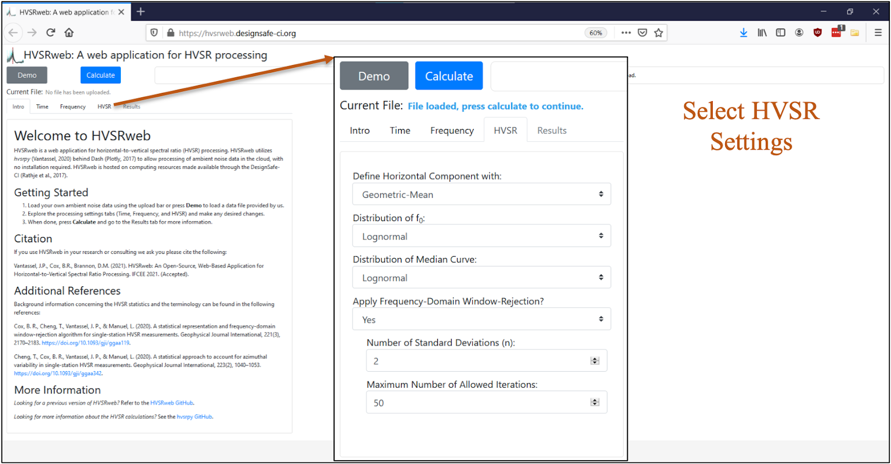
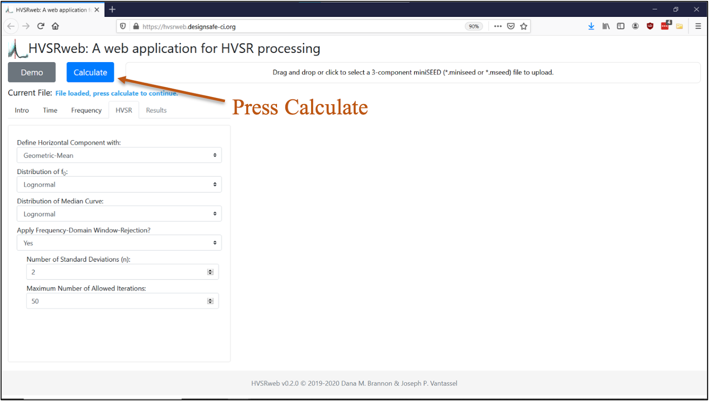
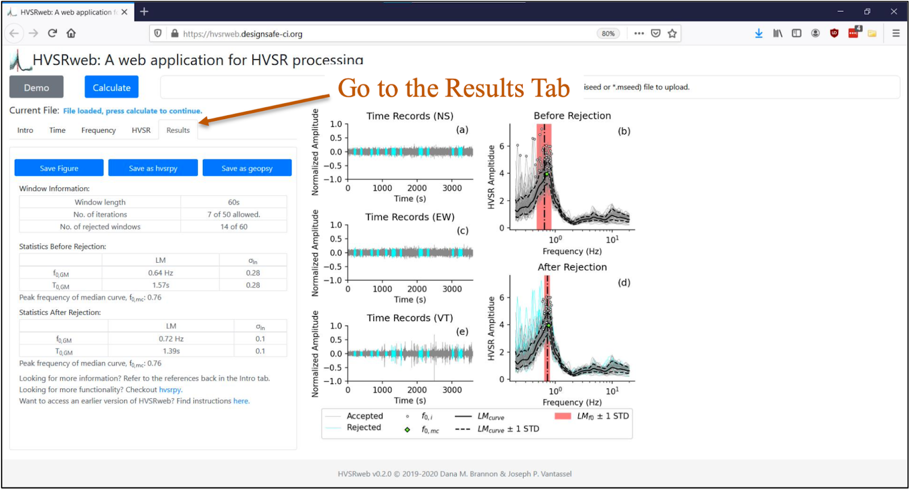
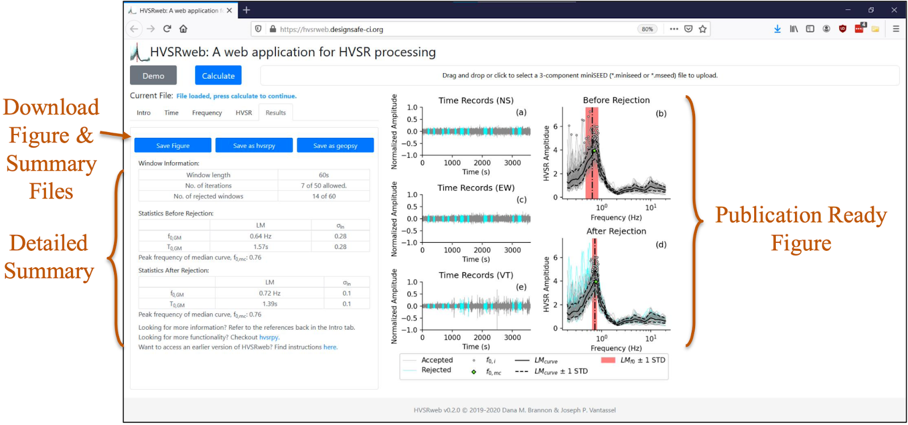

## HVSRweb
<!-- old heading name/id -->

The horizontal-to-vertical spectral ratio (HVSR) method has become an increasingly popular tool for developing a quick and reliable estimate of a site’s fundamental natural frequency (<em>f</em>0). HVSRweb is an open-source, web-based application for performing HVSR calculations in a convenient, reliable, and statistically-consistent manner. HVSRweb allows the user to upload three-component ambient noise records and perform the HVSR calculation in the cloud, with no installation required. The HVSR calculation can be performed using a single combined horizontal component (e.g., geometric-mean, squared-average) or multiple rotated horizontal components to investigate azimuthal variability. HVSRweb can reject spurious time windows using an automated frequency-domain window-rejection algorithm, removing the need for subjective and time-consuming user interaction. It also facilitates the use of lognormal statistics for <em>f</em>0, allowing for a consistent statistical framework capable of quantifying measurement uncertainty in terms of either frequency or its reciprocal, period. In addition, HVSRweb presents the opportunity to rapidly incorporate new developments in processing and quantification of uncertainty as they emerge, and encourages standardization of HVSR processing across users while avoiding the challenges associated with traditional approaches that require the user to perform regular updates to keep pace with new developments.

### Step 1 { #step1 }

### Step 2 { #step2 }

### Step 3 { #step3 }

### Step 4 { #step4 }

### Step 5 { #step5 }

### Step 6 { #step6 }

### Step 7 { #step7 }

