# How to Curate Data?

Below are step-by-step guides on how to create projects in the Data Depot, and curate and publish work/data across DesignSafe. We offer the following project types when publishing: Experimental, Simulation, Hybrid Simulation, Field Research, and Other. More information: [**Policies**](/user-guide/data-depot/policies), [**Best Practices**](/user-guide/curating/bestpractices/), [**Frequently Asked Questions**](/user-guide/curating/faq/).

## Experimental

!!! important "Not Up to Date"
    Anticipate a different user interface and experience.

### 1. Add a Project { #experimental-step1 }

You can start a project at the very beginning of its lifespan, upload and curate data incrementally, then publish sets of data at your convenience.

To add a new project, click **+ Add**, then select **New Project**.

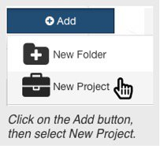

In the Add New Project window, fill in a project title and list the principal investigator (PI) and project members.

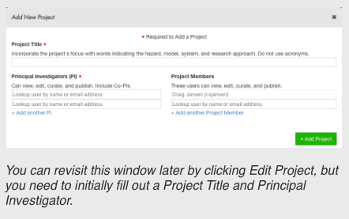

PIs and project members have the same level of access to the project, but the PI will be listed separately in the metadata. Additional PIs will be listed as Co-PIs.

You can edit all these fields later if you make any mistakes.

Once finished, click **+ Add Project** and you will be taken to your new project in the My Projects tab.

### 2. Add an Experiment { #step2 }

To begin curation and add an experiment, click on the **Curation Directory** and select **Experimental** as your Project Type.

Go through the overview and fill out additional required fields in the **Edit Project** window, click **Update Project**, then click **Add Experiments**.

Adding an experiment involves filling out high level information about the files you will be publishing. Each experiment will receive its own DOI. Add multiple experiments if any of this information changes or you want multiple DOIs. Do not add another experiment if you are testing multiple models and this information stays the same. Instead, you can add multiple models to one experiment.

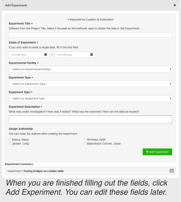

Fill out the required and optional fields using the advice given to create concise and understandable descriptions.

Also, assign authorship from a list of the project members and PIs. You can order the authors later when it is time to publish.

Click **+ Add Experiment** when you are done and it will appear below in your inventory.

You can edit an experiment from the inventory.

### 3. Add Categories { #step3 }

Click **Add Categories** to begin.

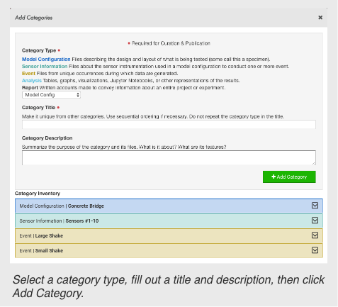

Categories group files together based on a shared purpose in an experiment. Be sure and read the definitions of each category to understand what files belong to each.

Model Configuration
:   Files describing the design and layout of what is being tested (some call this a specimen).

Sensor Information
:   Files about the sensor instrumentation used in a model configuration to conduct one or more event.

Event
:   Files from unique occurrences during which data are generated.

Analysis
:   Tables, graphs, visualizations, Jupyter Notebooks, or other representations of the results.

Report
:   Written accounts made to convey information about an entire project or experiment.

After filling out the fields, click **+ Add Category** and it will appear below in your inventory. If you make any mistakes, expand the category and click **Edit**.

### 4. Relate Data { #step4 }

Click **Relate Data** to begin.

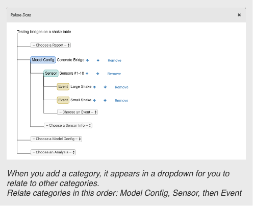

Relating Data allows you to relate categories to each other and to an experiment, which determines the layout and order of categories in your publication. You can reorder the categories if needed.

When published, this diagram will help others understand the structure of your experiment at a glance.

### 5. Assign Categories to Files { #step5 }

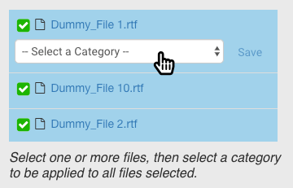

As you create categories, they will appear in a dropdown by each file. This allows you to group files in each category. Click **Save** to confirm the category.

If you categorize a folder, then all files within that folder will belong to the category of the folder.  
 
A file can belong to one or more categories.

Click **Remove** if you make any mistakes.

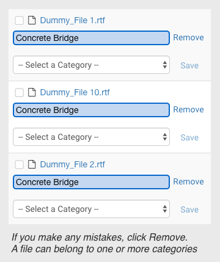

### 6. Tag Files { #step6 }

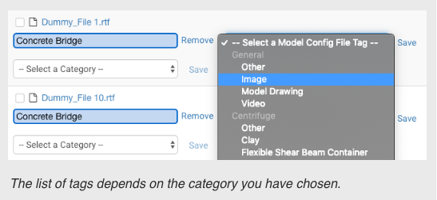

After putting files in categories, dropdowns will appear to allow you to tag specific files.

The natural hazards community has contributed to creating these agreed upon terms.

These tags are optional, but recommended.

If you do not see a file tag that fits, you can select **Other** and write in your own.

### 7. Publication Preview { #step7 }

All of the curation work is done in the Curation Directory, while the Publication Preview lets you examine the layout of your publication to give you a peace of mind about how your work will appear to other researchers once published.

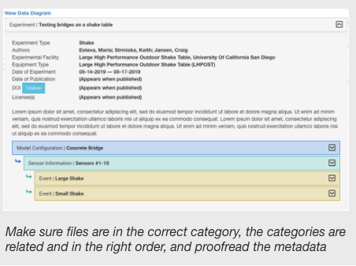

Look through the Publication Preview early and often to catch any mistakes. If you are working collaboratively with others, this is a good way to proofread changes they make.

### 8. Prepare to Publish { #step8 }

When you are satisfied with how your work is curated and wish to publish it, select Prepare to Publish in the Publication Preview.

There are 6 stages in the publication process:  
Selection, Proofread Project, Proofread Experiment, Proofread Categories, Order Authors, and Licenses

In **Selection**, select which experiment you want to publish. You can only publish one at a time.

In **Proofread Project**, **Experiment**, & **Categories**, take time to proofread all the descriptions and metadata you have entered. You cannot make changes after publishing.

In **Order Authors**, order the authors of the experiment and preview how your citation will appear.

In **Licenses**, select one or more licenses that best fit your data.

Finally, click **Request DOI & Publish** and agree to the agreement to publish your work.

---

## Simulation { #simulation }

!!! important "Not Up to Date"
    Anticipate a different user interface and experience.

Read the [Simulation Data Best Practices Guide](/user-guide/curating/bestpractices) prior to initiating your project.

### 1. Add a Project { #simulation-step1 }

You can start a project at the very beginning of its lifespan, upload and curate data incrementally, then publish sets of data at your convenience.

To add a new project, click **+ Add**, then select **New Project**.

In the Add New Project window, fill in a project title and list the principal investigator (PI) and project members.

PIs and project members have the same level of access to the project, but the PI will be listed separately in the metadata. Additional PIs will be listed as Co-PIs.

You can edit all these fields later if you make any mistakes.

Once finished, click **+ Add Project** and you will be taken to your new project in the My Projects tab.

### 2. Add a Simulation { #simulation-step2 }

To begin curation and add a simulation, click on the **Curation Directory** and select _Simulation_ as your Project Type.

Go through the overview and fill out additional required fields in the **Edit Project** window, click **Update Project,** then click **Add Simulations**.

Adding a simulation involves filling out high level information about the files you will be publishing. Each simulation will receive its own DOI. Add multiple simulations if any of this information changes or you want multiple DOIs. Do not add another simulation if you are testing multiple models and this information stays the same. Instead, you can add multiple models to one simulation.

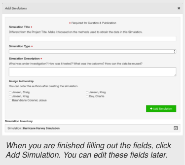

Fill out the required and optional fields using the advice given to create concise and understandable descriptions.

Also, assign authorship from a list of the project members and PIs. You can order the authors later when it is time to publish.

Click **+ Add Simulation** when you are done and it will appear below in your inventory.

You can edit a simulation from the inventory.

### 3. Add Categories { #simulation-step3 }

Click **Add Categories** to begin.

Categories group files together based on a shared purpose in a simulation. Be sure and read the definitions of each category to understand what files belong to each.

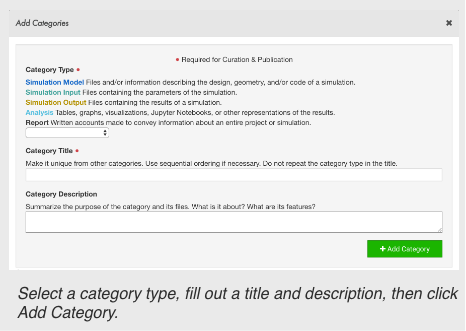

Simulation Model
:   Files and/or information describing the design, geometry, and/or code of a simulation.

Simulation Input
:   Files containing the parameters of the simulation.

Simulation Output
:   Files containing the results of a simulation.

Analysis
:   Tables, graphs, visualizations, Jupyter Notebooks, or other representations of the results.

Report
:   Written accounts made to convey information about an entire project or simulation.

After filling out the fields, click **+ Add Category** and it will appear below in your inventory. If you make any mistakes, expand the category and click **Edit**.

### 4. Relate Data { #simulation-step4 }

Click **Relate Data** to begin.

Relating Data allows you to relate categories to each other and to an simulation, which determines the layout and order of categories in your publication. You can reorder the categories if needed.

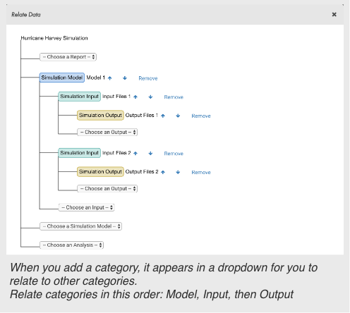

When published, this diagram will help others understand the structure of your simulation at a glance.

### 5. Assign Categories to Files { #simulation-step5 }

As you create categories, they will appear in a dropdown by each file. This allows you to group files in each category. Click **Save** to confirm the category.

If you categorize a folder, then all files within that folder will belong to the category of the folder.  
 
A file can belong to one or more categories.

Click **Remove** if you make any mistakes.

### 6. Tag Files { #simulation-step6 }

After putting files in categories, dropdowns will appear to allow you to tag specific files.

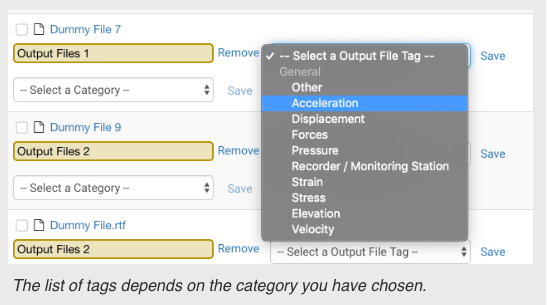

The natural hazards community has contributed to creating these agreed upon terms.

These tags are optional, but recommended.

If you do not see a file tag that fits, you can select **Other** and write in your own.

### 7. Publication Preview { #simulation-step7 }

All of the curation work is done in the Curation Directory, while the Publication Preview lets you examine the layout of your publication to give you a peace of mind about how your work will appear to other researchers once published.

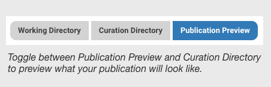

Look through the Publication Preview early and often to catch any mistakes. If you are working collaboratively with others, this is a good way to proofread changes they make.

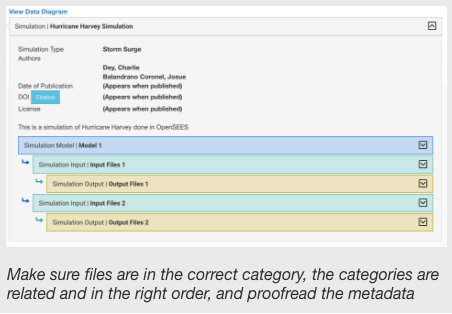

### 8. Prepare to Publish { #simulation-step8 }

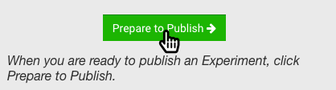

When you are satisfied with how your work is curated and wish to publish it, select Prepare to Publish in the Publication Preview.

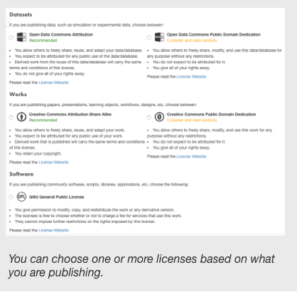

There are 6 stages in the publication process:  
Selection, Proofread Project, Proofread Simulation, Proofread Categories, Order Authors, and Licenses

In **Selection**, select which simulation you want to publish. You can only publish one at a time.

In **Proofread Project**, **Simulation**, & **Categories**, take time to proofread all the descriptions and metadata you have entered. You cannot make changes after publishing.

In **Order Authors**, order the authors of the simulation and preview how your citation will appear.

In **Licenses**, select one or more licenses that best fit your data.

Finally, click **Request DOI & Publish** and agree to the agreement to publish your work.

---

## Hybrid Simulation { #hybrid }

!!! important "Not Yet Written"
    If you need help, please [create a ticket](https://designsafe-ci.org/help){ target="_blank" } or contact us during our [virtual office hours](https://www.designsafe-ci.org/facilities/virtual-office-hours/).

---

## Field Research { #fieldresearch }

!!! important "Not Up to Date"
    Anticipate a different user interface and experience.

### 1. Add a Project { #fieldresearch-step1 }

You can start a project at the very beginning of its lifespan, upload and curate data incrementally, then publish sets of data at your convenience.

To add a new project, click **+ Add**, then select **New Project**.

In the Add New Project window, fill in a project title and list the principal investigator (PI) and project members.

PIs and project members have the same level of access to the project, but the PI will be listed separately in the metadata. Additional PIs will be listed as Co-PIs.

You can edit all these fields later.

Once finished, click **+ Add Project** and you will be taken to your new project in the My Projects tab.

### 2. Add a Mission { #fieldresearch-step2 }

To begin curation, click on the **Curation Directory** and select **Field Research** as your Project Type.

Please, read the overview, it has information that will clarify and guide you through the curation process.

Fill out required fields in the **Edit Project** window. Without this information your project will not be published. Click **Update Project**, then click **Add Missions**.

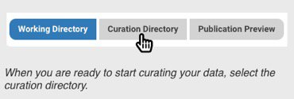

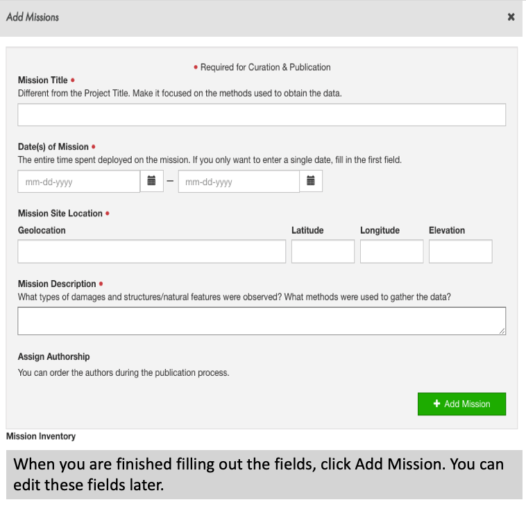

A mission is a group of data collections that are associated with a common goal or time. Some researchers may also refer to this as Time or Wave.

Adding a mission involves filling out high-level information (e.g. title, date, geolocation and description) about the files you will be publishing.

Each mission will receive a unique DOI. Add multiple missions if any of this high-level information changes or you want multiple DOIs. Do not add another mission if you are surveying the same location with different instruments and this information stays the same. Instead, you can add multiple collections to one mission.

Fill out the required and optional fields using the advice given to create concise and understandable descriptions. You can order the authors later when it is time to publish.

Click **+ Add Mission** when you are done and it will appear below in your inventory.

You can edit a mission from the mission inventory.

### 3. Add Collections { #fieldresearch-step3 }

Click **Add Collections** to begin.

Collections group files together based on a shared purpose in a mission. There are three different collection types in field research data model:

Research Planning Collection
:   A group of files related to planning and logistics, study design and administration, design, Institutional Review Board (IRB) procedures, or permits.

Engineering/Geosciences Collection
:   A group of related data and associated materials from the engineering/geosciences domain.

Social Sciences Collection
:   A group of related data and associated materials from the social sciences domain.
:   When defining a collection, there are several information that are required to be filled for curation and publication purposes such as collection title, observation type, data of collection, data collector, collection site location, the instrument and a summarized description.
:   After filling out the fields, click **+ Add Collection** and it will appear below in your collection inventory. If you make any mistakes, expand the category and click **Edit**.

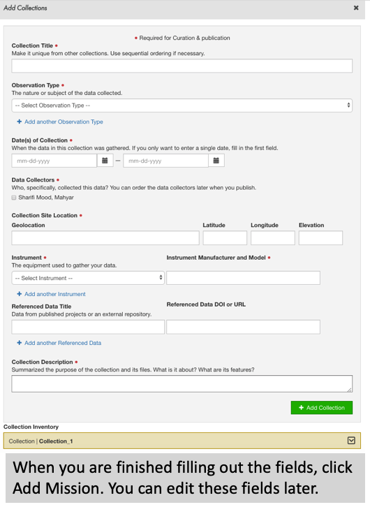

### 4. Relate Data { #fieldresearch-step4 }

Click **Relate Data** to begin.

Relating Data allows you to relate collections to missions, which determines the organization of your dataset. You can also establish the order of your collections.

When published, this diagram will help others understand the structure of your Field Research. Now you are ready to assign files to your collections.

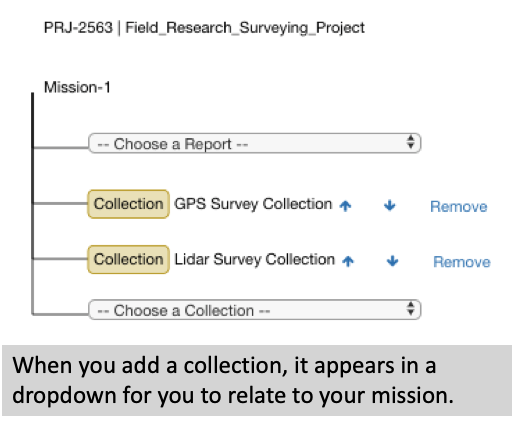

### 5. Assign Collections to Files { #fieldresearch-step5 }

As you create collections, they will appear in a dropdown next to each file. This allows you select collections for any file in your project and group them under each collection. Click **Save** to confirm the collection.

If you assigned a collection to a folder, then all files within that folder will belong to the collection of the folder.

A file can belong to one or more collections.

Click **Remove** if you make any mistakes.

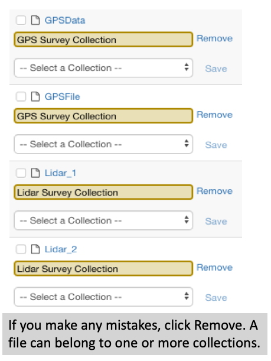

### 6. Tag Files { #fieldresearch-step6 }

After putting files in collections, dropdowns will appear to allow you to tag/describe unique files.

The natural hazards community has contributed to creating these agreed upon terms.

These tags are optional, but recommended.

If you do not see a file tag that fits, you can select **Other** and write in your own descriptive tag.

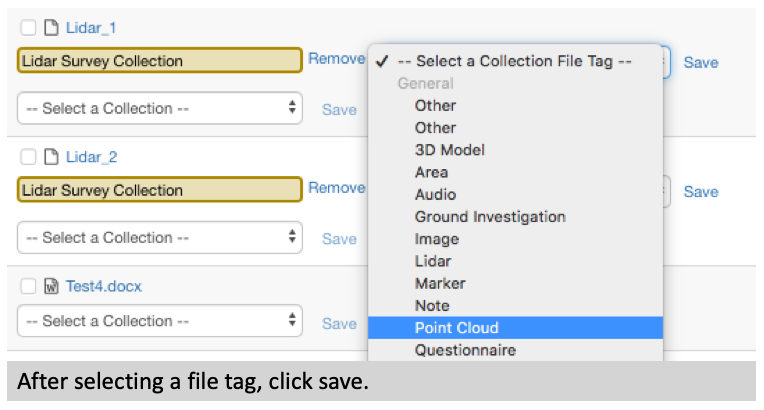

### 7. Publication Preview { #fieldresearch-step7 }

All of the curation work is done in the Curation Directory. The Publication Preview lets you examine the layout of your publication so you can visualize/verify how your work will appear once published.

Look through the Publication Preview early and often to make changes or catch mistakes. If you are working collaboratively with others, this is a good way to proofread changes.

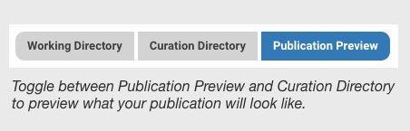

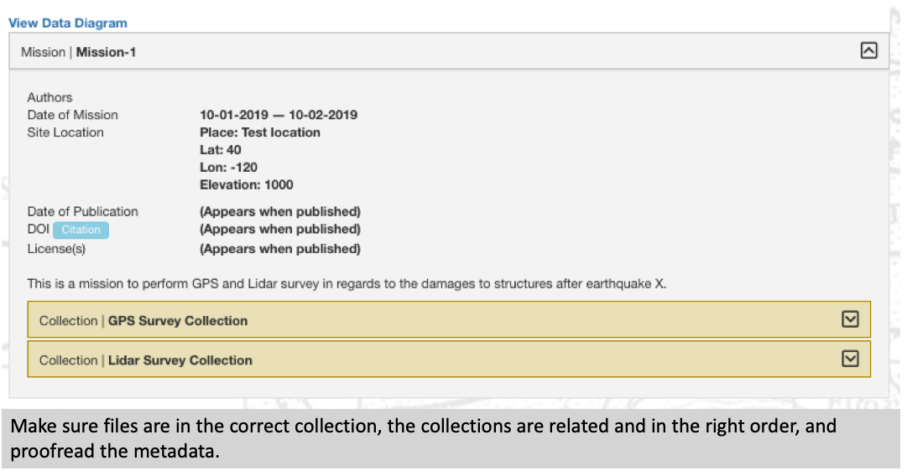

### 8. Prepare to Publish { #fieldresearch-step8 }

When you are satisfied with how your work is curated and wish to publish it, select Prepare to Publish in the Publication Preview.

There are 6 stages in the publication process:   
Selection, Proofread Project, Proofread Mission, Proofread Collections, Order Authors, and Licenses

In **Selection**, select which mission you want to publish. At this time, you can only publish one mission at a time.

In **Proofread Project**, **Missions**, & **Collections**, take time to read all the descriptions and metadata you have entered. You will not be able to make changes after publishing.

In **Order Authors**, order the authors of the mission and preview how your citation will appear.

In **Licenses**, select one or more licenses that best fit your data.

Please see the [Data Publication Guidelines](/user-guide/curating/bestpractices) for more information.

Finally, click **Request DOI & Publish** and agree to the agreement to publish your work.

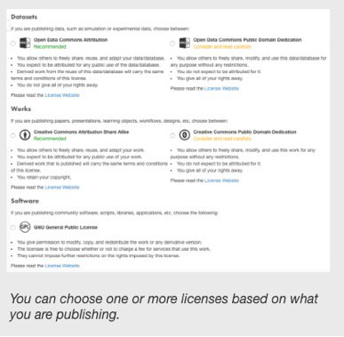

---

## Other

!!! important "Not Up to Date"
    Anticipate a different user interface and experience.

### 1. Add a Project { #other-step1 }

To add a new project, click **+ Add**, then select **New Project**.

In the Add New Project window, fill in a project title and list the principal investigator (PI) and project members.

PIs and project members have the same level of access to the project, but the PI will be listed separately in the metadata. Additional PIs will be listed as Co-PIs.

You can edit all these fields later if you make any mistakes.

Once finished, click **+ Add Project** and you will be taken to your new project in the My Projects tab.

### 2. Begin Curation { #other-step2 }

To begin curating and tagging your files, click on the **Curation Directory** and select _Other_ as your Project Type.

Fill out additional required fields in the **Edit Project** window, including a Data Type, then click **Update Project** and you will be brought to the **Curation Directory.**

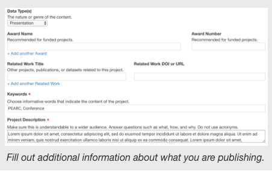

### 3. Tag Files { #other-step3 }

Dropdowns will appear by each file to allow you to tag specific files.

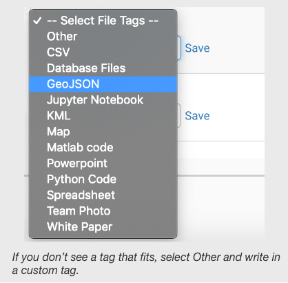

These tags are optional, but recommended. The help other users understand your data and discover it in searches.

If you do not see a file tag that fits, you can select **Other** and write in your own.

### 4. Prepare to Publish { #other-step4 }

When you are satisfied with your work and wish to publish it and recieve a DOI, click Prepare to Publish in the Publication Preview.

There are 5 stages in the publication process:  
Selection, Proofread Project, Proofread Data, Order Authors, and Licenses

In **Selection**, select which files you want to publish.

In **Proofread Project**, & **Data**, take time to proofread all the metadata and tags you have entered. You cannot make changes after publishing.

In **Order Authors**, order the authors of the publication and preview how your citation will appear.

In **Licenses**, select one or more licenses that best fit your data.

Finally, click **Request DOI & Publish** and agree to the agreement to publish your work.

