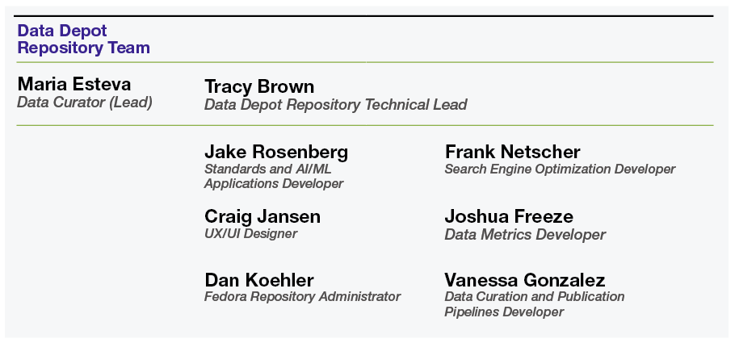

# About the Data Depot

## Mission

The Data Depot Repository (DDR) is one component of the DesignSafe cyberinfrastructure, which represents a comprehensive research environment that provides cloud-based tools to manage, analyze, understand, and publish critical data for research to understand the impacts of natural hazards. DDR is the platform for curation and publication of datasets generated in the course of natural hazards research. It is an open access repository that enables data producers to safely store, share, organize, and describe research data, and assigns Digital Object Identifiers towards permanent publication and distribution of datasets. The DDR allows data consumers to discover, search for, access, and reuse published data to accelerate research discovery. DDR monitors datasets usage and citations over time to communicate their impact.  DesignSafe is part of the NSF-supported Natural Hazards Engineering Research Infrastructure (NHERI), and aligns with its mission to provide the natural hazards research community with open access, shared-use scholarship, education, and community resources aimed at supporting civil infrastructure prior to, during, and following natural disasters. DesignSafe also supports the broader natural hazards research community that extends beyond the NHERI network.

## History

The DDR has been in operation since 2016 and is currently supported by NSF through 2025. The DDR preserves natural hazards research data published since its inception, and also provides access to legacy data dating from about 2005. These legacy data were generated as part of the NSF-supported Network for Earthquake Engineering Simulation (NEES), a predecessor to NHERI. Legacy data and metadata belonging to NEES were transferred to the DDR for continuous preservation and access. View the published NEES data [here](https://designsafe-ci.org/data/browser/public/nees.public).

## Governance

Policies for the DDR are driven by the Natural Hazards  scientific community and informed by best practices in library and information sciences. The DDR operates under the leadership of the DesignSafe Management Team, which establishes and updates policies, evaluates and recommends best practices, oversees its technical development, and prioritizes activities. The broad organizational structure under which the DDR operates is shown [here](https://designsafe-ci.org/about/designsafe/).

## Infrastructure

DesignSafe including DDR are hosted at the [Texas Advanced Computing Center (TACC)](https://tacc.utexas.edu/) at the [University of Texas at Austin](https://www.utexas.edu/). TACC provides access to high performance computing, visualization, and large scale data analysis computational resources, as well as to reliable large scale data management and storage solutions. Their cloud and portal services further increase the ways in which DesignSafe users can access data and computational resources to advance their work.

## Team

An interdisciplinary repository team carries out ongoing design, development and day-to-day operations, gathering requirements and discussing solutions through formal monthly and bi-weekly meetings, and maintaining regular communications with members of the network, including monthly meetings with the Experimental Facilities, RAPID, and CONVERGE staff. Based on these fluid communications, the RT designs functionalities, researches and develops best-practices, and implements agreed-upon solutions. The figure below shows the current formation of the repository team, including their expertise.

Formal mechanisms are in place for external evaluators to gather feedback and conduct structured assessments, in the form of usability studies and yearly user surveys, to ensure that the repository is meeting the community’s expectations and needs. To track development the DDR curator meets every other week with the DesignSafe PI and with the head of the development team. All DDR activities are reported to the National Science Foundation on a quarterly and annual basis in terms of quantitative and qualitative progress.

## Community Norms

Within the broader conditions of use for DesignSafe we have established a set of Community Norms specific for DDR which have to be agreed upon at the point of registering an account on the platform. These norms, highlighting our existing policies, are the following:

Users who either publish and use data in DDR must abide by both the [TACC Acceptable Use Policy](https://tacc.utexas.edu/use-tacc/user-policies/) and the [DesignSafe Terms and Conditions](https://www.designsafe-ci.org/account/terms-conditions/).

For users curating and publishing data in DDR:

* Users understand that their data submissions to the DDR should follow our [Data Depot Repository Policies](https://docs.google.com/document/d/1a1KSeyezPCwjDIHBSP2EEwauWFUKy_RiVVqKVepUAUA/edit?tab=t.0#heading=h.jcgpuqc6jitr) and our [Best Practices for Curation and Publication](https://docs.google.com/document/d/1a1KSeyezPCwjDIHBSP2EEwauWFUKy_RiVVqKVepUAUA/edit?tab=t.0#heading=h.yd85kbcdlgs9) 
* Users agree to use DDR to publish open access data, which they must document in a manner that enables data reuse and research reproducibility.
* In accordance with the [Joint Declaration of Data Citation Principles](https://force11.org/info/joint-declaration-of-data-citation-principles-final/)  and the [Software Citation Principles](https://force11.org/info/software-citation-principles-published-2016/), users reusing data and or research software of others in their data publications must properly cite them in the Referenced Data and Software field provided in the DDR interface.
* Users agree to provide all the needed licenses and permissions to make data available for archiving and for reuse by others.
* Users publishing human subjects data should abide by our [Protected Data Policy](https://docs.google.com/document/d/1a1KSeyezPCwjDIHBSP2EEwauWFUKy_RiVVqKVepUAUA/edit?tab=t.0#heading=h.gr7h4hq8k2fp).
* Using DDR to publish data is entirely voluntary. None of these terms supersede any prior contractual obligations to confidentiality or proprietary information the user may have with third parties; thus, the user is entirely responsible for what they upload or share with DDR. 
* Publications that do not fall within these norms may be removed.

For users using data published in DDR:

* Users accessing and using DDR data agree to the following [Data Usage Agreement](https://docs.google.com/document/d/1a1KSeyezPCwjDIHBSP2EEwauWFUKy_RiVVqKVepUAUA/edit?tab=t.0#heading=h.ng2qd9najkd9).
* Users agree to use DDR resources in accessing and reusing open access data in ways that respect the [licenses](https://docs.google.com/document/d/1a1KSeyezPCwjDIHBSP2EEwauWFUKy_RiVVqKVepUAUA/edit?tab=t.0#heading=h.fx2w0xfrwc1c) and access restrictions established in the publications.
* Users agree to properly cite the datasets they use in their works in accordance with the [Joint Declaration of Data Citation Principles](https://force11.org/info/joint-declaration-of-data-citation-principles-final/) using the citations provided in the published datasets landing pages.
* We reserve the right to ask users to suspend their use of DDR should we receive complaints or note violations of these Community Norms.

## CoreTrustSeal Certification

The Data Depot Repository is evaluated for the [CoreTrustSeal](https://www.coretrustseal.org/) certification every three years. Established in 2017, CoreTrustSeal is a non-profit dedicated to advancing sustainable data infrastructure in repository management. It achieves this by requiring adherence to a set of criteria developed collaboratively by the Data Seal of Approval (DSA) and the World Data System of the International Science Council (WDS), under the umbrella of the Research Data Alliance (RDA). A CoreTrustSeal certification assures users that a repository has implemented essential safeguards for long-term data preservation and has received endorsement of its trustworthiness through a transparent, independent evaluation.
