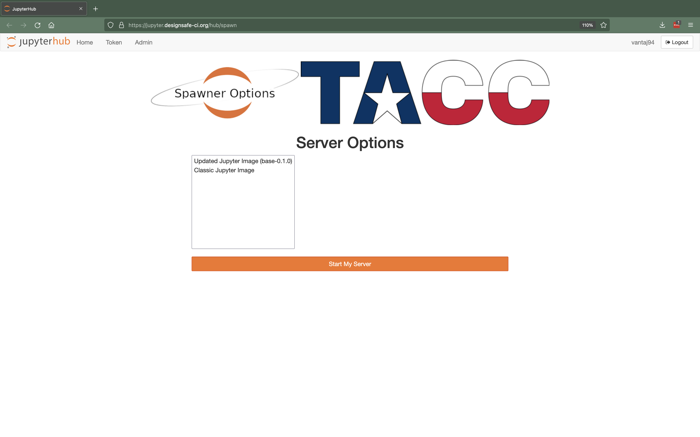
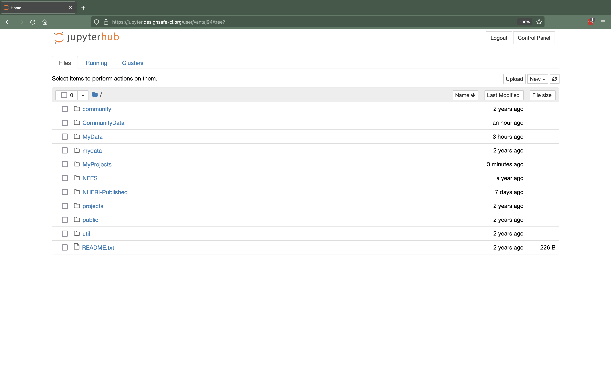
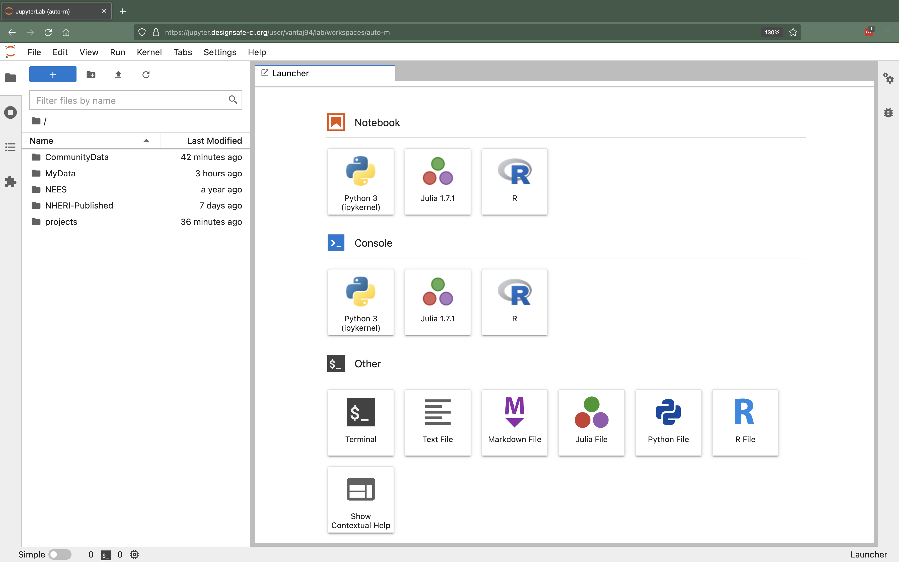
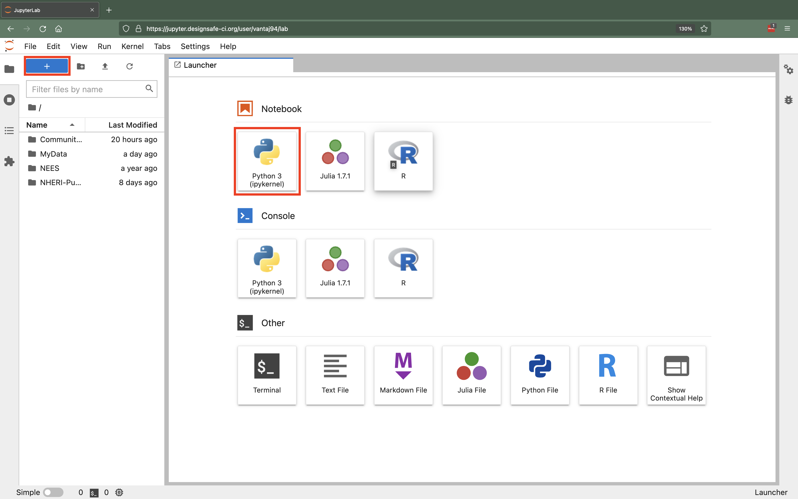

## JupyterHub Guide

DesignSafe provides you access to the Jupyter ecosystem via its JupyterHub. The most popular component of the Jupyter ecosystem is the Jupyter notebook that allows you to create and share documents (i.e., notebooks) that contain code, equations, visualizations, and narrative text. Jupyter notebooks can be used for many research-related tasks including data cleaning and transformation, numerical simulation, statistical modeling, data visualization, and machine learning.

You can access DesignSafe's JupyterHub via the DesignSafe-CI workspace by selecting "Workspace" &gt; "Tools &amp; Applications" &gt; "Analysis" &gt; "Jupyter" &gt; Select "Jupyter" &gt; "Launch" or directly via <a href="https://jupyter.designsafe-ci.org" target="_blank">https://jupyter.designsafe-ci.org</a>. Upon entry you will be prompted to log in using your DesignSafe credentials.

### [JupyterHub Spawner](#spawner) { #spawner }

If you have not accessed Jupyter previously or if your previous Jupyter session has stopped you will be brought to the JupyterHub Spawner. An image of the JupyterHub Spawner is shown below.

Figure 1. JupyterHub Spawner

The JupyterHub Spawner allows you to select from different notebook images available on DesignSafe. Each notebook image provides a unique user-interface complete with various pre-installed system and software-specific packages. There are two notebook images available the Classic Jupyter Image and the Updated Jupyter Image. To use an image, select it from the list and click "Start My Server". The spawner will then prepare and serve you the associated image via your browser. Note that it may take a minute or two for the image to load.

The interface that you see once your image has been served will depend on the image you selected. The two options are the classic JupyterNotebook interface (the default for older images) or the updated JupyterLab interface (the default for newer images). Images of the classic JupyterNotebook Interface and the updated JupyterLab Interface are shown below.

Figure 2. Classic JupyterNotebook Interface

To return to the spawner in the classic JupyterNotebook interface select "Control Panel" &gt; "Stop My Server" &gt; "Start My Server".

Figure 3.  Updated JupyterLab Interface

To return to the spawner in the updated JupyterNotebook interface select "File" &gt; "Hub Control Panel" &gt; "Stop My Server" &gt; "Start My Server".

### [Jupyter Notebook Images](#images) { #images }

As mentioned in the previous section there are two images available for use on DesignSafe the Classic Jupyter Image and the Updated Jupyter Image.

#### [Classic Jupyter Image](#images-classic) { #images-classic }

The Classic Jupyter Image was the default image prior to March 2022. The image uses JupyterNotebook as its default interface, supplies Python 3.6 as its default Python interpreter, and provides an R kernel. The image comes with many Advanced Package Tool (APT) and Python packages pre-installed. As a result many users will be able to use the image without having to perform custom installations using <em>pip</em> or <em>conda</em> (see section on Installing Packages for details), however this also result in a large image with many interdependent packages that makes adding or upgrading packages difficult.

#### [Updated Jupyter Image](#images-updated) { #images-updated }

The Updated Jupyter Image was released in March 2022 to replace the Classic Jupyter Image. The image uses JupyterLab as its default interface,  supplies Python 3.9 as its default Python interpreter, and provides an R and Julia kernel. The new image provides fewer pre-installed APT and Python packages compared to the Classic Jupyter Image to allow it to remain light and flexible. Small packages that are quick to install can be done so at the top of a notebook via <em>pip</em> or <em>conda</em> (see section on Installing Packages for details). Persistent installations can be created and shared between users using the <em>kernelutility</em> Python package (see section on Installing Packages for details).

### [Accessing Data from the Data Depot](#accessingdatadepot) { #accessingdatadepot }

While using Jupyter on DesignSafe you have access to all your files stored in the Data Depot. The directory "MyData" and "projects" point to the "My Data" and "My Projects" sections of the Data Depot, respectively. Files in "CommunityData", "NEES", and "NHERI-Published" point to the "Community Data", "Published (NEES)", and "Published" sections of the Data Depot, respectively.

In the Classic Jupyter Image you may notice very similarly named directories (e.g., "mydata" and "MyData"). These folders ("mydata", "projects", and "community’") are symlinks for their similarly named counterparts and were added during the development of the Classic Jupyter Image to ensure backwards compatability. You can use either of these directories to access your files, however using the CamelCase directories is preferred. Note that in the Updated Jupyter Image the symlinks have been removed and only one set of directories is provided to present a simplified user experience.

Note that any changes (e.g., edits, deletions, and etcetera) made in Jupyter are immediately reflected in the Data Depot. Importantly, all of your work should be saved within your "MyData" or "projects" directories, changes in all other directories will be lost upon server termination. Stated differently, data is not preserved between Jupyter server sessions except within the "MyData" and "projects" directories.

If you have recently created or been added to a project on DesignSafe, you will need to stop and restart your server to ensure the new project is accessible through the "projects" directory. The general procedure for this is to first return to the JupyterHub spawner (see the JupyterHub Spawner section for instructions) &gt; Log Out &gt; Log In &gt; Start Your Server. Please note that the projects are listed by their project (PRJ) number which can be found next to the project's title when viewing through the Data Depot.

### [Using Jupyter](#using) { #using }

#### [Creating a Jupyter Notebook](#using-creating) { #using-creating }

Creating a new Jupyter notebook is different depending on whether you are using the classic JupyterNotebook interface or the updated JupyterLab interface.

For the classic JupyterNotebook interface select "New" &gt; then select the notebook of your choice for example "Python 3". If you want to run a notebook using a different kernel for example Python 2, R, or Bash you can do so using a similar approach. Note that the notebook will be created in the directory that you are currently viewing, so be sure to navigate into "MyData" or "projects" before creating a new notebook to ensure your changes will be saved.

Figure 4.

For the updated JupyterLab interface select "+" to open the launcher &gt; then select the notebook of your choice for example "Python 3 (ipykernel)". If you want to run a notebook using a different kernel for example Julia or R you can do so using a similar approach. Note that the notebook will be created in the directory that you are currently viewing, so be sure to navigate into "MyData" or "projects" before creating a new notebook to ensure your changes will be saved.

Figure 5.

#### [Ending your Jupyter Session](#using-ending) { #using-ending }

The computational resource on which DesignSafe's JupyterHub operates is a shared resource meaning that the computational resources you use will be taken from a shared pool. To ensure that these resources are available to as many researchers as possible we ask that users stop your Jupyter server, thereby freeing up those resources for others, when you are no longer using Jupyter. To shut down your server in the classic JupyterNotebook interface select "Control Panel" &gt; "Stop My Server" &gt; "Log Out" and in the updated JupyterLab interface select "File" &gt; "Hub Control Panel" &gt; "Stop My Server" &gt; "Log Out".

#### [Server Information](#using-serverinfo) { #using-serverinfo }

Each Jupyter session is served through an Ubuntu-based Docker image and distributed across a Kubernetes cluster located at the Texas Advanced Computing Center (TACC). To ensure Jupyter is available to as many researchers as possible each server has limited computational power (4 cores) and memory (10 GB).

#### [High Performance Computing (HPC) Job Submission through Jupyter](#using-jobs) { #using-jobs }

For greater computational power, you can use <em>agavepy</em>, a Python interface to TAPIS, to submit jobs to TACC's high performacne computing systems (e.g., Frontera) directly through Jupyter. Existing applications avaialble through DesignSafe include OpenSees, SWbatch, ADCIRC and others. For more information, please watch the following webinar on leveraging DesignSafe using TAPIS <a href="https://youtu.be/-_1lNWW8CAg" target="_blank">here</a>.

### [Installing Packages](#installing) { #installing }

Each Juptyer image contains some pre-installed system and software-specific packages. This section will focus on Python packages, however packages for the Julia and R kernels can also be installed using their respective syntax. System-related packages, those requiring sudo privaledges, cannot be installed by users directly, but may be requested by submitting a ticket. Requests for system-related packages will be approved on a case-by-case basis. Requests should include a clear and compeling justification for why the system-related package will be of benefit to the natural hazards community.

There are two approaches for installing Python packages the first is via effemoral user installations and the second is via custom user-defined kernels. Note that only the former is availabe in the Classic Jupyter Image whereas both are available in the Updated Jupyter Image.

#### [Ephemeral User Installations](#installing-ephemeral) { #installing-ephemeral }

Ephemoral or temporary user installations of Python packages is the preferrred approach when the number of required packages is small and/or when those installations can be done relatively quickly (i.e., in a few minutes). To perform the installation you can either open a Jupyter "Terminal" and use standard <em>pip</em> or <em>conda</em> syntax (e.g., pip install tensorflow) or use the "!", "%pip", or "%conda" line magics (e.g., !pip install tensorflow) to execute <em>pip</em> in a subshell in Jupyter directly. Note in the Classic Jupyter Image you will also need to add the "--user" flag to ensure a user-based installation (e.g., pip install tensorflow --user). After the installation completes you will need to restart your Jupyter notebook by going to "Kernel" &gt; "Restart and Clear All Output" for Python to be able to see the recently installed package. The second approach of doing the installation at the top of the notebook is generally preferred to using the Terminal as it allows you to document the dependencies required for your work. Importantly, installations using this procedure are ephemoral and will survive only as long as your Jupyter session. As soon as your Jupyter session ends, your server will be cleaned up, and all installations will be destroyed. For the ability to create persistent installations see the next section on Custom User-Defined Kernels.

#### [Custom User-Defined Kernels](#installing-kernels) { #installing-kernels }

The objective of custom user-defined kernels is to allow users to build, customize, and share entire Python kernels to enable highly-customized Jupyter workflows and greater scientific reproducability. Each kernel includes their own Python interpreter and any number of user-selected Python packages installed via <em>pip</em> or <em>conda</em>. By being able to create and share their Python kernels, resarchers are able to easily create, share, and publish their development enviroments alongside their software avoiding any potential issue related to the environment and the dreaded "It works on my machine" issue.

User-defined kernels are supported in the Updated Jupyter Image using the <em>kernelutility</em> Python package. To get started you will need to install the <em>kernelutility</em> which you can do using <em>pip</em> (e.g., in Jupyter "!pip install kernelutility", do not forget to restart your notebook after the installation is complete for Python to be able to see the new installation). To start using the <em>kernelutility</em>, run "from kernelutility import kernelset". Importing the kernelset will restore any kernels you created previously and allow you to manage your kernels via Python. The kernelset instance of the KernelSet class has four basic methods: <em>create</em> - that allows you to create new kernels, <em>destroy</em> - that allows you destroy previously created kernels, <em>add</em> - that allows you to add an existing kernel from a specified path by making a local copy, and <em>remove</em> - that allows you to remove a previously added or created kernel. Note that add is similar to destroy except that it does not clean up the kernel's files on disk such that it can be added again later if desired. Once you have created or added a new kernel those will become selectable alongside the base Python 3, Julia, and R kernels in the Launcher tab. Note that you can create as many kernels as you like to manage your various projects and their dependencies on DeisgnSafe. When you shutdown your server your user-defined kernels will not be immediately visible on restart, to activate them all you need to do is open a Jupyter notebook and run "from kernelutility import kernelset". If you do not see your kernels reappear wait a few seconds, refresh your browser, and return to the Launcher tab.

<strong>If you have any issues using DesignSafe's JupyterHub, please create a ticket (<a href="https://designsafe-ci.org/help">https://designsafe-ci.org/help</a>)</strong>.

<em>Last Update: March 2022</em>
