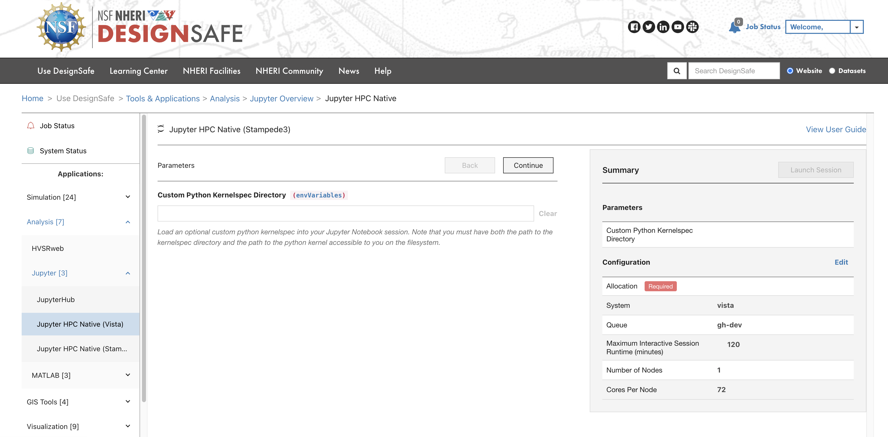

# DesignSafe HPC Jupyter Guide

On DesignSafe web portal, three versions of Jupyter have been created, including **Jupyter**, **Jupyter Lab HPC (CPU)** and **Jupyter Lab HPC (GPU)**. **Jupyter** will be run on a virtual machine, while **Jupyter Lab HPC (CPU)** and **Jupyter Lab HPC (GPU)** will be run on the CPU nodes on Stampede3 and GPU nodes on Vista, respectively. In particular, the **Jupyter Lab HPC (GPU)** will be run on Vista's NVIDIA H100 GPU nodes that have the best performance, and many commonly used Python packages for AI/ML applications have been pre-installed, including PyTorch.

   

| Application | Pro | Con |
| --- | - | - |
| **Jupyter** | No wait; <br>No maximum job runtime limit; <br>Sufficient memory for data processing purpose | Low performance for AI/ML jobs; <br>Need to install Python packages every time |
| **Jupyter Lab HPC (CPU)** | More memory and faster than **Jupyter**; <br>No need to reinstall Python packages once they have been installed; <br>Excellent capability for data processing and parallel computing using 56 cores. | Queue exists, longer wait time may be needed; <br>Slower than **Jupyter Lab HPC (GPU)** for deep learning jobs; <br>Maximum job runtime is 48 hours | 
| **Jupyter Lab HPC (GPU)** | Four GPUs in total, best performance for AI/ML jobs; <br> Many commonly used Python packages for AI/ML applications have been pre-installed, including TensorFlow and PyTorch | Queue exists, longer wait time may be needed; <br>Maximum job runtime is 48 hours |

**Note:** When using the **Jupyter Lab HPC (CPU)** and **Jupyter Lab HPC (GPU)**, you need to place all your files/data/codes/Jupyter Notebooks inside the *Work* folder. This can be done on DesignSafe Data Depot page without submitting any jobs.

   

## Launch the Jupyter Lab HPC (GPU)

1. Go to [DesignSafe website](https://www.designsafe-ci.org) and sign in to your DesignSage account. Then click "Use DesignSafe" > "Tools & Applications" > "Analysis" > "Jupyter" and select "Jupyter HPC Native (Vista)".

    

2. In the DesignSafe Jupyter HPC Native interface, there is a field labeled Custom Python Kernelspec Directory (envVariables). You can enter the path to your custom directory in that box. A kernelspec is a small JSON configuration file that tells Jupyter how to start a kernel (e.g., Python interpreter) for your notebooks. The default Kernelspec directory on TACC is `~/.local/share/jupyter/kernels/`.You can define a custom kernelspec directory if you want to. For example:
`/work/<username>/jupyter/share/jupyter/kernels`.
    


3. Once select Allocation, Queue and maximum Job runtime (no more than 2 and 48 hours for gh-dev and gh queue, respetively), click the "Launch session" buttton so the session will be launched. Then you can monitor your job status by clicking the "Job Status" buton on the left column.
    

4. Once your job status shows as "Running", then click the "Open" button. A pop out window will show a "Connect" button. Click on it to connect to your interactive session, i.e., JupyterLab. And once you are done with your job, please click the "End" button to terminate your job.

    
    


## Launch the Jupyter Notebook

1. Click on the `Python 3 (ipykernel)` button on the right to launch a new Jupyter Notebook. In this example, a Jupyter Notebook `Untitled.ipynb` was created. As seen, the PyTorch has been pre-installed and a total of one GPU have been recognized. By typing `pip list`, you can view all the Python packages that have been pre-installed, including many popular ones, such as matplotlib, numpy, scipy, PyTorch, etc.
    
    

2. To install a Python package, simply type `!pip3 install <Python Package Name>`.

# Containerized Kernel for Jupyter Lab

This part of the document contains two sections:

1. [Container Build](#container-build-with-pytorch-and-additional-packages) – How to create a Dockerfile and share the image.

2. [Containerized Kernel for JupyterLab](#containerized-kernel-for-jupyterlab) – How to distribute and use containerized kernels in JupyterLab. 


## Container build with PyTorch and additional packages 

This part of the document walks you through how to build a container *on your own machine*.

### Selecting a PyTorch Dcker Image
First, determine the PyTorch version you need. Then, find a docker image from [nvidia’s NGC page](https://catalog.ngc.nvidia.com/orgs/nvidia/containers/pytorch/tags?version=25.09-py3) that has the correct PyTorch version. You can find the PyTorch version from the corresponding [release note](https://docs.nvidia.com/deeplearning/frameworks/pytorch-release-notes/index.html).
<figure>
  
  <figcaption>Container list from NGC page</figcaption>
</figure>
<figure>
  
  <figcaption>Release notes show PyTorch version</figcaption>
</figure>

### Writing a Dockerfile
To build a Docker container, we begin with the FROM command, using the NVIDIA PyTorch base image. Then, copy your requirements.txt file and install the necessary Python packages using pip. 

    Note: This tutorial does not include a requirements.txt file. You need to create one based on your project’s dependencies.

Example Dockerfile:
```
============== Dockerfile Example ==============
FROM nvcr.io/nvidia/pytorch:25.08-py3


# Copy the requirements file and install required 
# python pip packages. This is just an example: 
# there is not requirement.txt provided in this tutorial
COPY requirements.txt .
RUN pip install -r requirements.txt
============== End Dockerfile ==============
```

### Building a docker image from the Dockerfile
When building the container, we have to build it for the specific computer architecture we plan to run the container on. In the case of Vista, that’s linux/arm64. TACC has a [tutorial](https://containers-at-tacc.readthedocs.io/en/latest/advanced/02.multiarchitecture.html) of how to create a Docker image that can support multiple architectures. Also note, Docker Desktop on Mac/Windows can build for architectures different than the one they are running on by default, but Linux requires some additional software libraries (outlined in the linked tutorial)

After you’ve saved your dockerfile, navigate to its location. Ensure the requirements.txt file is in the same directory as the dockerfile. Now run the following command to build the container:
```
docker build --platform [architecture] -t [username]/[container name]:[tag] .
```

Example:
```
docker build --platform linux/arm64 -t testUser/chishiki:0.0.1 .
```

### Optional: Test container locally

If you want to test out the container locally on a system with gpus you can run
```
docker run --gpus all --ipc=host -it --rm [username]/[container name]:[tag]
```

Example:
```
docker run --gpus all --ipc=host -it --rm testUser/chishiki:0.0.1
```

### Upload container to dockerhub

Once you’re satisfied with your container, you can upload the docker image to docker hub

```
docker login
docker push [username]/[container name]:[tag]
```

Example:

```
docker push testUser/chishiki:0.0.1
```

## Containerized Kernel for JupyterLab

### Jupyter for DesignSafe

In the Designsafe Jupyter Lab, you can launch a notebook with the default python kernel, as show [previously](#launch-the-jupyter-notebook).

### What are Jupyter Kernels?

When we launch a jupyter notebook, we have the ability to select what kernel (program that executes code) we use. The ability to select different kernels allows you to execute code in different languages and environments for different applications.  These kernels could be a python virtual environment or a container you have set up. The [Container Build](#container-build-with-pytorch-and-additional-packages) part of the guide walks you through the steps to take to build a container. In the section below, we will walk you through how to set up a containerized jupyter kernel. By doing this you will be able to select a kernel that executes code in different containers you have built. 

### Containerized Kernels at TACC 

Note: This tutorial assumes you have a working container on dockerhub. We will reference the kernel created in the [Container Build](#container-build-with-pytorch-and-additional-packages) section of this tutorial. 

### Preparation

Open the DesignSafe Jupyter interface from the DesignSafe portal by folloing steps in [Launch the Jupyter Lab HPC](#launch-the-jupyter-lab-hpc-gpu). Connect to interactive session by clicking the "Connect" button.


### Download .sif file for a container
From the [launch interface](#launch-the-jupyter-notebook) where you launched jupyter notebook, open a new Terminal in your Jupyter Lab session by clicking on Terminal button inside the "Other" tab.
    

With that, you have a terminal to run commands.


Run the following commands in terminal.


1. Load apptainer module
    ```
    module load tacc-apptainer
    ```

2. Navigate to the location on TACCs filesystem where you would like to download the container. For this example you could move to SCRATCH:
    ```
    cds
    ```	
3. Then, pull the container you would like to use from dockerhub
    ```
    apptainer pull docker://[username]/[container name]:[tag]
    ```

    The command above creates a `<container name>-<version tag>.sif` file which can be renamed and or stored where you need it.

    Example:
    ```
    apptainer pull docker://testUser/chishiki:0.0.1
    ```


4. Set up Kernel.json

    In addition to the container, we need to add a kernel configuration json file to the users environment. This file, named `kernel.json`, has the command to run the kernel, the name of the kernel, which appears in the list of kernels in Notebook tab in the launching interface, and the language. 
    

    Below is a generic kernel.json file for a kernel using a container and running Python. In the file below you will need to make two modifications. First is to replace "PATH_TO_SIF_FILE" with path to your own sif file. Second the to replace "NAME" with name of your prefered name. The changes add the path to the .sif file for you container as well as adding a display name for this particular kernel: 
    ```
    {
    "argv": [
    "/opt/apps/tacc-apptainer/1.4.1/bin/apptainer",   
    "exec",
    "--nv",
    "--bind",
    "/run/user:/run/user",
    “PATH_TO_SIF_FILE”,   
    "python3",
    "-m",
    "ipykernel_launcher",
    "--debug",
    "-f",
    "{connection_file}"
    ],
    "display_name": "NAME",
    "language": "python"
    }
    ```
    To fully understand building kernel.json files please reference the [jupyter docs](https://jupyter-client.readthedocs.io/en/stable/kernels.html). The import notes about the file above is that *argv* includes a list of command line arguments used to start the kernel. Above we are specifying that we want to launch the specified container with apptainer, then start python. Additionally, the *display_name* will be the name of the kernel displayed in the jupyter notebook UI. 

### Installing Kernel

Once you have kernel.json, place it in the Jupyter kernelspec directory. The default kernelspec directory is ~/.local/share/jupyter/kernels/. You could [customized your kernelspec directory](#launch-the-jupyter-lab-hpc-gpu).


The example code assumes you are using the default kernelspec directory. If you use a custom kernelspec directory, adjust accordingly.


Each kernel has its own directory (which should reflect which kernel it is but is not used by Jupyter). To install the kernel you need to execute the following commands:
```
mkdir  ~/.local/share/jupyter/kernels/<kernel directory>
cp kernel.json ~/.local/share/jupyter/kernels/<kernel directory>
```

### Test Kernel 

Once you have installed a new kernel, it will become selectable alongside the base Python 3 in the Launcher tab. You may need to wait a few seconds or refresh the browser to observe the new available kernel. Note that you can create as many kernels as you like to manage your various projects and their dependencies on DesignSafe.


You could create a notebook with the kernel by clicking on the new kernel.  This kernel will become the default kernel for that notebook. 

  

