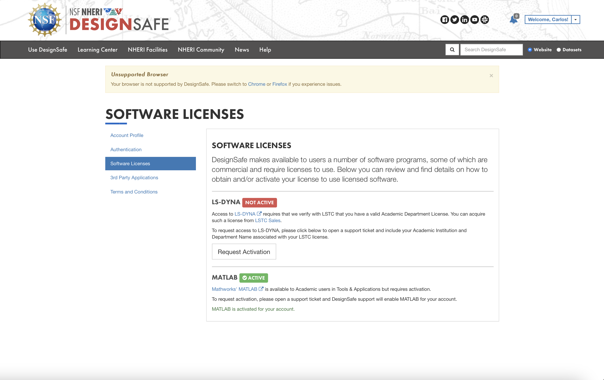
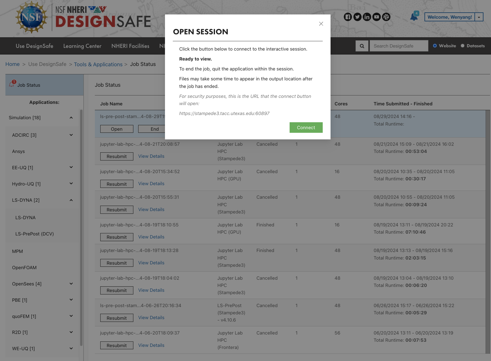
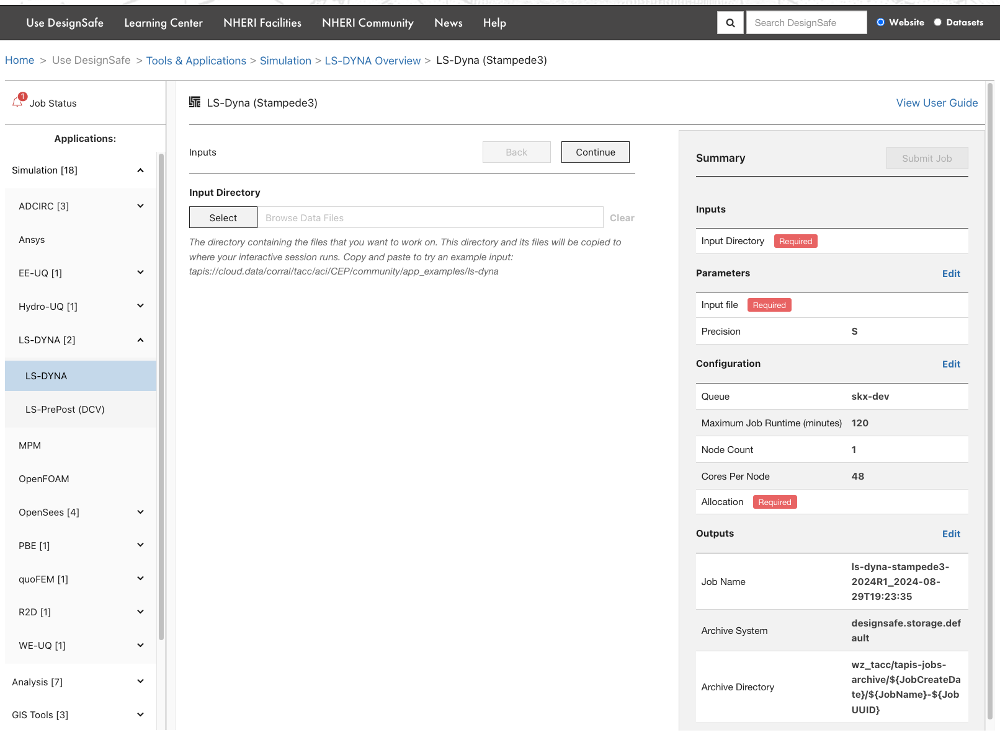
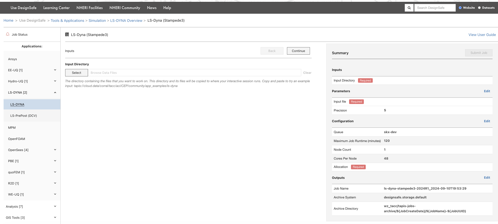
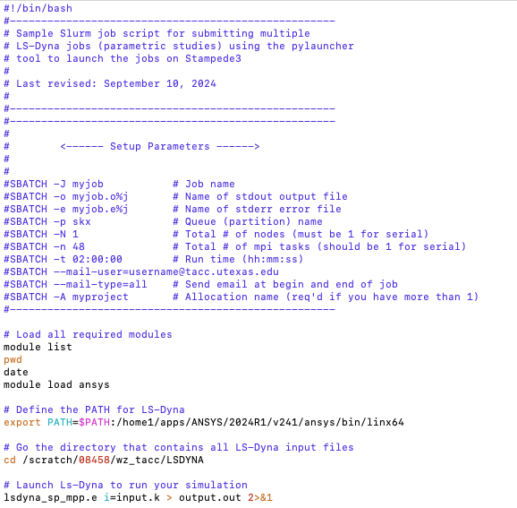
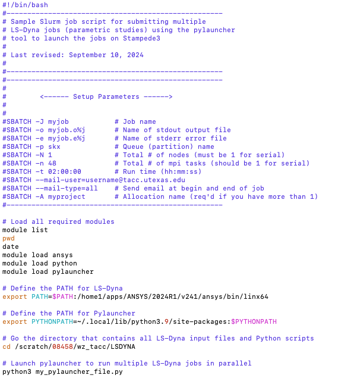

## LS-DYNA User Guide

Ls-Dyna is a general-purpose multi-physics simulation software package. It was originated from DYNA3D, developed by John Hallquist at the Lawrence Livermore National Laboratory in 1976. The software was commercialized as LS-Dyna in 1988 by Livermore Software Technology Corporation and now it is part of [Ansys](https://lsdyna.ansys.com){target="_blank"}.

The main Ls-Dyna capabilities are:

<ul>
	<li>2D and 3D;</li>
	<li>Nonlinear dynamics (implicit and explicit solvers);</li>
	<li>Static and quasi-static analysis;</li>
	<li>Thermal analysis and electromagnetic analysis;</li>
	<li>Computational fluid dynamics:</li>
	<li>Incompressible and compressible solver;</li>
	<li>Fluid-structure interactions;</li>
	<li>Smoothed-particle hydrodynamics;</li>
	<li>Geotechnical and soil-structure interactions;</li>
	<li>Contact algorithms;</li>
	<li>Large library of elements (shell, discrete, solid, etc).</li>
</ul>

### Ls-Dyna on DesignSafe { #ds }

In the Workspace are available the following apps:

<ul>
	<li>LS-PrePost (DCV): Pre-processing and post-processing of models (<i>Use DesignSafe &gt; Tools & Applications &gt; LS-DYNA&gt; LS-PrePost(DCV)</i>);</li>
	<li>LS-Dyna: Actual solver (version 2024R1) – single and double precisions (after activation - <i>Use DesignSafe &gt; Tools & Applications &gt; LS-DYNA&gt; LS-DYNA</i>).</li>
</ul>

### Activate Ls-Dyna on DesignSafe { #activate }

DesignSafe (through TACC) has negotiated with Ansys to allow LS-DYNA access on TACC systems for academic research. Users can submit a ticket (https://www.designsafe-ci.org/help/new-ticket/) requesting LS-DYNA access and are granted access upon verification with Ansys that they have an existing academic departmental license or that you acquire such license.

A <i>Request Activation</i> button is also available in <i>Use DesignSafe &gt; Tools & Applications &gt; LS-DYNA</i>:

### How to launch LS-Dyna { #launch }

Examples in this guide:

<ul>
	<li>Launching LS-PrePost to generate or visualize model via DesignSafe web portal;</li>
	<li>Launching a single job via DesignSafe web portal;</li>
	<li>Launching a single job via Command Line Interface.</li>
	<li>Launching batch of jobs via Command Line Interface.</li>
</ul>

#### Launching LS-Pre/Post { #launch-prepost }

<ul>
	<li>Select the LS-PrePost app at (<i>Use DesignSafe &gt; Tools & Applications &gt; LS-DYNA</i>):</li>
</ul>

<ul>
	<li>Fill the form with the following information:
	<ul>
		<li>Input Directory: that contains the files that you want to work on;</li>
		<li>Queue: the queue your job will be submitted to;</li>
		<li>Maximum Job runtime: The maximum time you expect this job to run for. Note that after this amount of time your job will be killed by the job scheduler;</li>
		<li>Allocation: the project allocation that this job will be used;</li>
		<li>Click on <i>Submit Job</i>;</li>
	</ul>
	</li>
</ul>

<ul>
	<li>Once ready a notification window will pop-up.
	<ul>
		<li>Click on Open and then Connect! Enter your DesignSafe credentials and start using LS-Dyna PrePost.</li>
	</ul>
	</li>
</ul>

#### Launching a single job via DesignSafe web portal { #launch-singlejob }

<ul>
	<li>Select LS-DYNA from the LS-DYNA app in (<i>Use DesignSafe &gt; Tools & Applications &gt; LS-DYNA</i>):</li>
</ul>

<ul>
	<li>Fill the form with the following information:
	<ul>
		<li>Input directory: that contains the files that you want to work on;</li>
		<li>Input file: provide the input file name;</li>
		<li>Precision: precision of your LS-Dyna solver;</li>
		<li>Queue: the queue your job will be submitted to;</li>
		<li>Maximum Job runtime: The maximum time you expect this job to run for. Note that after this amount of time your job will be killed by the job scheduler;</li>
		<li>Node Count: Number of requested process nodes for the job;</li>
		<li>Cores per Node: numbers of cores per node for the job. The total number of cores used is equal to NodeCount x ProcessorsPerNode;</li>
		<li>Allocation: the project allocation that this job will be used;</li>
		<li>Click on <i>Submit Job</i>;</li>
	</ul>
	</li>
</ul>

* Follow the Job Status by clicking on <i>Job Status</i> on the left tab.
* When the analysis is completed two options available:
	* Launching LS-PrePost again to visualize/extract results;
	* [Transfer output files via Globus.](/user-guide/managingdata/datatransfer/#globus){target="_blank"}

#### Launching a single job via Command Line Interface (CLI) { #launch-singlecli }

* Connect to Stampede3 using SSH Client. See TACC's [Data Transfer &amp; Management Guide](https://docs.tacc.utexas.edu/hpc/stampede3/):
	* Host name: stampede3.tacc.utexas.edu;
	* Username and Password should be the same ones as for DesignSafe.

<ul>
	<li>Transfer LS-Dyna k files to /scratch or /work directory on Stampede3 (via Globus or scp);</li>
	<li>Prepare a slurm file for job submission (see example file below):
	</li>
</ul>

<em>Example slurm for Ls-Dyna via CLI.</em>

<ul>
	<li>Launch jobs using SSH client:
	<ul>
		<li><strong>cd</strong> directory_where_your_inputs_are</li>
		<li><strong>sbatch</strong> <em>Ls_Dyna.slurm</em> (slurm file)</li>
		<li><strong>squeue</strong> –u user_name (see status of job)</li>
	</ul>
	</li>
	<li>Emails at begin and end of job will be sent to the email address provided in the slurm file.</li>
	<li>Once the analysis is completed, output files can be transferred using Globus (or SCP client) and used LS-PrePost (or else) to visualize them.</li>
</ul>

#### Launching batch of jobs via Command Line Interface (CLI) { #launch-batchcli }

<ul>
	<li>Connect to Stampede3 using SSH Client. See TACC's [Data Transfer &amp; Management Guide](https://docs.tacc.utexas.edu/hpc/stampede3/):
	<ul>
		<li>Host name: stampede3.tacc.utexas.edu;</li>
		<li>Username and Password should be the same ones as for DesignSafe.</li>
	</ul>
	</li>
</ul>

<ul>
	<li>Transfer LS-Dyna k files to /scratch or /work directory on Stampede3 (via Globus or scp);</li>
	<li>Generate 3 files:
	<ul>
		<li>A batch file (<em>launcherLs_Dyna.slurm</em>) that contains all the information about the resources that you need for the parallel job and calls input files (see example file below);</li>
		<li>An input file for pylauncher that is a python-based parametric job launcher:
		<ul>
			<li><em>parallellines</em>: it contains the list of the <i>n</i> jobs that you need to run (see example file below);
			</li>
		</ul>
		</li>
		<li><em>my_pylauncher_file.py</em>: it calls Pylauncher that allows to submit all the jobs in parallel. The number of cores assigned to each job is specified in cores (4 in this example). The script will call the file <em>parallellines</em> (see example file below);</li>
	</ul>
	</li>
</ul>

<em>Example batch file for Ls-Dyna via CLI.</em>

<em>Example my_pylauncher_file.py file.</em>

<em>Example parallellines file.</em>

<ul>
	<li>Launch jobs using SSH client:
	<ul>
		<li><strong>cd</strong> directory_where_your_inputs_are</li>
		<li><strong>sbatch</strong> <em>launcherLs_Dyna.slurm</em> (slurm file)</li>
		<li><strong>squeue</strong> –u user_name (see status of job)</li>
	</ul>
	</li>
	<li>Emails at begin and end of job will be sent to the email address provided in the batch file.</li>
	<li>Once the analysis is completed, output files can be transferred using Globus (or SCP client) and used LS-PrePost (or else) to visualize them.</li>
</ul>
