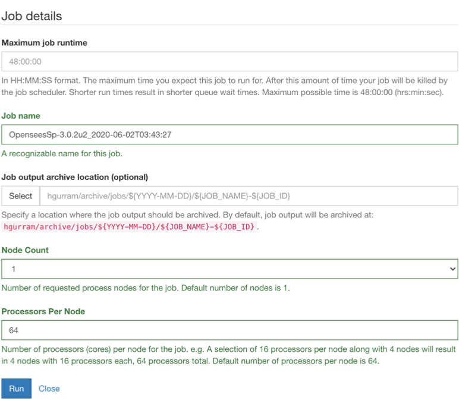

## OpenSees User Guide

The Open System for Earthquake Engineering Simulation ([OpenSees](http://opensees.berkeley.edu/){target="_blank"}) is a software framework for simulating the static and seismic response of structural and geotechnical systems. It has advanced capabilities for modeling and analyzing the nonlinear response of systems using a wide range of material models, elements, and solution algorithms.

One sequential (OpenSees-EXPRESS) and two parallel interpreters (OpenSeesSP and OpenSeesMP) are available on DesignSafe. Please explore the desired interpreter for more details.

<b>OpenSees-EXPRESS</b>

OpenSees-Express provides users with a sequential OpenSees interpreter. It is ideal to run small sequential scripts on DesignSafe resources freeing up your own machine.

<b>OpenSeesSP</b>

OpenSeesSP is an OpenSees interpreter intended for high performance computers for performing finite element simulations of very large models on parallel machines. OpenSeesSP is easy to use even with limited knowledge about parallel computing. It only requires minimal changes to input scripts to make them consistent with the parallel process logic. <!-- up to 12 KNL Nodes on OpenSeesSP runs on  Frontera, with 64 cores per Node-->.

<b>OpenSeesMP</b>

OpenSeesMP is an OpenSees interpreter intended for high performance computers for performing finite element simulations with parameteric studies and very large models on parallel machines. OpenSeesMP requires understanding of parallel processing and the capabilities to write parallel scripts. <!-- OpenSeesMP runs on up to 12 KNL Nodes on Stampede2, with 64 cores per Node. -->

### How to Submit an OpenSees Job in the Workspace { #submit }

1. Select the OpenSees application from the simulation tab in the workspace.

2. Choose the application that is best suited for your work.

	

	

3. Locate your OpenSees input files and TCL script in the Data Depot and follow the onscreen directions to provide your Input Directory and TCL Script in the form.

4. To test out a tutorial case you can copy paste the link in the description for working directory as well as the TCL script name. As shown in the figure below.

	

5. Enter a maximum job runtime in the form. See guidance on form for selecting a runtime.

6. Enter a job name (Optional).

7. Enter an output archive location or use the default provided.

8. Node Count: Number of requested process nodes for the job.

9. Processors per Node: numbers of cores per node for the job. The total number of cores used is equal to <i style="">NodeCount x ProcessorsPerNode</i>.

10. Click Run to submit your job.

	

11. Check the job status by clicking on the arrow in the upper right of the job submission form.

	

### DesignSafe Tutorial: OpenSees &amp; DesignSafe, October 31, 2018 { #tutorial }

  <iframe class="embed-responsive-item"
          src="https://www.youtube.com/embed/upMaiz79h7E"
          frameborder="0"
          allowfullscreen></iframe>

For detailed explanation of slides below, watch the tutorial above.

* [OpenSees-EXPRESS Slides](/media/filer_public/34/e9/34e9dd3c-e954-4a78-9376-e65d1b793277/openseesexpress.pdf){target="_blank"}
* [OpenSeesSP Slides](/media/filer_public/1d/58/1d58638b-6cd4-48a1-b1b8-ce7313986e4e/openseessp.pdf){target="_blank"}
* [OpenSeesMP Slides](/media/filer_public/c4/d6/c4d6aaef-5035-4506-9c4b-256fdaa47d0f/openseesmp.pdf){target="_blank"}

### Additional Resources { #resources }

#### Examples in Community Data { #resources-communitydata }

* OpenSees-EXPRESS:
	* [input directory](https://www.designsafe-ci.org/data/browser/public/designsafe.storage.community//app_examples/opensees/OpenSeesEXPRESS){target="_blank"}
	* input TCL file: freeFieldEffective.tcl
* OpenSeesSP:
	* [input directory](https://www.designsafe-ci.org/data/browser/public/designsafe.storage.community//app_examples/opensees/OpenSeesSP){target="_blank"}
	* input TCL file: RigidFrame3D.tcl
	* resources: 1 Node, 2 Processors  
* OpenSeesMP:
	* [input directory](https://www.designsafe-ci.org/data/browser/public/designsafe.storage.community//app_examples/opensees/OpenSeesMP){target="_blank"}
	* input TCL file: parallel_motion.tcl
	* resources: 1 Node, 3 Processors

#### Powerpoint Presentations { #resources-ppt }

* [OpenSees-EXPRESS](/media/filer_public/34/e9/34e9dd3c-e954-4a78-9376-e65d1b793277/openseesexpress.pdf){target="_blank"}
* [OpenSees SP](/media/filer_public/1d/58/1d58638b-6cd4-48a1-b1b8-ce7313986e4e/openseessp.pdf){target="_blank"}
* [OpenSees MP](/media/filer_public/c4/d6/c4d6aaef-5035-4506-9c4b-256fdaa47d0f/openseesmp.pdf){target="_blank"}

