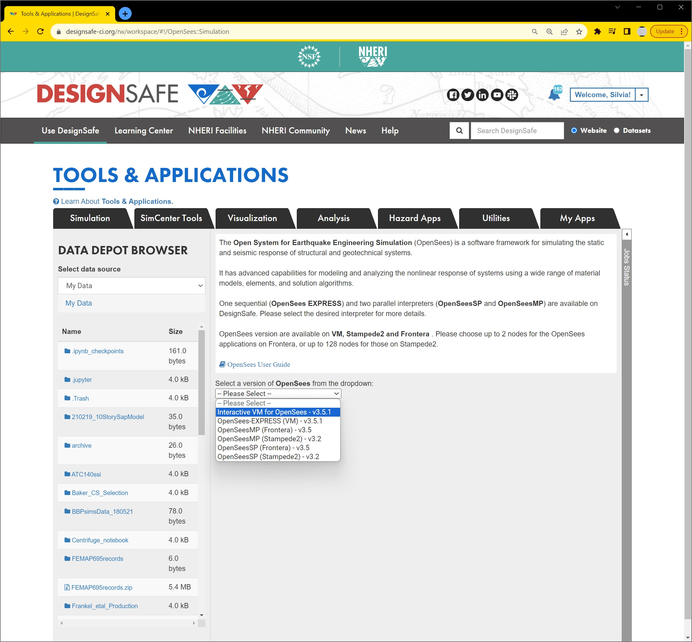

### The Interactive Virtual Machine (Interactive-VM)

 The Interactive Virtual Machine is a new platform intended to help you in the early stages of building your OpenSees Model by providing you direct interactivity with OpenSees for both Sequential and Parallel applications for immediate feedback for each line of input.

This NEW dedicated VM has been built for OpenSees. All OpenSees applications (OpenSees, OpenSeesSP, OpenSeesMP, and OpenSeesPy) have been pre-installed and can be run interactively in a user-friendly environment with an integrated terminal window, file editor, and file-tree navigation. This VM has limited shared resources and is intended for building and testing your OpenSees script.

Interactivity allows you to monitor the analysis in real time. The workspace, with its multiple tabs, allows you to run your OpenSees in one tab while editing a file in another. Direct interaction to OpenSees via a <b>Linux terminal</b> allows you to check your model as you develop it, as you have immediate access to warning, errors, or echoed data.

#### Connecting to the Interactive-VM

The Interactive-VM is found on DesignSafe in the same Web Portal as OpenSees: [Tools & Applications > Simulation > OpenSees](https://www.designsafe-ci.org/use-designsafe/tools-applications/simulation/opensees/).
<ol>
    <li>Once you have reached the OpenSees page, select the first option in the portal's OpenSees-Application menu: "Interactive VM for OpenSees...": option with the latest version of OpenSees.<i>(Figure 1)</i></li>
    <li>Once you have made the selection, the following simple form will appear. There is no need to edit the Job name. <i>(Figure 2)</i></li>
    <li>Click the Launch button and WAIT a few seconds for the job to be set up and a new window pops up <i>(Figure 3)</i></li>
    <li>Click the Connect button and a you will be redirected to the Interactive-VM Environment  <i>(Figure 4, see the next section)</i></li>
    <li>Go back to the original tab and press the Close button <i>(Figure 3)</i></li>
    <li>You can go through this process again to re-connect to the VM. If the original VM has not been terminated, you will be placed in the same workspace you had left.</li>
</ol>

<small><i><b>Figure 1</b>: Select Interactive-VM</i> </small>
{ width=75% , align=center}  
<small><i><b>Figure 2</b>: Web Form for Interactive-VM</i> </small>
{ width=75% , align=center}  
<small><i><b>Figure 3</b>: Connect to Interactive-VM</i> </small>
{ width=75% , align=center} 

#### The Interactive-VM Environment & Workflow

Once you have started your instance of the OpenSees VM, you will be redirected to the Jupyter-Lab Launcher environment in your browser. Here you can interact with your data as well as your analysis processes.
Here are the step necessary to run OpenSees in the Interactive-VM <i>(Figure 4)</i>:
<ol style="margin-top:-3px;">
    <li><b>Navigate</b>: Navigate within the DataDepot to your working/current directory where your main script is, or will be, found. The path in the navigation window defines the working path for any process you start while there.</li>
    <li><b>Upload Files</b>: Upload files from your local machine to the current directory.</li>
    <li><b>File Editor</b>: Double-click on a file in the Navigation space to edit it in the basic editor in a new tab.</li>
    <li><b>Run OpenSees</b>:
        <ul>
            <li style="list-style:none;"><b>a.</b> Run OpenSees in the <b>Linux Terminal</b>: this is where you run OpenSees, OpenSeesSP, OpenSeesMP, or OpenSeesPy. (See section on Running OpenSees at the Linux Terminal)</li>
            <li style="list-style:none;"><b>b.</b> Run OpenSeesPy in a <b>Jupyter Notebook</b>: Jupyter Notebooks allow you to develop interactive workflows with integrated widgets and graphics. </li>
            <li style="list-style:none;"><b>c.</b> Interactive <b>Python Console</b>: Run OpenSeesPy interactively without the weight of additional graphics capabilities.</li>
        </ul>
    </li>
    <li><b>Post-Process</b>: You can use the Jupyter Notebook to process and visualize your analysis results.</li>
</ol>

<small><i><b>Figure 4</b>: Interactive-VM Environment</i> </small>
{ width=75% , align=center} 

