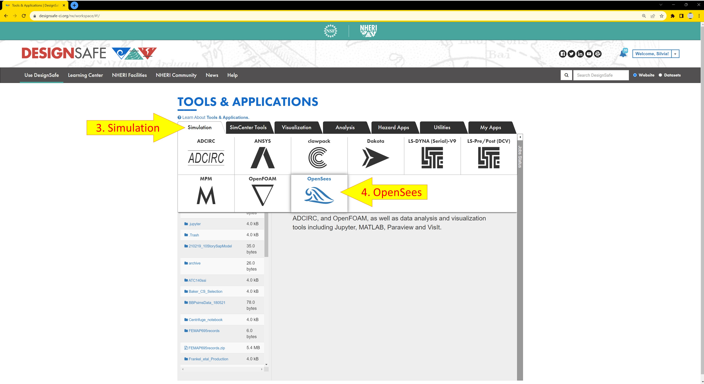
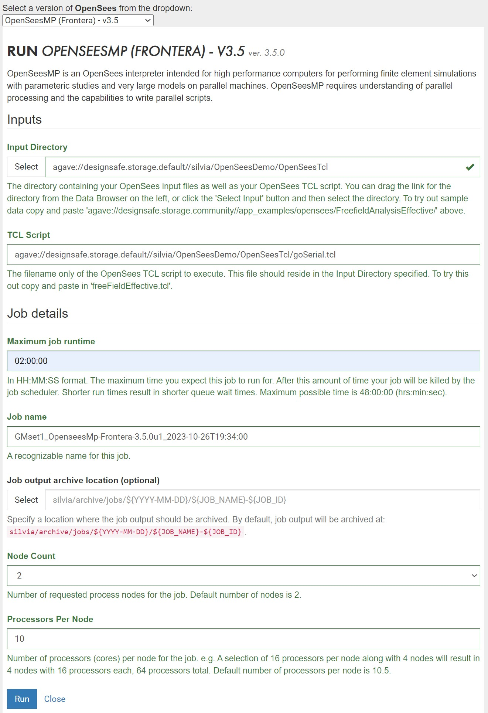
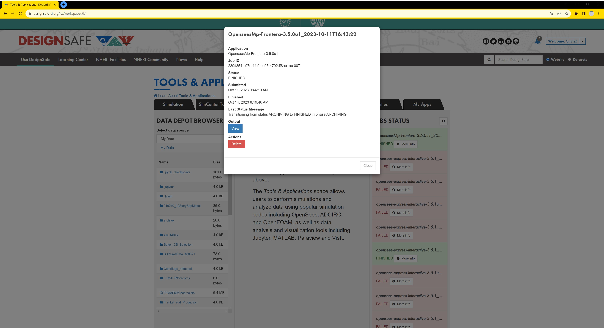

## Running OpenSees via DesignSafe Web Portal

Submitting your OpenSees Job to the HPC system via DesignSafe's WebPortal allows you to scale up your project easily through a simple web-form submittal. The Web Portal provides two access points, one for sequential analyses, one for parallel ones:
    <ul>
        <li><b>OpenSees Express VM</b> provides a faster user experience than the Interactive-VM once your input script has been tested and runs with no errors. OpenSees-Express also runs on a different dedicated virtual machine which has the specifications as the interactive-VM: a shared 24-core 48 GB node (=virtual computer). </li>
        <li><b>OpenSeesSP and OpenSeesMP</b> jobs are submitted to the small 2-node partition in the HPC system. The significant upgrade to more Nodes (2), processors/node (56), memory/node (192GB) and not having to share these resources is worth the extra scripting required and the wait in the queue. 
        <i> Save time by testing your parallel-analyses algorithm in the <b>Interactive-VM</b>. It has limited resources, but you receive immediate feedback on errors so you can iterate quickly to fix them.</i></li>

    </ul>

 Being able to submit multiple jobs simultaneously via the simple web form makes the <b>DesignSafe Web Portal</b> the ideal solution for most projects (<i>see below for user limits on multiple jobs</i>). The only significant drawback is the fact that you do not have access to the results until the analysis is finished. Wait times in the queue can seem an inconvience, but the ability to run many analysis in parallel effectively reduces the total job time.

## File Management when running the Web-Portal Jobs

Job submission via the Web Portal is easy and efficient because it only requires you to fill out a web form and press the run button. All the keyboarding work from that point on is done for you via automation. Understanding what is happening behind the courtain will help you plan your script and data management.

Because file I/O is fastest closest to the CPU, the input directory you specify in your job-submittal form gets cloned to the compute node that will run OpenSees. During the OpenSees run all the output and recorder files you defined in your input script will be written in that location. Once the OpenSees job is finished, the entire folder that was cloned, with the additional output files, will be moved to the output folder you specify in your job-submittal form. 

A few important notes about the file management:
    <ol>
        <li>You will not have access to the analysis data until the job is complete.</li>
        <li>ALL the files found in the input directory will be cloned and placed into the output directory</li>
        <li>The files will not be returned to their original location your input directory</li>
        <li>If you specify the same directory for your input and output, the output will be placed in a subdirectory of your input directory, using the same files structure</li>
        <li>Copying files into your output directory will overwrite existing data. This will be an issue, for example, when you specify the same directory for your input and output, and run multiple jobs with these same directories</li>
        <li>Using the default directory structure, where files are placed into your archive folder and the directory name includes the job metadata, is the best way to maintain data integrity</li>
        <li>If you can make changes to your input script and directory after job submittal, remember that the original ones have been cloned in the first step</li>
        <li>ALL files necessary for your OpenSees run must be located within the input directory</li>
        <li>To avoid having to manage a lot of data, make sure your input directory contains only relevant files</li>
        <li>Do not forget to copy the relevant files back into your working directory</li>
    </ol>

### Using the DesignSafe WebPortal

Before starting your project, make sure you read the File-Management section as it will help you plan your file and data structure

Follow these steps to run your OpenSees job via the WebPortal:
    <ol style="margin-top:-20px;">
        <li>Import script and all input files to DataDepot </li>
        <li>Navigate to the Web Portal
            <ul>https://www.designsafe-ci.org/</ul>
            <ul>log in or create an account in DesignSafe</ul>
            <ul>Use DesignSafe >> Tools & Applications >> Simulation >> OpenSees <i>(Figure 1)</i></ul>
        </li>
        <li>Select OpenSees Application <i>(Figure 2)</i>:
            <ol>
                <li>OpenSees-Express: Sequential Application</li>
                <li>OpenSees-MP and OpenSeesSP: Parallel Applications</li>
                <li>If more than one option, use the one with the newest version of OpenSees</li>
            </ol>
        </li>
        <li>Fill out Web Form <i>(OpenSees-Express: Figure 3 and OpenSeesMP: Figure 4)</i> 
            <small><i>Each input parameter is explained in detail in a separate section</i></small>
            <ul>
                <li>Specify input directory <i>(read section on File Management)</i></li>
                <li>Specify main input script</li>
                <li>Decide maximum run time -- job gets killed at this runtime</li>
                <li>Specify output directory <i>(read section on File Management)</i></li>
                <li>Name your job -- add a unique identifier to the metadata-rich default name, especially if you are running multiple jobs</li>
                <li>If using a parallel application, select number of nodes and processors</li>
            </ul>
        </li>
        <li>Click Run to submit job</li>
        <li>Pause for a second for the system to receive the request.</li>
        <li>Check Job Status in the Job-Status sidebar, click the refresh button if needed. Note: this information is limited to where the job is in the process, from submitted to finished <i>(Figure 5)</i></li>
        <li>Once the job is Finished, click the "More info" button in the Jobs Status bar for more details on the job </li>
        <li>If the job Finished successfully, click "View" the output <i>(Figure 6)</i> 
            The system takes you to the DesignSafe Data Depot, in the output folder you had specified in the input form <i>(Figure 7)</i>
            <ol>
                <li style="list-style:none;"><b>A.</b> Open the ".err" file for details on analysis run. Scroll to different parts of this file to check all key parts of the job: <i>(see the very-busy Figure 8)</i>, or <a href="./PostWebSubmitImages/CheckErrFile.jpg" target="_blank">Click here for full-page view of it</a>
                    <ol type="i">
                        <li>The top lines provide details on the job. These may be useful if there are issues in loading the project</li>
                        <li>Scroll to start of OpenSees, check:
                            <ul>
                                <li>No errors in start up of OpenSees</li>
                                <li>Program echoes what you requested. <i>Remember: echoing too much data, especially at each time step, will slow your analyses significantly. Do it when debugging your model!</i></li>
                            </ul>
                        </li>
                        <li>Scroll carefully through all the analysis output to check for Warnings & Errors</li>
                        <li>Scroll to the end to check if your “All Done!” has been echoed by all processes</li>
                        <li>Confirm that there are no termination error at the end of the script</li>
                    </ol>
                </li>
                <li style="list-style:none;"><b>B.</b> Examine the Output and Recorder files to make sure you have all the output you need and expect <i>(Figure 9)</i></li>
            </ol>
        </li>
        <li>Move relevant output files from Archive into final DataDepot location: .err file and all recorder files</li>
        <li>Post-process</li>
    </ol>

<small><i><b>Figure 1</b>: Navigate to OpenSees</i> </small>
{ width=75% , align=center}  

<small><i><b>Figure 2</b>: Select OpenSees Application</i> </small>
{ width=75% , align=center}  

<small><i><b>Figure 3</b>: Sample Form for OpenSees-Express</i> </small>
{ width=75% , align=center}  
<small><i><b>Figure 4</b>: Sample Form for OpenSeesMP</i> </small>
{ width=75% , align=center}  

<small><i><b>Figure 5</b>: Checking Job Status</i> </small>
{ width=75% , align=center}  

<small><i><b>Figure 6</b>: Job-Status Window</i> </small>
{ width=75% , align=center}  

<small><i><b>Figure 7</b>: .err Echo File</i> </small>
{ width=75% , align=center}  

<small><i><b>Figure 8</b>: Checking the .err file after job is Finished</i> </small>
{ width=75% , align=center}  

<small><i><b>Figure 9</b>: Check Output Files</i> </small>
{ width=75% , align=center}  

