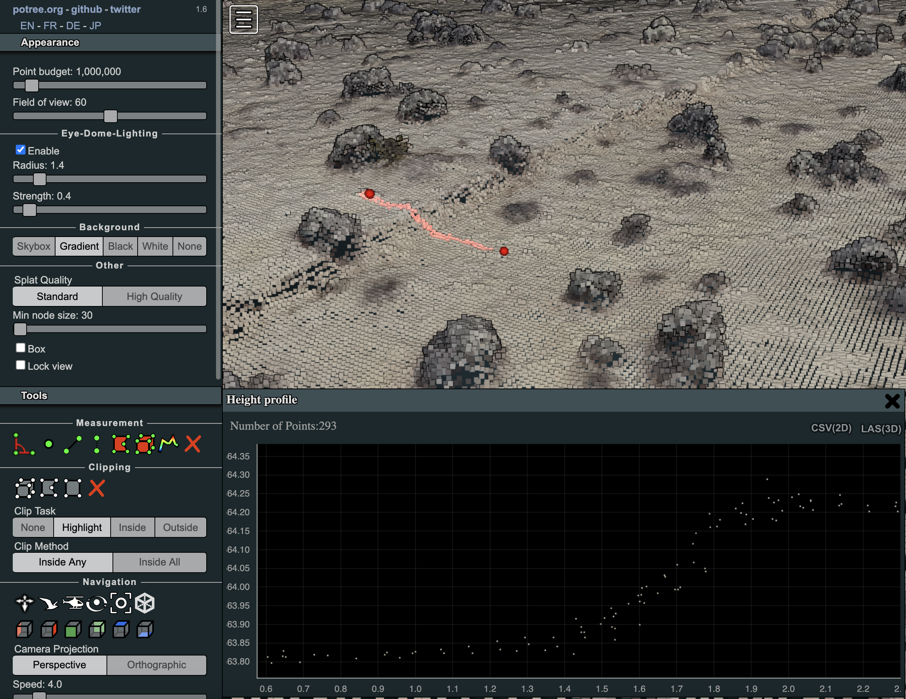
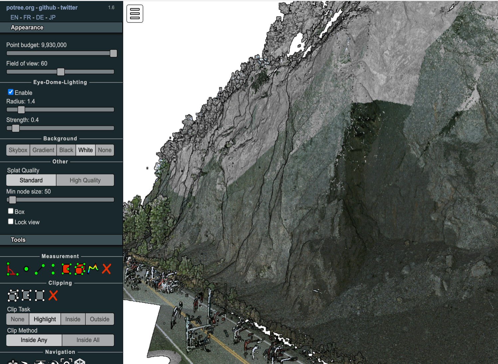

## Potree Viewer User Guide

Potree Viewer is a point cloud viewer that enables exploration and measurement of very large LiDAR datasets and is designed to be efficient in a web browser. Use the Potree Converter to first convert your point cloud data to a format compatible with the Potree Viewer.

### How to Start a Potree Interactive Session in the Workspace { #submit }

<ul>
<li>Select the Potree Viewer application from the Visualization tab in the Workspace.</li>
<li>Locate the folder containing your data files in the Data Depot and follow the onscreen directions to enter this folder into the form.</li>
<li>Enter a maximum job runtime in the form. While this field is required in the form it is not actually used, simply enter any time using the time format shown.</li>
<li>Enter a job name.</li>
<li>Enter an output archive location or use the default provided.</li>
<li>Click Run to start your interactive session.</li>
</ul>

### General Potree Viewing Instructions { #viewing }

You can upload the data, run the Potree converter and then create a Potree Viewer website where you can view the data in your web browser (Best with Chrome). Here are some examples you can explore:

(1) RidgeCrest Earthquake Fault Rupture - (DOI: <a data-ng-href="https://doi.org/10.17603/ds2-wfgc-a575" href="https://doi.org/10.17603/ds2-wfgc-a575">https://doi.org/10.17603/ds2-wfgc-a575</a>)

<a href="https://agave.designsafe-ci.org/geo/v2/assets/72/961e37b1-a0ac-47b9-9161-b977c0eb92e5/index.html">https://agave.designsafe-ci.org/geo/v2/assets/72/961e37b1-a0ac-47b9-9161-b977c0eb92e5/index.html</a>

<a href="https://agave.designsafe-ci.org/geo/v2/assets/72/077e6d23-930b-4b20-9c04-f7c92503f751/index.html">https://agave.designsafe-ci.org/geo/v2/assets/72/077e6d23-930b-4b20-9c04-f7c92503f751/index.html</a>

(2) Alaska Anchorage Rockslope - (DOI: <a data-ng-href="https://doi.org/10.17603/ds2-jmfv-9171" href="https://doi.org/10.17603/ds2-jmfv-9171">https://doi.org/10.17603/ds2-jmfv-9171</a>)

<a href="https://agave.designsafe-ci.org/geo/v2/assets/104/cfc136e1-e91c-40d2-8d8e-c010da0f9656/index.html">https://agave.designsafe-ci.org/geo/v2/assets/104/cfc136e1-e91c-40d2-8d8e-c010da0f9656/index.html</a>

(3) SfM Point Cloud (University of Washington Campus):

<a href="https://agave.designsafe-ci.org/geo/v2/assets/80/8f4c3c75-a0b0-44f1-a858-e1949802cf6e/index.html">https://agave.designsafe-ci.org/geo/v2/assets/80/8f4c3c75-a0b0-44f1-a858-e1949802cf6e/index.html</a>

Note for best viewing, be sure to turn on eye dome lighting in the appearance tab and increase the point budget. You can also change the coloring of point clouds by clicking on index under object which will bring various coloring objects under attribute menu. For instance, you can select "Elevation" and set the minimum and maximum range for a coloring scheme. 

<strong>Potree Point Cloud Cross-section Tutorial</strong>

Note that the locations of the tools and options will vary somewhat in different version of potree, but the process is similar. The current version of potree Viewer in DesignSafe is 1.6. The figure below shows examples of tools in version 1.6.

To view data in potree, the following mouse movements are used to navigate the scene. 

<ul>
<li><i>Double Click</i>- sets center of rotation and zooms into that point.</li>
<li><i>Left Click</i>, hold and move mouse, rotates the view</li>
<li><i>Middle Scroll Wheel</i> – Zooms in and out</li>
<li><i>Right Click</i>, hold and move mouse pans in the scene</li>
</ul>

Potree enables you to extract cross sections of the data. To extract those cross sections, do the following:

<ul>
<li>Click on the <b>menu button</b> (3 horizontal lines) in the upper left-hand corner of the view window.</li>
<li>Scroll down to the "<b>Tools</b>" bar and click.</li>
<li>Select the tool icon that looks like a <b>multicolored M</b>.</li>
<li>When you mouse over the point cloud data, you should now see a red ball attached to your mouse cursor. This allows you to drop nodes and establish the location of your profile.</li>
<li>When you want to finalize your profile <b>double click</b> on the last node. Once a profile is finalized, you can still change its location by clicking on the red nodes and dragging them to a different location.</li>
</ul>

<ul>
<li>Now, return to the side menu and click on the "<b>Measurements</b>" bar. You should see a Profile item with coordinates listed. Click the "<b>show 2D profile</b>" button. This is also where you can delete profiles by clicking the red X.</li>
<li>A profile of the lidar data should now be visible at the bottom of the screen. The profile will also update in real time if you move the profile throughout the data.</li>
<li>The save button in the upper right corner of the profile window will download a las file containing the points from the profile. This is useful for extracting the data you want to use for further analysis. </li>
</ul>
