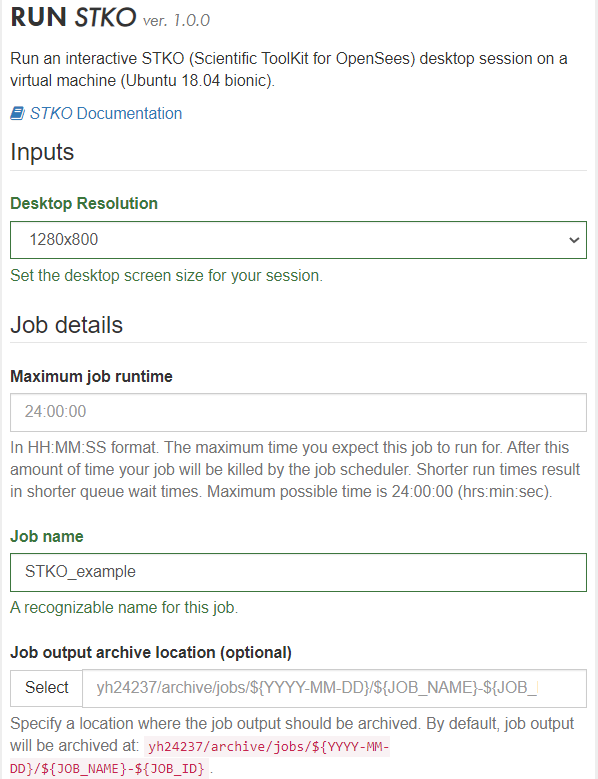
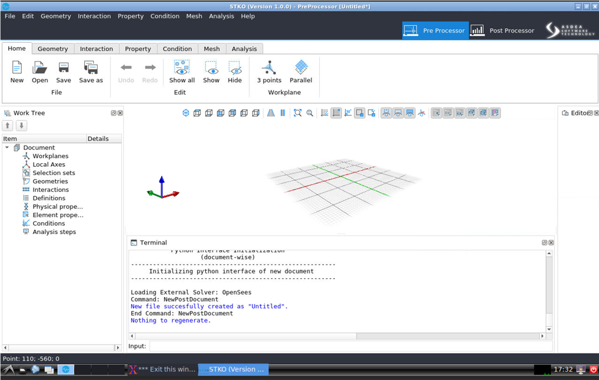
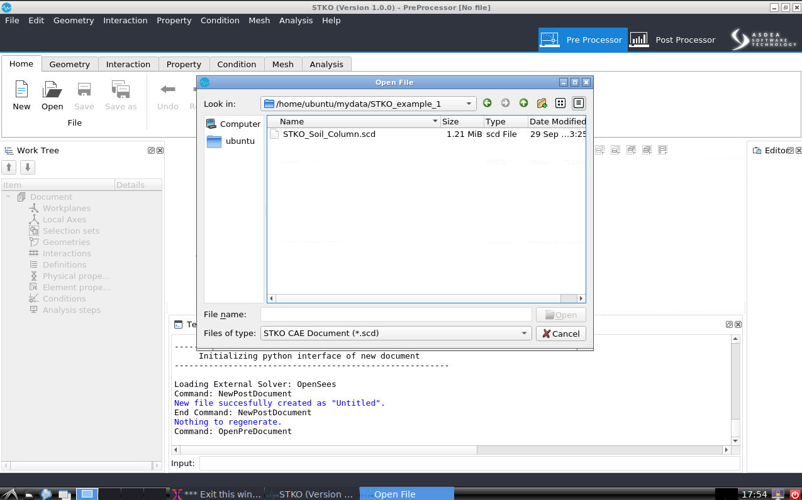
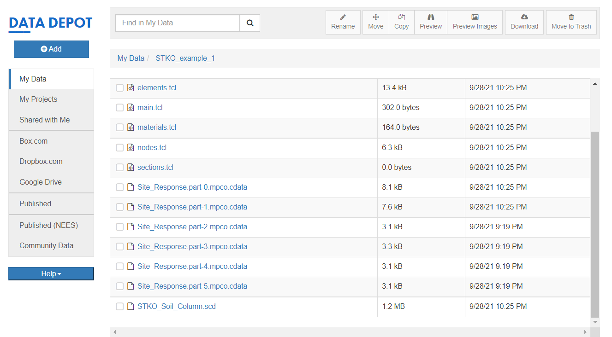
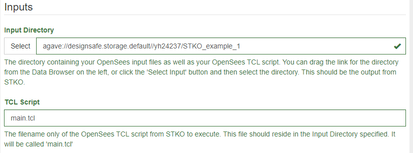
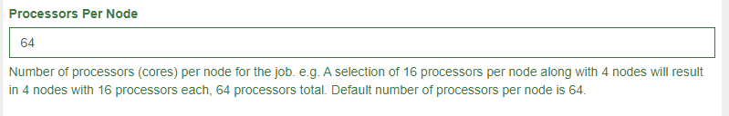
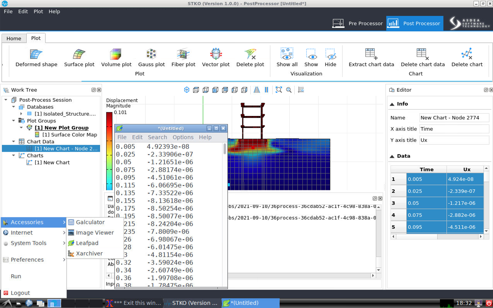

## STKO User Guide



<!--
The Scientific ToolKit for OpenSees (STKO) is a data visualization tool for OpenSees, it creates an input (Tool Command Language, TCL) and output file, which can be read with its advanced graphic interface. The preprocessor features advanced CAD modeling tools and provides a comprehensive set of meshing algorithms. This application runs as an interactive STKO Desktop session on a virtual machine using VNC technology.

More detailed information and STKO user documentation can be found on the <a href="http://www.asdeasoft.net/stko?product-stko" target="_blank">http://www.asdeasoft.net/stko?product-stko</a>

1. You will have to fill out a form to submit your job that asks for three pieces of information.

	1. Desktop Resolution: The desktop screen size for your STKO Desktop session.
	2. Maximum Job Runtimes: The maximum time user expect to use STKO Desktop session.
	3. Job Name: Enter a recognizable job name.
	
		

2. Once the form is filled, user can select “Run” to use STKO on a virtual machine. 
3. By clicking on “Connect!”, a new tab will be opened that comprises STKO interactive session (see figure below).
	
	

4. User should save their STKO files (e.g., mpco and mpco.cdata files) in their own folder under “mydata” folder when using a virtual machine. Note that the user can also check (or upload and download) these files via DATA DEPOT on DesignSafe.

	

	

### Run OpenSees-STKO on DesignSafe { #run }

1. After users create their Tcl scripts and mpco.cdata files in their folder (e.g., “STKO_example_1” in this example). Users can submit the OpenSees Job via [OPENSEESMP](https://www.designsafe-ci.org/workspace/opensees-mp-s3){target="_blank"} (V 3.0)-STKO.

2. The input directory should contain OpenSees TCL script and mpco.cdata files. The filename is the OpenSees TCL script from STKO to execute. This file should reside in the input directory specified. If user use STKO to generate all the scripts, the default filename will be called 'main.tcl'.

	

3. If users do partition mesh in STKO, users can use OpenSeesMP to speed up their analysis. The number of processors should be equal to the number of partitions in users’ STKO models. More detailed information and OpenSeesMP user documentation can be found on: <a href="https://www.designsafe-ci.org/media/filer_public/c4/d6/c4d6aaef-5035-4506-9c4b-256fdaa47d0f/openseesmp.pdf">https://www.designsafe-ci.org/media/filer_public/c4/d6/c4d6aaef-5035-4506-9c4b-256fdaa47d0f/openseesmp.pdf</a>

	

4. Click Run to submit your job.

5. After the analysis is finished, the user can use an interactive STKO Desktop session to post-process and visualize the results.

	
-->