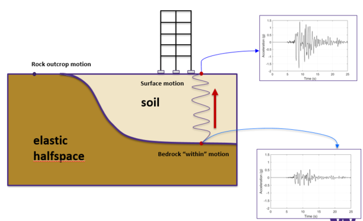

/// html | header

## OpenSees Model Calibration

From Constitutive Parameter Calibration to Site Response Analysis

///

**Pedro Arduino - University of Washington**   
**Sang-Ri Yi - SimCenter, UC Berkeley**   
**Aakash Bangalore Satish - SimCenter, UC Berkeley**

*Key Words: quoFEM, OpenSees, Tapis, Python*

A collection of educational notebooks to introduce model-parameter calibration and site response analysis using OpenSees in DesignSafe-CI.

### Resources
 
#### Jupyter Notebooks
The following Jupyter notebooks are made available to facilitate the analysis of each case. They are described in detail in this section. You can access and run them directly on DesignSafe by clicking on the "Open in DesignSafe" button.

| Site Response | Notebook |
| :-------: | :---------:  |
| FreeField Response | freeFieldJupyterPM4Sand_Community.ipynb    |

---

| quoFEM | Notebook |
| :-------: | :---------:  |
| Sensitivity analysis     | quoFEM-Sensitivity.ipynb   |
| Bayessian calibration     | quoFEM-Bayesian.ipynb   |
| Forward propagation  | quoFEM-Propagation.ipynb   |

#### DesignSafe Resources
The following DesignSafe resources were used in developing this use case.

* [DesignSafe - Jupyter notebooks on DS Juypterhub](https://www.designsafe-ci.org/use-designsafe/tools-applications/analysis/jupyter/)
* [SimCenter - quoFEM](https://www.designsafe-ci.org/use-designsafe/tools-applications/simulation/quofem/)
* [Simulation on DesignSafe - OpenSees](https://www.designsafe-ci.org/use-designsafe/tools-applications/simulation/opensees/)

### Background

#### Citation and Licensing
* Please cite [Aakash B. Satish et al. (2022)](https://doi.org/10.1007/978-3-031-11898-2_152){:target="_blank"}  to acknowledge the use of resources from this use case.

* Please cite [Sang-Ri Yi et al. (2022)](https://doi.org/10.1007/978-3-031-30125-4_6){:target="_blank"}  to acknowledge the use of resources from this use case.

* Please cite [Chen, L. et al. (2021)](https://peer.berkeley.edu/sites/default/files/2021_chen_final.pdf){:target="_blank"}  to acknowledge the use of resources from this use case.

* Please cite [Rathje et al. (2017)](https://doi.org/10.1061/(ASCE)NH.1527-6996.0000246){:target="_blank"}  to acknowledge the use of DesignSafe resources.

* This software is distributed under the [GNU General Public License](https://www.gnu.org/licenses/gpl-3.0.html){:target="_blank"}.

### Description

Seismic site response refers to the way the ground responds to seismic waves during an earthquake. This response can vary based on the soil and rock properties of the site, as well as the characteristics of the earthquake itself.

Site response analysis for liquefiable soils is fundamental in the estimation of demands on civil infrastructure including buildings and lifelines. For this purpose, current state of the art in numerical methods in geotechnical engineering require the use of advance constitutive models and fully couple nonlinear finite element (FEM) tools. Advanced constitutive models require calibration of material parameters based on experimental tests. These parameters include uncertainties that in turn propagate to uncertenties in the estimation of demands. The products included in this use-case provide simple examples showing how to achieve site response analysis including parameter identification and uncertainty quantification using SimCenter tools and the DesignSafe cyber infrastructure.

 Fig.1 - Site response problem 

### Implementation

This use-case introduces a suite of Jupyter Notebooks published in DesignSafe that navigate the process of  constitutive model parameter calibration and site response analysis for a simple liquefaction case. They also introduce methods useful when using DesignSafe infrastructure in TACC. All notebooks leverage existing SimCenter backend functionality (e.g. Dakota, OpenSees, etc) implemented in quoFEM and run locally and in TACC through DesignSafe. The following two pages address these aspects, including:

1. [**Site response workflow notebook**](./usecase_siteResponse.md): This notebook introduces typical steps used a seismic site response analysis workflow taking advantage of Jupyter, OpenSees, and DesignSafe-CI.

2. [**quoFEM Notebooks**](./usecase_quoFEM.md): These notebooks provide an introduction to uncertainty quantification (UQ) methods using *quoFEM* to address sensitivity, Bayesian calibration, and forward propagation specifically in the context of seismic site response. Three different analysis are discussed including:

    a. **Global sensitivity analysis** This notebook provides insight into which model parameters are critical for estimating triggering of liquefaction.

    b. **Parameter calibration notebook**: This  notebook is customized for the PM4Sand model and presents the estimation of its main parameters that best fit experimental data as well as their uncertainty.

    c. **Propagation of parameter undertainty in site response analysis notebook**: This notebook introduces methods to propagate material parameter uncertainties in site reponse analysis.

