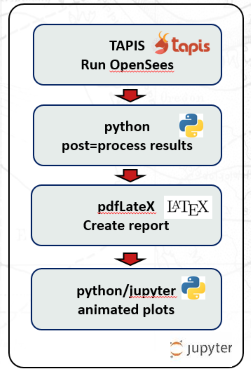
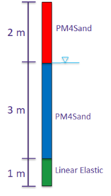
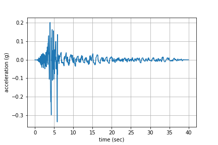
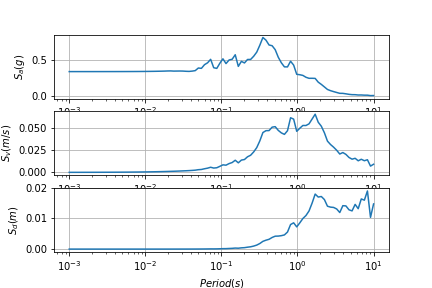
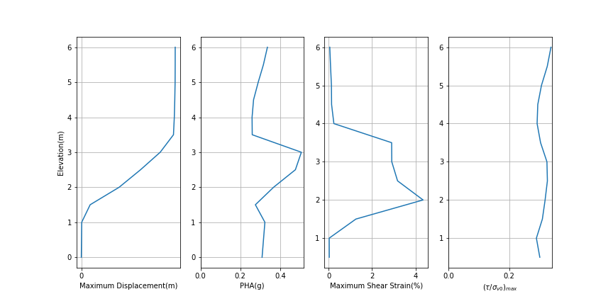
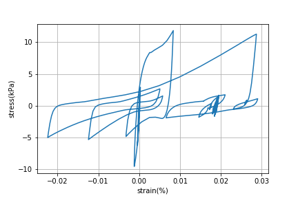
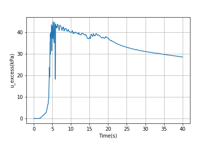
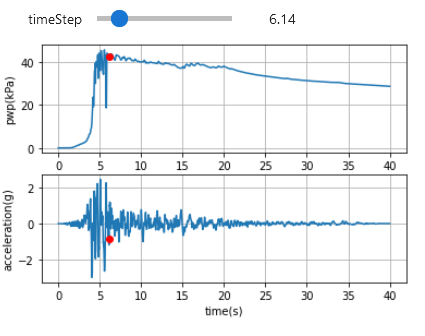
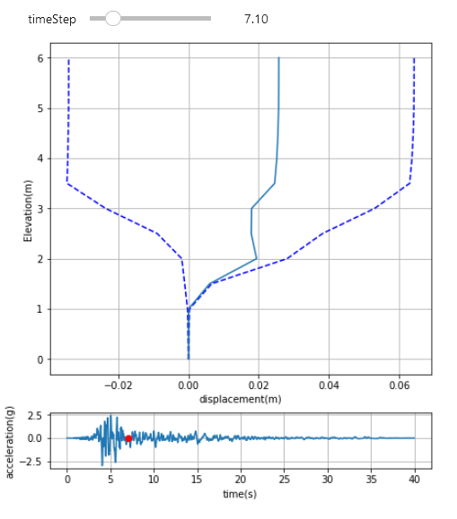

# Performing site response analysis in Jupyter

#### Simple jupyter notebook to introduce site response analysis using OpenSees in DesignSafe-CI. 

**Pedro Arduino - University of Washington**

## Resources

This example makes use of the following DesignSafe resources:

[](https://jupyter.designsafe-ci.org/hub/user-redirect/lab/tree/CommunityData/Jupyter%20Notebooks%20for%20Civil%20Engineering%20Courses/University_of_Washington/freeFieldJupyterPM4Sand/freeFieldJupyterPM4Sand_Community.ipynb)

The notebook, and required scripts, are available in the Community Data folder and can be executed without any modification. Users are invited to try this notebook and use any parts of it.

## Description

The *site response workflow notebook* introduces typical steps used in the evaluation of the surface response for a site with liquefiable soil.
The notebook takes advantage of the site response problem to introduce the general numerical analysis workflow shown in Figure 2 that includes: 

1. running OpenSees using a **TAPIS** APP,
2. postprocessing results using python,
3. generating authomatic reports using rst2pdf or latex, and
4. Creating animated plots using visualization widgets.


<p style="text-align: center;"> Fig.2 - OpenSees numerical simulation workflow </p>

The soil profile shown in Figure 3 includes a 5.0m loose sand underlain by a 1.0 m dense soil.The loose sand is modeled using the PM4Sand constitutive model for liquefiable soils available in OpenSees. The dense sand is considered linear elastic. The groundwter table is assumed at 2.0 m making the lower 3.0 m of the loose sand susceptible to liquefaction. The soil profile is subject to a dynamic excitation at its base. The site response of interest includes (i) the surface acceleration, (ii) profiles of lateral displacement, horizontal acceleration, maximum shear strain, and cyclic stress ratio and (iii) stress strain and pore pressure plots for a point in the middle of the soil profile.  The opensees model definition, analysis steps, and recorders are contained in the [N10_T3.tcl](files/N10_T3.tcl) file, and the input signal is in [velocity.input](files/velocity.input). The model can be run using OpenSees in any OS framework.


<p style="text-align: center;"> Fig.3 - N10_T3 soil profile with liquefiable layer </p>


## Implementation

The notebook can be broken down into four main components:

<ol type="a">
  <li>Setup TAPIS/AGAVE APP and run OpenSees job</li>
  <li>Post process results</li>
  <li>Generate report</li>
  <li>Generate interactive plots</li>
</ol>

It is emphasize that the main motivation of this notebook is to take advantage of DesignSafe resources. 
Therefore, relevant details for each component as it pertains to access to DesignSafe-CI resources are described here.

### Setup tapis/agave app and run OpenSees job

The notebook can be executed launching *Jupyter Lab* in Designsafe. This opens a user *docker container* in DesignSafe that includes all the functionality required to execute jupyter commands. This gives immediate access to the **agavepy** module from which it is possible to run any **TAPIS** APP. 

#### Setup job description

A few commands are required to setup a TAPIS OpenSees job in DesignSafe. This requires definition of the TAPIS APP to use, control variables, parameters and inputs. The control variables define the infrastructre resources requested to TACC. The parameters define the executable (opensees), version (current), and opensees input file to run. For the site response case the *OpenseesSp-3.3.0u1* app is selected. The main steps required to setup an agave job are: 


1. importing agave/tapis, 
2. getting the specific app of interest,
3. defining control variables, parameters and inputs, and
4. encapsulating all data in a job_description array 

The python code shown below exemplifies these steps. The complete set of commands is available in the notebook. The job_description array includes all the information required to submit the job.

```python
# Import Agave
from agavepy.agave import Agave
ag = Agave.restore()

# Get Agave app of interest
app_id = 'OpenseesSp-3.3.0u1'
app = ag.apps.get(appId=app_id)

# Define control tapis-app variables
control_batchQueue       = 'small'
control_jobname          = 'Jup_OP_Tapis'
control_nodenumber       = '1'
control_processorsnumber = '8'
control_memorypernode    = '1'
control_maxRunTime       = '00:1:00'

# Define inputs
# Identify folder with input file in DesignSafe
cur_dir = os.getcwd()
if ('jupyter/MyData' in cur_dir ):
    cur_dir = cur_dir.split('MyData').pop() 
    storage_id = 'designsafe.storage.default'
    input_dir = ag.profiles.get()['username']+ cur_dir
    input_uri = 'agave://{}/{}'.format(storage_id,input_dir)
    input_uri = input_uri.replace(" ","%20")
...
...
inputs = {"inputDirectory": [ input_uri ]}

# Define parameters
parameter_executable      = 'opensees'
parameter_version         = 'current'
input_filename            = 'N10_T3.tcl'
parameters = {}
parameters["executable"]  = parameter_executable
parameters["version"]     = parameter_version
parameters["inputScript"] = input_filename


# Set job_description array
job_description = {}
job_description["appId"]      = (app_id)
...
job_description["inputs"]     = inputs
job_description["parameters"] = parameters
```

#### Run OpenSees Job

Submitting a job using DesignSafe HPC resources requires the use of agave job.submit(); and passing the job_description array as argument. Checking the status of a job can be done using jobs.getStatus(). The python code shown below exemplifies these commands.  When submitting a job, agave copies all the files present in the input folder to a temporary location that is used during execution. After completion agave copies all the results to an archived folder. 

```python
import time
job = ag.jobs.submit(body=job_description)
print(" Job launched. Status provided below")
print(" Can also check in DedignSafe portal under - Workspace > Tools & Application > Job Status")

status = ag.jobs.getStatus(jobId=job["id"])["status"]
while status != "FINISHED":
    status = ag.jobs.getStatus(jobId=job["id"])["status"]
    print(f"Status: {status}")
    time.sleep(60)
```    

### Postprocess Results

Postprocessing requires identification of the location of the archived files. This is done interrogating a particular agave job and evaluating the correct folder location. The python code lines shown below exemplifly the steps required for this purpose. 

#### Identify job, archived location and user

``` python
jobinfo = ag.jobs.get(jobId=job.id)
jobinfo.archivePath
user = jobinfo.archivePath.split('/', 1)[0]

import os
%cd ..
cur_dir_name = cur_dir.split('/').pop() 
os.chdir(jobinfo.archivePath.replace(user,'/home/jupyter/MyData'))
if not os.path.exists(cur_dir_name):
    os.makedirs(cur_dir_name)
os.chdir(cur_dir_name)    
```
#### Plot Results

Once in the archived folder (cur_dir_name), postprocessing can be done using python scripts that operate on output files. For the particualar case of the site response analysis used in this notebook three scripts are used to evaluate:
1. surface acceleration time history and its response spectrum, 
2. profiles of maximum displacement, peak horizontal acceleration (PHA), peak shear strain, and cyclic stress ratio, and
3. Stress-strain and excess pore water pressure at the middle of the liquefiable layer.  

The python code and figures shown below exemplify these steps. All python scripts are available in the notebook community folder. 

Plot acceleration time hisotory and response spectra on log-linear scale
``` python
from plotAcc import plot_acc
plot_acc()
```



<p style="text-align: center;"> Fig.4 - Surface acceleratio and response spectrum </p>


Plot profiles
``` python
from plotProfile import plot_profile
plot_profile()
```


<p style="text-align: center;"> Fig.5 - Profiles of max displacement, PHA, Max shear strain and cyclic stress ratio </p>


Plot excess pore water pressure
``` python
from plotPorepressure import plot_porepressure
plot_porepressure()
```



<p style="text-align: center;"> Fig.6 - stress strain and pore pressure in the middle of liquefiable layer </p>


#### Generate report 

Generating a summary report is a convenient way to present results from lengthy simulations prcesses. In jupyter this can be done invoking any posprocessor available in the docker container image. Among them rst2pdf is commonly distributed with python. For the site response notebook a simple ShortReport.rst file is included that collects the results and plots generated in a simple pdf file. The python code shown below, exemplifies this process and include:
1. Running rst2pdf on [ShortReport.rst](files/ShortReport.rst)
2. Posting the resulting pdf file in the jupyter notebook. For this it is convenient to define the PDF function shown below that specifies the format of the file in the screen. 

Run rst2pdf, assign to pdf_fn, and  call PDF show function 
``` python
import sys
!{sys.executable} -m pip install rst2pdf
os.system('rst2pdf ShortReport.rst ShortReport.pdf')

pdf_fn = jobinfo.archivePath.replace(user, '/user/' + user + '/files/MyData')
pdf_fn += '/'
pdf_fn += cur_dir.split('/')[-1]
pdf_fn += '/ShortReport.pdf'
print pdf_fn

PDF(pdf_fn , (750,600))
```

PDF function 
``` python
class PDF(object):
  def __init__(self, pdf, size=(200,200)):
    self.pdf = pdf
    self.size = size

  def _repr_html_(self):
    return '<iframe src={0} width={1[0]} height={1[1]}></iframe>'.format(self.pdf, self.size)

  def _repr_latex_(self):
    return r'\includegraphics[width=1.0\textwidth]{{{0}}}'.format(self.pdf)
```

#### Create Interactive Plots

Finally, jupyter notebooks offer flexibility to invoke GUI widgets that can help present results in a dynamic and interactive manner. The python scripts shown below create interactive plots for pore water pressure and soil profile lateral displacements. The horizontal bars allow users interrogate each plot for results at any particular time. Complete pyhon scripts are included in the [interactiveplot.py](files/interactiveplot.py) available in community.   

#### Pore water pressure

``` python
from interactiveplot import createpwpplot, createDispplot
createpwpplot()
```


<p style="text-align: center;"> Fig.7 - Pore pressure interactive plot </p>


#### Displacement

``` python
createDispplot()
```


<p style="text-align: center;"> Fig.8 - Displacement proficle interactive plot </p>

## Citation and Licensing

* Please cite [Chen, L. et al. (2021)](https://peer.berkeley.edu/sites/default/files/2021_chen_final.pdf){target=_blank} to acknowledge the use of resources from this use case.

* Please cite [Rathje et al. (2017)](https://doi.org/10.1061/(ASCE)NH.1527-6996.0000246){target=_blank} to acknowledge the use of DesignSafe resources.  

* This software is distributed under the [GNU General Public License](https://www.gnu.org/licenses/gpl-3.0.html){target=_blank}.  

