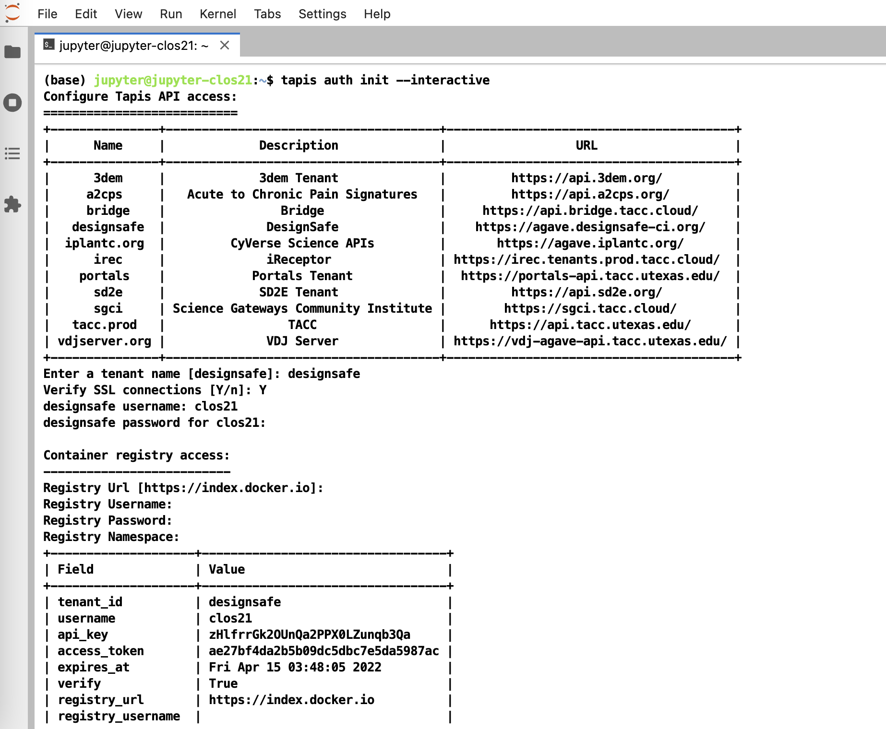
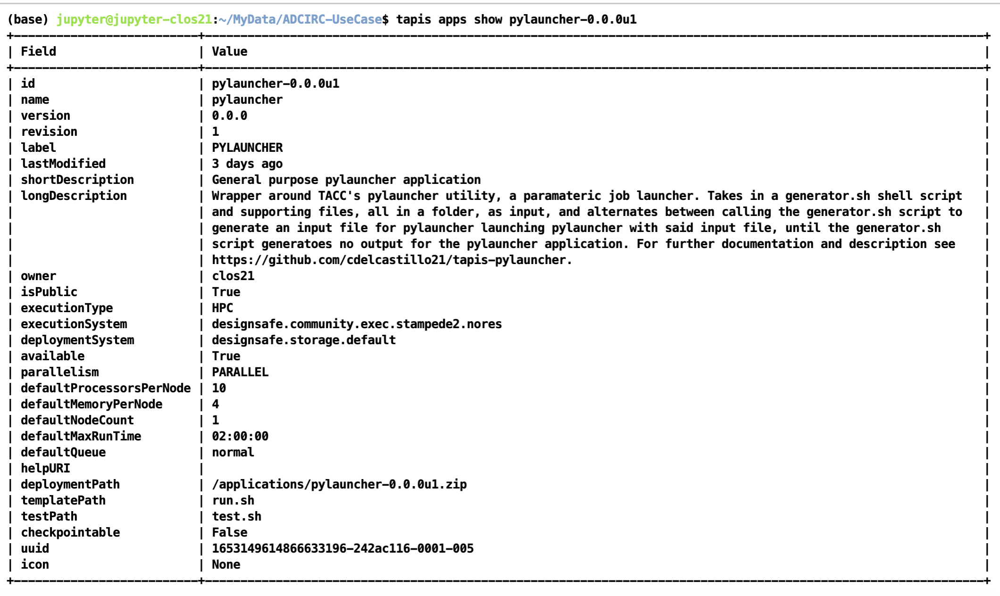

/// html | header

## Large-Scale Storm Surge

ADCIRC Use Case - Using Tapis and Pylauncher for Ensemble Modeling in DesignSafe

///

**Clint Dawson, University of Texas at Austin**  <br>
**Carlos del-Castillo-Negrete, University of Texas at Austin**   <br>
**Benjamin Pachev, University of Texas at Austin**  

The following use case presents an example of how to leverage the Tapis API to run an ensemble of HPC simulations. The specific workflow to be presented consists of running ADCIRC, a storm-surge modeling application available on DesignSafe, using the parametric job launcher pylauncher. All code and examples presented are meant to be be executed from a Jupyter Notebook on the DesignSafe platform and using a DesignSafe account to make Tapis API calls. 


### Resources
 
#### Jupyter Notebooks
Accompanying jupyter notebooks for this use case can be found in the ADCIRC folder in [Community Data](https://www.designsafe-ci.org/data/browser/public/designsafe.storage.community/Use%20Case%20Products/ADCIRC){target=_blank}. You may access these notebooksdirectly:

| Scope | Notebook |
| :-------: | :---------:  |
| Create an ADCIRC DataSet | Creating an ADCIRC DataSet.ipynb <br> [](https://jupyter.designsafe-ci.org/hub/user-redirect/lab/tree/CommunityData/Use%20Case%20Products/ADCIRC/Creating%20an%20ADCIRC%20Dataset.ipynb) |
| Create an Ensemble Simulations | ADCIRC Ensemble Simulations.ipynb <br> [](https://jupyter.designsafe-ci.org/hub/user-redirect/lab/tree/CommunityData/Use%20Case%20Products/ADCIRC/ADCIRC%20Ensemble%20Simulations.ipynb) |

#### DesignSafe Resources
The following DesignSafe resources were used in developing this use case.

* [Jupyter notebooks on DS Juypterhub](https://www.designsafe-ci.org/use-designsafe/tools-applications/analysis/jupyter/){target=_blank}.

#### Background 

##### Citation and Licensing

* Please cite [Rathje et al. (2017)](https://doi.org/10.1061/(ASCE)NH.1527-6996.0000246){target=_blank} to acknowledge the use of DesignSafe resources.  

* This software is distributed under the [GNU General Public License](https://www.gnu.org/licenses/gpl-3.0.html){target=_blank}.  

##### ADCIRC

For more information on running ADCIRC and documentation, see the following links:

* [ADCIRC Wiki](https://wiki.adcirc.org/wiki/Main_Page){target=_blank}
* [ADCIRC Web Page](https://adcirc.org/){target=_blank}

ADCIRC is available as a standalone app accesible via the [DesignSafe front-end](https://www.designsafe-ci.org/use-designsafe/tools-applications/simulation/adcirc){target=_blank}.

##### Tapis

Tapis is the main API to control and access HPC resources with. For more resources and tutorials on how to use Tapis, see the following:

* [Tapis CLI](https://tapis-cli.readthedocs.io/en/latest/contents.html){target=_blank}
* [AgavePy](https://tacc-cloud.readthedocs.io/projects/agave/en/latest/){target=_blank}
* [DesignSafe Webinar](https://www.youtube.com/watch?v=-_1lNWW8CAg&t=1854s&ab_channel=NHERIDesignSafe-CIMedia){target=_blank}

To initialize tapis in our jupyter notebook we use AgavePy. Relies on `tapis auth init --interactive` being run from a terminal first upon initializing your Jupyter server.


> Initialize Tapis from within a shell in a jupyter session. A shell can be launched by going to File -> New -> Terminal.

Once this is complete, you can now run from a code cell in your jupyter session the following to load your AgavePy credentials:

```python
from agavepy.agave import Agave

ag = Agave.restore()
```

##### Pylauncher

[Pylauncher](https://github.com/TACC/pylauncher){target=_blank} is a parametric job launcher used for launching a collection of HPC jobs within one HPC job. By specifying a list of jobs to execute in either a CSV or json file, pylauncher manages resources on a given HPC job to execute all the jobs using the given nodes. Inputs for pylauncher look something like (for csv files, per line):

```
num_processes,<pre process command>;<main parallel command>;<post process command>
```

The pre-process and post-process commands are executed in serial, while the main command is executed in parallel using the appropriate number of processes. Note pre and post process commands should do light file management and movement and no computationally intensive tasks.

#### Tapis Pylauncher App

Overview of this section:

* Getting the Appication
* App Overview
* Staging Files
* Example Ensemble ADCIRC RUN

##### Accessing the Application

The code for the tapis application is publicly accessible at [https://github.com/UT-CHG/tapis-pylauncher](https://github.com/UT-CHG/tapis-pylauncher){target=_blank}. A public Tapis application exists using [version 0.0.0](https://github.com/UT-CHG/tapis-pylauncher/tree/v0.0.0){target=_blank} of the application deployed under the ID `pylauncher-0.0.0u1 `. 


> The publicly available pylauncher application should be available to all users via the CLI/API, but will not be visible via DesignSafe's workspaces front-end.

##### Basic Application Overview

The tapis-pylauncher application loops through iterations of calling pylauncher utility, using as input a file generated by a user defined generator shell script `generator.sh`. A simplified excerpt of this main execution loop is as follows:

```bash
### Main Execution Loop:
###   - Call generator script.
###   - Calls pylauncher on generated input file. Expected name = jobs_list.csv
###   - Repeats until generator script returns no input file for pylauncher.
ITER=1
while :
do
  # Call generator if it exists script
  if [ -e generator.sh ]
  then
    
    ./generator.sh ${ITER} $SLURM_NPROCS $generator_args
  fi

  # If input file for pylauncher has been generated, then start pylauncher
  if [ -e ${pylauncher_input} ]
  then
    python3 launch.py ${pylauncher_input} >> pylauncher.log
  fi

  ITER=$(( $ITER + 1 ))
done
```

Note how a generator script is not required, with a static pylauncher file, of input name determined as a job parameter `pylauncher_input`, being sufficient to run a single batch of jobs. 

All input scripts and files for each parametric job should be zipped into a file and passed as an input to the pylauncher application. Note that these files shouldn't be too large and shouldn't contain data as tapis will be copying them around to stage and archive jobs. Data should ideally be pre-staged and not part of the zipped job inputs.

##### Staging Files 

For large scale ensemble simulations, it is best to stage individual ADCIRC run files in a project directory that execution systems can access before-hand so that Tapis itself isn't doing the moving and staging of data. 

The corresponding TACC base path to your project with a particular id can be found at `/corral-repl/projects/NHERI/projects/[id]/`. To find the ID for your project, you can just look at the URL of your project directory in designsafe:


> TX FEMA storms project directory. Note how the URL on top contains the Project ID corresponding to the path on corral that login nodes on TACC systems should have access to.

From a login node then (assuming this is done on stampede2), the data can be staged onto a public directory on `/work` as follows. First we create a public directory in our workspace where the data will be staged:

```bash
(base) login2.stampede2(1020)$ cd $WORK
(base) login2.stampede2(1022)$ cd ..
(base) login2.stampede2(1023)$ ls
frontera  lonestar  longhorn  ls6  maverick2  pub  singularity_cache  stampede2
(base) login2.stampede2(1024)$ pwd
/work2/06307/clos21
(base) login2.stampede2(1026)$ chmod o+x
(base) login2.stampede2(1027)$ mkdir -p pub
(base) login2.stampede2(1028)$ chmod o+x pub
(base) login2.stampede2(1029)$ cd pub
(base) login2.stampede2(1030)$ mkdir -p adcirc/inputs/ShinnecockInlet/mesh/test
```

Next we copy the data from our project directory to the public work directory 

```bash
(base) login2.stampede2(1039)$ cp /corral-repl/projects/NHERI/projects/586025607221276180-242ac118-0001-012/ShinnecockInletMesh/* adcirc/inputs/ShinnecockInlet/mesh/test/
```

Finally we change the ownership of the files and all sub-directories where the data is staged to be publicly accessible by the TACC execution systems. Which we can check via the file permissions of the final directory we created with the staged data:


```bash
(base) login2.stampede2(1040)$ chmod -R a-x+rX adcirc
(base) login2.stampede2(1042)$ cd adcirc/inputs/ShinnecockInlet/mesh/test
(base) login2.stampede2(1043)$ pwd
/work2/06307/clos21/pub/adcirc/inputs/ShinnecockInlet/mesh/test
(base) login2.stampede2(1045)$ ls -lat
total 360
-rw-r--r-- 1 clos21 G-800588 341496 May 13 17:27 fort.14
-rw-r--r-- 1 clos21 G-800588  15338 May 13 17:27 fort.15
drwxr-xr-x 2 clos21 G-800588   4096 May 13 17:26 .
drwxr-xr-x 4 clos21 G-800588   4096 May 13 17:24 ..
```

The directory `/work2/06307/clos21/pub/adcirc/inputs/ShinnecockInlet/mesh/test` now becomes the directory we can use in our pylauncher configurations and scripts to access the data to be used for the ensemble simulations. 

##### Example Ensemble Run: Shinnecock Inlet Test Grid Performance

For an example of how to use the tapis-pylauncher application, we refer to the accompanying notebook in the [ADCIRC Use Case folder](https://www.designsafe-ci.org/data/browser/public/designsafe.storage.community/Use%20Case%20Products/ADCIRC){target=_blank} in the Community Data directory.

The notebook goes over how to run ADCIRC on the [Shinnecock Inlet Test Grid](https://adcirc.org/home/documentation/example-problems/shinnecock-inlet-ny-with-tidal-forcing-example/){target=_blank}. 


> Shinnecock Inlet Test Grid. ADCIRC solves the Shallow Water Equations over a Triangular Mesh, depicted above.

An ensemble of adcirc simulations using different amounts of parallel processes on the same grid is configured, and output from active and archived job runs is analyzed to produced bar plots of run-time versus number of processors used for the Shinneocock Inlet Grid.


> Total Runtime for ADCIRC on the Shinnecock Inlet grid pictured above using different number of processors on stampede2.
