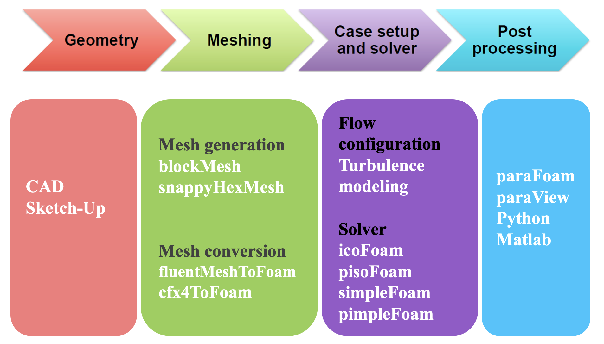
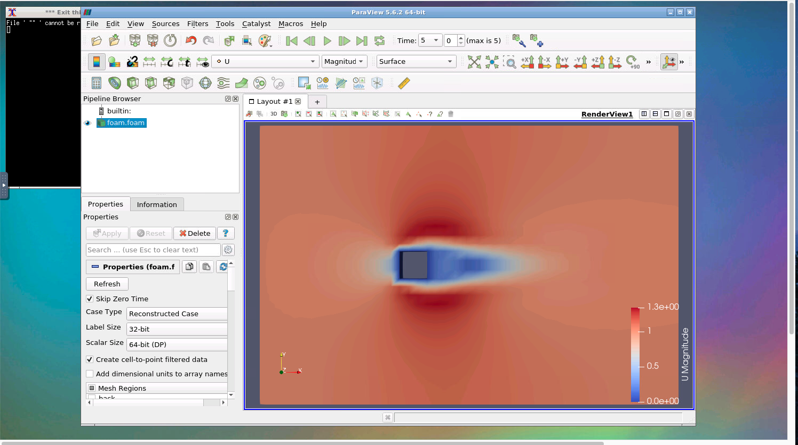

/// html | header

## CFD Analysis of Winds on Structures

CFD Simulations using the Jupyter Notebooks

///

**Fei Ding - [NatHaz Modeling Laboratory](https://nathaz.nd.edu/){target=_blank}, University of Notre Dame**<br>
**Ahsan Kareem - [NatHaz Modeling Laboratory](https://nathaz.nd.edu/){target=_blank}, University of Notre Dame**<br>
**Dae Kun Kwon - [NatHaz Modeling Laboratory](https://nathaz.nd.edu/){target=_blank}, University of Notre Dame**

OpenFOAM is the free, open source CFD software and is popularly used for computationally establishing wind effects on structures. To help beginners overcome the challenges of the steep learning curve posed by OpenFOAM and provide users with the capabilities of generating repetitive jobs and advanced functions, this use case example presents the work to script the workflow for CFD simulations using OpenFOAM in the Jupyter Notebooks. The developed two Jupyter Notebooks can aid in determining inflow conditions, creating mesh files for parameterized building geometries, and running the selected solvers. They can also contribute to the education for CFD learning as online resources, which will be implemented in the [DesignSafe](https://www.designsafe-ci.org){target=_blank}.

All files discussed in this use case are shared at [Data Depot > Community Data](https://www.designsafe-ci.org/data/browser/public/designsafe.storage.community/Use%20Case%20Products/OpenFOAM){target=_blank}. It is recommended that users make a copy of the contents to their directory (My Data) for tests and simulations.

### Resources
 
#### Jupyter Notebooks
The following Jupyter notebooks are available to facilitate the analysis of each case. They are described in details in this section. You can access and run them directly on DesignSafe by clicking on the "Open in DesignSafe" button.

| Scope | Notebook |
| :-------: | :---------:  |
| Jupyter PyFoam Example | Jupyter_PyFoam.ipynb <br> [](https://jupyter.designsafe-ci.org/hub/user-redirect/lab/tree/CommunityData/Use%20Case%20Products/OpenFOAM/PyFoam_Jupyter/Jupyter_PyFoam.ipynb) |
| Use case Example | OpenFOAM_Run_example.ipynb <br> [](https://jupyter.designsafe-ci.org/hub/user-redirect/lab/tree/CommunityData/Use%20Case%20Products/OpenFOAM/OpenFOAM_Run_example.ipynb) |

#### DesignSafe Resources

The following DesignSafe resources were leveraged in developing this use case.

[OpenFoam](https://www.designsafe-ci.org/use-designsafe/tools-applications/simulation/openfoam){target=_blank}<br/> 
[ParaView](https://www.designsafe-ci.org/use-designsafe/tools-applications/visualization/paraview){target=_blank}<br/>
[Jupyter notebooks on DS Juypterhub](https://www.designsafe-ci.org/use-designsafe/tools-applications/analysis/jupyter){target=_blank}<br/>

### Background
#### Citation and Licensing

* Please cite [Ding and Kareem (2021)](https://tigerprints.clemson.edu/cgi/viewcontent.cgi?article=1025&context=aawe){target=_blank} to acknowledge the use of any resources from this use case.
* Please cite [Rathje et al. (2017)](https://doi.org/10.1061/(ASCE)NH.1527-6996.0000246){target=_blank} to acknowledge the use of DesignSafe resources.
* This software is distributed under the [GNU General Public License](https://www.gnu.org/licenses/gpl-3.0.html){target=_blank}.

### OpenFOAM with the Jupyter Notebook for creating input environments

The overall concept of the OpenFOAM workflow may be expressed as physical modeling-discretisation-numerics-solution-visualization as shown in Fig. 1.


<p align="center">Fig. 1 OpenFOAM workflow for CFD modeling</p>

#### Prerequisite to run OpenFOAM simulation

To run a CFD simulation using OpenFOAM, three directories (and associated input files) named `0`, `constant` and `system` should be predefined by users. If the root directory of the directories is DH1_run, then it has the following directory structure [1].
```
DH1_run		   # a root directory
  - 0          # initial and boundary conditions for CFD simulations
  - constant   # physical properties and turbulence modeling
  - system     # run-time control (parallel decomposition) and solver
```
The commonly used solvers for turbulent flows include `pisoFoam` which is a transient solver for incompressible and turbulent flows and `simpleFoam` as a steady-state solver. Parallel computations in OpenFOAM allow the simulation to run in the distributed processors simultaneously.

#### Introducing advanced utilities to CFD modeling using PyFoam

Jupyter Notebooks can provide an interpretable and interactive computing environment to run a CFD simulation using the OpenFOAM. To introduce such flexibilities and bring maximum automation to CFD modeling using the OpenFOAM, an OpenFOAM library named `PyFoam` [2] can be used in the Jupyter Notebooks, which can introduce advanced tools for CFD modeling. With the aid of the PyFoam, the goal is to achieve an end-to-end simulation in which the Jupyter Notebooks can manipulate dictionaries in OpenFOAM based on the user's input as regular Python dictionaries without looking into the OpenFOAM C++ libraries (Fig. 2).


<p align="center">Fig. 2 Schematic of an end-to-end flow simulation implemented in the Jupyter Notebooks</p>

##### Jupyter Notebook example for advanced utilities

For better understanding, A Jupyter Notebook example, [Jupyter_PyFoam.ipynb](https://www.designsafe-ci.org/data/browser/public/designsafe.storage.community/Use%20Case%20Products/OpenFOAM/PyFoam_Jupyter/){target=_blank}, is provided that facilitates the automated CFD modeling with the aid of advanced utilities. Automated mesh generation and inflow configuration in the Jupyter Notebooks are explored through the case study of a rectangular building's cross-section. [](https://jupyter.designsafe-ci.org/hub/user-redirect/lab/tree/CommunityData/Use%20Case%20Products/OpenFOAM/PyFoam_Jupyter/Jupyter_PyFoam.ipynb)

In addition, a baseline model housed in [DH_Baseline](https://www.designsafe-ci.org/data/browser/public/designsafe.storage.community/Use%20Case%20Products/OpenFOAM/PyFoam_Jupyter){target=_blank} directory is provided that can be used to generate an input environment for an OpenFOAM simulation.

It is worth noting that DesignSafe recently introduced a [Jupyterhub Spawner](../../../tools/jupyterhub/#spawner) for users to run one of two Jupyter server images. To run Jupyter Notebooks for CFD presented in this document, users should use the `Classic Jupyter Image` as the Jupyter server.

##### Using PyFoam utilities in the Jupyter Notebook

At first, PyFoam and other modules should be imported into a Notebook, e.g.:

```python
import sys
sys.path.append('/home1/apps/DesignSafe')
import PyFoam

import os, shutil, scipy.io, math, glob
import numpy as np

from pylab import *

from PyFoam.Execution.UtilityRunner import UtilityRunner
from PyFoam.Execution.BasicRunner import BasicRunner
from PyFoam.RunDictionary.SolutionDirectory import SolutionDirectory
from PyFoam.RunDictionary.SolutionFile import SolutionFile
from PyFoam.RunDictionary.BlockMesh import BlockMesh

from os import path
from subprocess import Popen
from subprocess import call
```

##### Mesh generation

To allow users to edit the dimensions of the rectangular building's cross-section, `m4-scripting` is employed for parameterization in OpenFOAM. To achieve it, case directories of the baseline geometry which is a square cross-section were first copied to the newly created case directories. The controlling points for mesh topology are functions of the input geometric variables. M4-scripting then manipulates the `blockMeshDict` dictionary, from which values of the controlling points were assigned as shown in Fig. 3.

In the end, the blockMeshDict dictionary file, which is the file for specifying the mesh parameter and used to generate a mesh in OpenFOAM, is built by executing m4-script command, e.g.,
```python
cmd='m4 -P blockMeshDict.m4 > blockMeshDict'
pipefile = open('output', 'w')
retcode = call(cmd,shell=True,stdout=pipefile)
pipefile.close()
```


<p align="center">Fig. 3 Use of m4-scripting for automated mesh generation</p>

##### Setup inflow condition

To edit the inflow turbulence properties based on the user's input, PyFoam is employed to set the inflow boundary conditions. In this example, `k-ω SST model` is selected for turbulence modeling for a demonstration, hence the two inflow turbulence parameters k and ω are modified at different inflow conditions by calling the replaceBoundary [2] utility in the PyFoam. Part of the codes is shown in the following:

```python
from PyFoam.Execution.UtilityRunner import UtilityRunner
from PyFoam.Execution.BasicRunner import BasicRunner
from PyFoam.RunDictionary.SolutionDirectory import SolutionDirectory
from PyFoam.RunDictionary.SolutionFile import SolutionFile
### change the values k and ω at the inlet
os.chdir(case)
dire=SolutionDirectory(case,archive=None)
sol=SolutionFile(dire.initialDir(),”k”)
sol.replaceBoundary(”inlet”,”%f” %(k))
sol=SolutionFile(dire.initialDir(),”omega”)
sol.replaceBoundary(”inlet”,”%f” %(omega))
```

More detailed information can be found in the [Jupyter_PyFoam.ipynb](https://www.designsafe-ci.org/data/browser/public/designsafe.storage.community/Use%20Case%20Products/OpenFOAM/PyFoam_Jupyter/){target=_blank}. The Notebook also illustrates how to prepare multiple models to simulate simultaneously and their automatic generation of input environments.

#### Use case of an OpenFOAM simulation with Jupyter Notebook in the DesignSafe workspace

##### Description

A use case example is a `URANS` simulation for wind flow around a rectangular building's cross-section, which is implemented at a Jupyter Notebook, [OpenFOAM_Run_example.ipynb](https://www.designsafe-ci.org/data/browser/public/designsafe.storage.community/Use%20Case%20Products/OpenFOAM/){target=_blank}. The input environments are prepared at [DH1_run](https://www.designsafe-ci.org/data/browser/public/designsafe.storage.community/Use%20Case%20Products/OpenFOAM/){target=_blank} directory. The test rectangular cross-section model and its mesh are shown in Fig. 4. [](https://jupyter.designsafe-ci.org/hub/user-redirect/lab/tree/CommunityData/Use%20Case%20Products/OpenFOAM/OpenFOAM_Run_example.ipynb) |


<p align="center">Fig. 4 Test model and its mesh</p>

##### Setup agave

This script shows how to import the agave client, get the authorization (assuming that the user is already logged into DesignSafe), and access the OpenFOAM. Also

```python
from agavepy.agave import Agave
ag = Agave.restore()
### see user profile
ag.profiles.get()
### access OpenFOAM
app = ag.apps.get(appId = 'openfoam-7.0u4')
```

##### Submit the OpenFOAM job to DesignSafe/TACC

To utilize parallel computing for faster computation, the simulation is run in the DesignSafe workspace using the Texas Advanced Computing Center (TACC) computing resources. The following script shows how to set up the OpenFOAM configuration to run, and its submission to TACC, and check the status of the submitted job [3].

```python
### Creating job file
jobdetails = {
	# name of the job
	"name": "OpenFOAM-Demo",
	# OpenFOAM v7 is used in this use case
	"appId": "openfoam-7.0u4",
	# total run time on the cluster (max 48 hrs)
	"maxRunTime": "00:02:00",
	# the number of nodes and processors for parallel computing
	"nodeCount": 1,
	"processorsPerNode": 2,
	# simulation results will be available in the user's archive directory
	"archive": True,
	# default storage system
	"archiveSystem": "designsafe.storage.default",
	# parameters for the OpenFOAM simulation
	"parameters": {
		# running blockmesh and/or snappyHexMesh (On)
        "mesh": "On",
        # running in parallel (On) or serial (Off)
        "decomp": "On",
        # name of OpenFOAM solver: pisoFoam is used in this use case
        "solver": "pisoFoam"
    },
	"inputs": {
### directory where OpenFOAM files are stored: the path for the DH1_run directory in this use case
### check the web browser's URL at the DH1_run and use the path after "agave/" which includes one's USERNAME
### If DH1_run is located at Data depot > My Data > JupyterCFD > DH1_run, then the URL looks like:
### https://www.designsafe-ci.org/data/browser/agave/designsafe.storage.default/USERNAME/JupyterCFD/DH1_run
		"inputDirectory": "agave://designsafe.storage.default/USERNAME/JupyterCFD/DH1_run"
		}
}
### Submit the job to TACC
job = ag.jobs.submit(body=jobdetails)
### Check the job status
from agavepy.async import AgaveAsyncResponse
asrp = AgaveAsyncResponse(ag,job)
asrp.status
### if successfully submitted, then asrp.status outputs 'ACCEPTED'
```

##### Post-processing on DesignSafe

Simulation results are stored in the Data Depot in the DesignSafe and available to be post-processed by users: `Data Depot > My Data > archive > jobs`. To visualize the flow fields, users can utilize a visualization tool in the `Tools & Application` menu in the DesignSafe (Fig. 5), `Paraview` [4], which can read OpenFOAM files using .foam file. Fig. 6 shows an example of the post-processing of simulation results in the Paraview.


<p align="center">Fig. 5 Paraview software in the DesignSafe</p>


<p align="center">Fig. 6 Visualization of simulation results using the Paraview</p>

For data analysis such as plotting the time series of drag or lift force coefficients, users can make a script in a Jupyter Notebook to load simulation results and make output figures using a python graphic library such as `Matplotlib`, etc. An example script using Matplotlib can also be found in this use case Jupyter Notebook.

### References
[1] H. Jasak, A. Jemcov, Z. Tukovic, et al. OpenFOAM: A C++ library for complex physics simulations. In International workshop on coupled methods in numerical dynamics, volume 1000, pages 1-20. IUC Dubrovnik Croatia, 2007.<br />
[2] OpenFOAM wiki. Pyfoam. [https://openfoamwiki.net/index.php/Contrib/PyFoam](https://openfoamwiki.net/index.php/Contrib/PyFoam){target=_blank}. Online; accessed 24-Feb-2022.<br />
[3] Harish, Ajay Bangalore; Govindjee, Sanjay; McKenna, Frank. [CFD Notebook (Beginner)](https://www.designsafe-ci.org/data/browser/public/designsafe.storage.published/PRJ-2915){target=_blank}. DesignSafe-CI, 2020. <br />
[3] N. Vuaille. Controlling paraview from jupyter notebook. [https://www.kitware.com/paraview-jupyter-notebook/](https://www.kitware.com/paraview-jupyter-notebook/){target=_blank}. Online; accessed 24-Feb-2022.<br />
