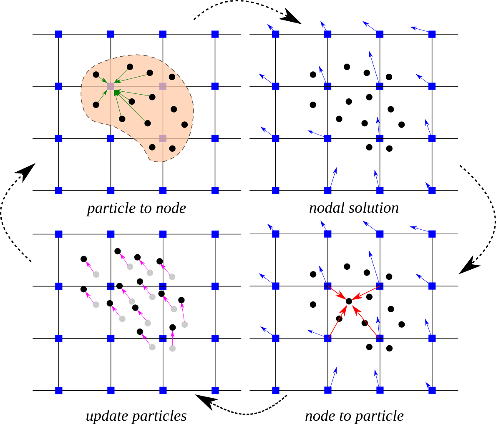
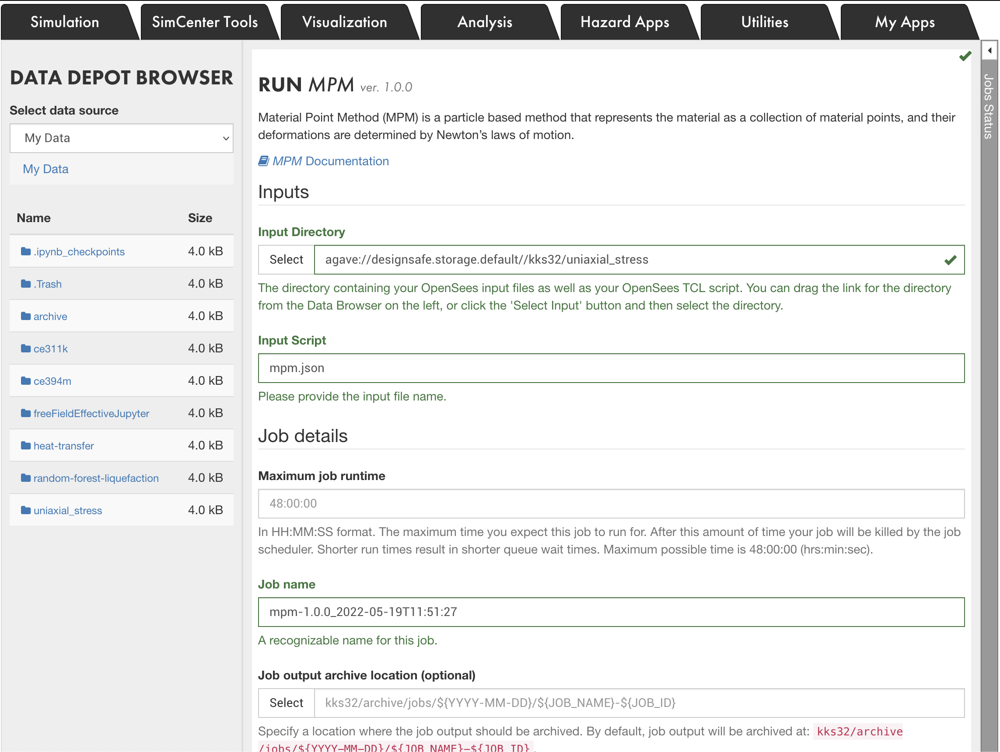
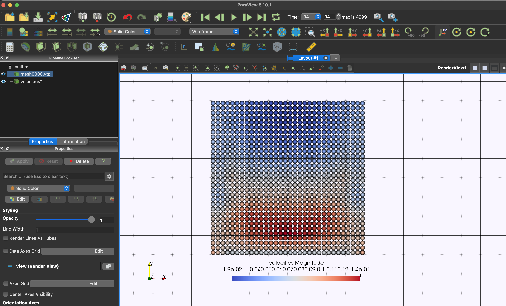

/// html | header

## MPM Landslide

Material Point Method for Landslide Modeling

///

**Material Point Method for Landslide Modeling**   
**Krishna Kumar - University of Texas at Austin**

The example makes use of the following DesignSafe resources:

[Jupyter notebooks on DS Juypterhub](https://www.designsafe-ci.org/use-designsafe/tools-applications/analysis/jupyter){target=_blank}<br/>
[CB-Geo MPM](https://www.designsafe-ci.org/use-designsafe/tools-applications/simulation/mpm){target=_blank}<br/> 
[ParaView](https://www.designsafe-ci.org/use-designsafe/tools-applications/visualization/paraview){target=_blank}<br/>

### Background 
#### Citation and Licensing

* Please cite [Kumar et al. (2019)](https://arxiv.org/abs/1909.13380){target=_blank} to acknowledge the use of CB-Geo MPM.
* Please cite [Abram et al. (2022)](https://arxiv.org/abs/2109.02754){target=_blank} to acknowledge the use of any resources from the Oso in situ use case.
* Please cite [Rathje et al. (2017)](https://doi.org/10.1061/(ASCE)NH.1527-6996.0000246){target=_blank} to acknowledge the use of DesignSafe resources.  
* This software is distributed under the [MIT License](https://github.com/cb-geo/mpm/blob/develop/license.md){target=_blank}.


#### Description
Material Point Method (MPM) is a particle based method that represents the material as a collection of material points, and their deformations are determined by Newton’s laws of motion. The MPM is a hybrid Eulerian-Lagrangian approach, which uses moving material points and computational nodes on a background mesh. This approach is very effective particularly in the context of large deformations.


> Illustration of the MPM algorithm (1) A representation of material points overlaid on a computational grid. Arrows represent material point state vectors (mass, volume, velocity, etc.) being projected to the nodes of the computational grid. (2) The equations of motion are solved onto the nodes, resulting in updated nodal velocities and positions. (3) The updated nodal kinematics are interpolated back to the material points. (4) The state of the material points is updated, and the computational grid is reset.

This use case demonstrates how to run MPM simulations on DesignSafe using [Jupyter Notebook](https://www.designsafe-ci.org/use-designsafe/tools-applications/analysis/jupyter){target=_blank}. For more information on CB-Geo MPM visit the [GitHub repo](https://github.com/cb-geo/mpm){target=_blank} and [user documentation](https://mpm.cb-geo.com){target=_blank}.


### Input generation

Input files for the MPM code can be generated using [pycbg](https://forgemia.inra.fr/mpm-at-recover/pycbg){target=_blank}. For API details, please refer to [pycbg's documentation](https://pycbg.readthedocs.io/en/latest/){target=_blank}. For more information on the input files, please refer to [CB-Geo MPM documentation](https://mpm.cb-geo.com/#/user/preprocess/input){target=_blank}. The generator is available at [PyPI](https://pypi.org/project/pycbg/){target=_blank} and an be easily installed with `pip install pycbg`. `pycbg` enables a Python generation of expected `.json` input files, offering all Python capabilities to CB-Geo MPM users for this preprocessing stage.

Typing a few Python lines is usually enough for a user to define all necessary ingredients for a MPM simulation:

 - generate the mesh (using [gmsh](https://pypi.org/project/gmsh/){target=_blank})

 - generate the particles

 - define the entity sets

 - create boundary conditions

 - set the analysis' parameters

 - setup batch of simulations (the documentation doesn't mention it yet but the function `pycbg.preprocessing.setup_batch` has a complete docstring)


#### An example

Simulation of a settling column made with two different materials is described in [preprocess.ipynb](https://www.designsafe-ci.org/data/browser/public/designsafe.storage.community/Use%20Case%20Products/MPM){ target="_blank" } ([](https://jupyter.designsafe-ci.org/hub/user-redirect/lab/tree/CommunityData/Use%20Case%20Products/MPM)) as follows:

```python
import pycbg.preprocessing as utl

### The usual start of a PyCBG script:
sim = utl.Simulation(title="Two_materials_column")

### Creating the mesh:
sim.create_mesh(dimensions=(1.,1.,10.), ncells=(1,1,10))

### Creating Material Points, could have been done by filling an array manually:
sim.create_particles(npart_perdim_percell=1)

### Creating entity sets (the 2 materials), using lambda functions:
sim.init_entity_sets()
lower_particles = sim.entity_sets.create_set(lambda x,y,z: z<5, typ="particle")
upper_particles = sim.entity_sets.create_set(lambda x,y,z: z>=5, typ="particle")

### The materials properties:
sim.materials.create_MohrCoulomb3D(pset_id=lower_particles)
sim.materials.create_Newtonian3D(pset_id=upper_particles)

### Boundary conditions on nodes entity sets (blocked displacements):
walls = []
walls.append([sim.entity_sets.create_set(lambda x,y,z: x==lim, typ="node") for lim in [0, sim.mesh.l0]])
walls.append([sim.entity_sets.create_set(lambda x,y,z: y==lim, typ="node") for lim in [0, sim.mesh.l1]])
walls.append([sim.entity_sets.create_set(lambda x,y,z: z==lim, typ="node") for lim in [0, sim.mesh.l2]])
for direction, sets in enumerate(walls): _ = [sim.add_velocity_condition(direction, 0., es) for es in sets]

### Other simulation parameters (gravity, number of iterations, time step, ..):
sim.set_gravity([0,0,-9.81])
nsteps = 1.5e5
sim.set_analysis_parameters(dt=1e-3, nsteps=nsteps, output_step_interval=nsteps/100)

### Save user defined parameters to be reused at the postprocessing stage:
sim.add_custom_parameters({"lower_particles": lower_particles,
                           "upper_particles": upper_particles,
                           "walls": walls})

### Final generation of input files:
sim.write_input_file()
```

This creates in the working directory a folder `Two_materials_column` where all the necessary input files are located.

### Running the MPM Code
The CB-Geo MPM code is available on DesignSafe under `WorkSpace > Tools & Applications > Simulations`. [Launch a new MPM Job.](https://www.designsafe-ci.org/use-designsafe/tools-applications/simulation/mpm){target=_blank} The input folder should have all the scripts, mesh and particle files. CB-Geo MPM can run on multi-nodes and has been tested to run on upto 15,000 cores.



### Post Processing

#### VTK and ParaView

The MPM code can be set to write VTK data of particles at a specified output frequency. The input JSON configuration takes as optional `vtk` argument. The following attributes are valid options for VTK: `"stresses`, `strains`, and `velocities`. When the attribute `vtk` is not specified or an incorrect argument is defined, the code will write all available options.

```JSON
  "post_processing": {
    "output_steps": 5,
    "path": "results/",
    "vtk" : ["stresses","velocities"],
    "vtk_statevars": [
      {
        "phase_id": 0,
        "statevars" : ["pdstrain"]
      }
    ]
  }
```

> When opening particle data (*.vtp) in [ParaView](https://www.paraview.org/){target=_blank}, please use the representation `Point Gaussian` to visualise the particle data attribute.


The CB-Geo MPM code generates parallel `*.pvtp` files when the code is executed across MPI ranks. Each MPI rank will produce an attribute subdomain files, for example `stresses-0_2-100.vtp` and `stresses-1_2-100.vtp` file for stresses generated in rank 0 of 2 rank MPI processes and also a parallel `pvtp` file `stresses-100.pvtp`. The parallel `*.pvtp` file combines all the VTK outputs from different MPI ranks.

> Use the `*.pvtp` files for visualizing results from a distributed simulation. No need to load individual subdomain `*.vtp` when visualizing results from the MPI tasks.


The parameter `vtk_statevars` is an optional VTK output, which will print the value of the state variable for the particle. If the particle does not have the specified state variable, it will be set to NaN.

You can view the results in [DesignSafe ParaView](https://www.designsafe-ci.org/use-designsafe/tools-applications/visualization/paraview):




#### HDF5

The CB-Geo mpm code writes HDF5 data of particles at each output time step. The HDF5 data can be read using Python / Pandas. If `pandas` package is not installed, run `pip3 install pandas`. The [postprocess.ipynb](https://www.designsafe-ci.org/data/browser/public/designsafe.storage.community/Use%20Case%20Products/MPM){ target="_blank" } ([](https://jupyter.designsafe-ci.org/hub/user-redirect/lab/tree/CommunityData/Use%20Case%20Products/MPM)) shows how to perform data analysis using HDF5 data.

To read a particles HDF5 data, for example `particles00.h5` at step 0:

```python
### Read HDF5 data
### !pip3 install pandas
import pandas as pd
df = pd.read_hdf('particles00.h5', 'table')
### Print column headers
print(list(df))
```

The particles HDF5 data has the following variables stored in the dataframe:

```
['id', 'coord_x', 'coord_y', 'coord_z', 'velocity_x', 'velocity_y', 'velocity_z', 
'stress_xx', 'stress_yy', 'stress_zz', 'tau_xy', 'tau_yz', 'tau_xz', 
'strain_xx', 'strain_yy', 'strain_zz', 'gamma_xy', 'gamma_yz', 'gamma_xz', 'epsilon_v', 'status']
```

Each item in the header can be used to access data in the `h5` file. To print velocities (x, y, and z) of the particles:

```python
### Print all velocities
print(df[['velocity_x', 'velocity_y','velocity_z']])
```

```
   velocity_x  velocity_y  velocity_z
0         0.0         0.0    0.016667
1         0.0         0.0    0.016667
2         0.0         0.0    0.016667
3         0.0         0.0    0.016667
4         0.0         0.0    0.033333
5         0.0         0.0    0.033333
6         0.0         0.0    0.033333
7         0.0         0.0    0.033333
```

#### Oso landslide with in situ visualization

In situ visualization is a broad approach to processing
simulation data in real-time - that is, wall-clock time, as the
simulation is running. Generally, the approach is to provide
data extracts, which are condensed representations of the data
chosen for the explicit purpose of visualization and computed
without writing data to external storage. Since these extracts
(often images) are vastly smaller than the raw simulation itself,
it becomes possible to save them at a far higher temporal
frequency than is practical for the raw data, resulting in
substantial gains in both efficiency and accuracy. In situ
visualization allows simulations to export complete datasets
only at the temporal frequency necessary for economic check-
point/restart.

We leverage in situ viz with MPM using [TACC Galaxy](https://github.com/TACC/galaxy){target=_blank}.


> In situ rendering of the Oso landslide with CB-Geo MPM of 5 million material points running 16 MPI tasks for compute + 8 MPI tasks for visualization.
