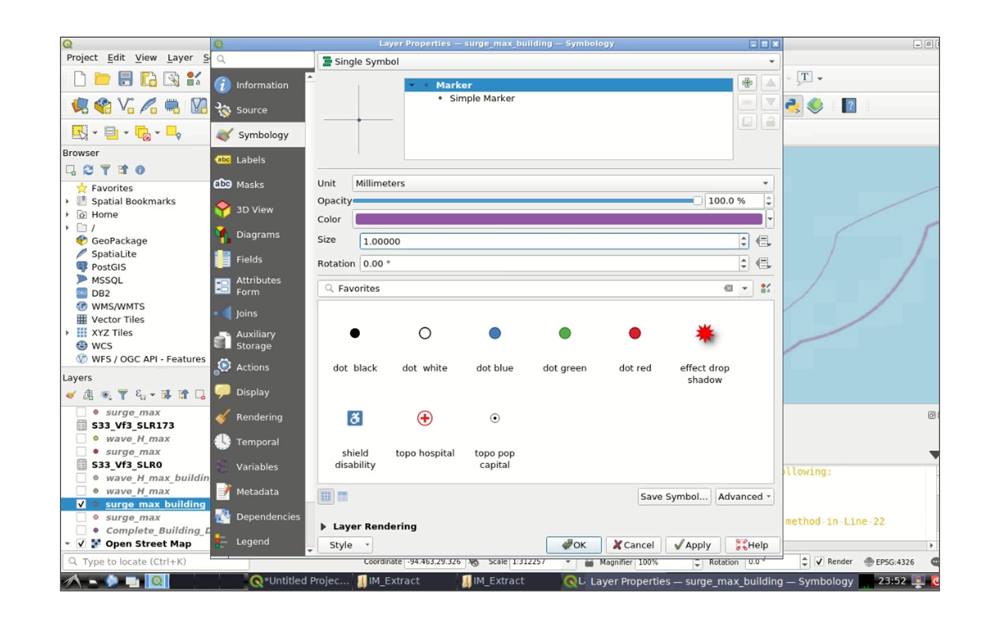
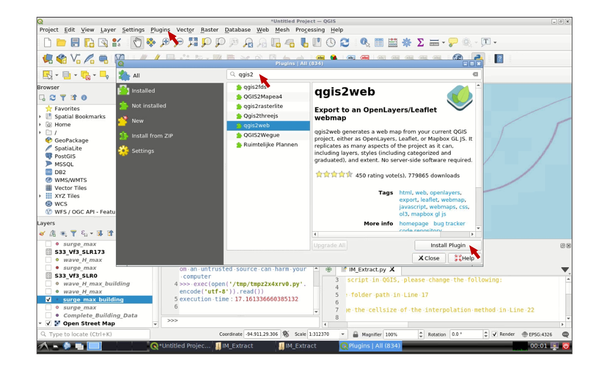
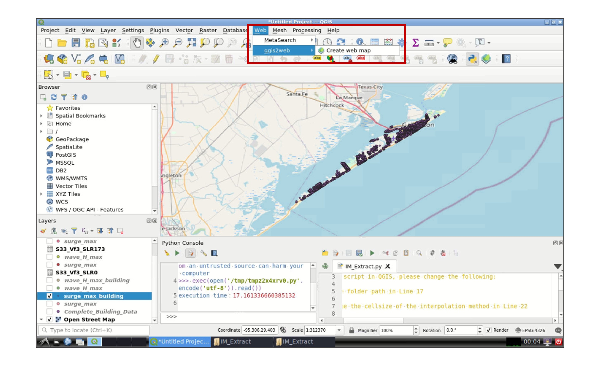
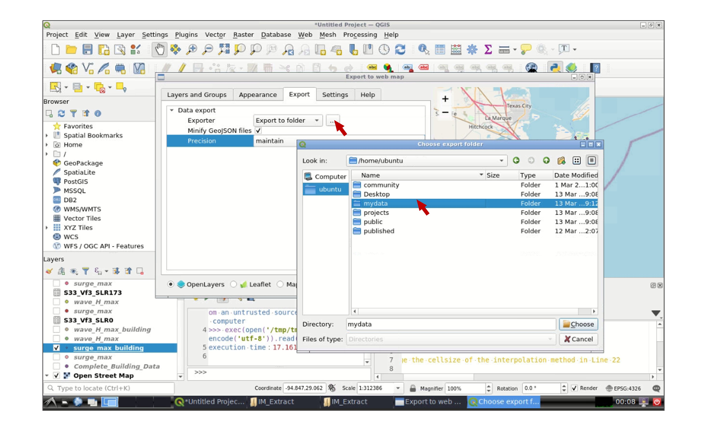

/// html | header

## Visualizing Surge for Regional Risks

Integration of QGIS and Python Scripts to Model and Visualize Storm Impacts on Distributed Infrastructure Systems

/// 

**Catalina González-Dueñas and Jamie E. Padgett - Rice University**<br/>
**Miku Fukatsu - Tokyo University of Science**

This use case study shows how to automate the extraction of storm intensity parameters at the structure level to support regional risk assessment studies. This example leverages QGIS and python scripts to obtain the surge elevation and significant wave height from multiple storms at specific building locations. The case study also shows how to visualize the outputs in QGIS and export them as a web map. 


### Resources
 
#### Jupyter Notebooks
The following Jupyter notebooks are available to facilitate the analysis of each case. They are described in details in this section. You can access and run them directly on DesignSafe by clicking on the "Open in DesignSafe" button.

| Scope | Notebook |
| :-------: | :---------:  |
| Read Surge | Surge_Galv.ipynb <br> [](https://jupyter.designsafe-ci.org/hub/user-redirect/lab/tree/CommunityData/Use%20Case%20Products/QGIS/Read_ADCIRC/Surge_Galv.ipynb) |
| Read Wave | Wave_Galv.ipynb <br> [](https://jupyter.designsafe-ci.org/hub/user-redirect/lab/tree/CommunityData/Use%20Case%20Products/QGIS/Read_ADCIRC/Wave_Galv.ipynb) |

#### DesignSafe Resources

The following DesignSafe resources are leveraged in this example: 

[Geospatial data analysis and Visualization on DS - QGIS](https://www.designsafe-ci.org/use-designsafe/tools-applications/gis-tools/qgis){target=_blank}<br/>
[Jupyter notebooks on DS Jupyterhub](https://www.designsafe-ci.org/use-designsafe/tools-applications/analysis/jupyter){target=_blank}

### Background 

#### Citation and Licensing

* Please cite [González-Dueñas and Padgett (2022)](https://doi.org/10.17603/ds2-3zdj-493){target=_blank} to acknowledge the use of any resources from this use case.

* Please cite [Rathje et al. (2017)](https://doi.org/10.1061/(ASCE)NH.1527-6996.0000246){target=_blank} to acknowledge the use of DesignSafe resources.

* This software is distributed under the [GNU General Public License](https://www.gnu.org/licenses/gpl-3.0.html){target=_blank}.

#### Description 

This case study aims to support pre-data processing workflows for machine learning applications and regional risk analysis. When developing predictive or surrogate models for the response of distributed infrastructure and structural systems, intensity measures (IMs) need to be associated with each component of the system (e.g., buildings, bridges, roads) under varying hazard intensity or different hazard scenarios. To accomplish this and given the different resolutions of the hazard and infrastructure data, geographical tools need to be used to associate the intensity measures with the distributed infrastructure or portfolio components. In this case study, python codes were developed to automate geospatial analysis and visualization tasks using QGIS. 

This case study is divided into four basic components:

> 1. Introduction and workflow of analysis
> 2. Storm data analysis using Jupyter notebooks
> 3. Geospatial analysis via QGIS
> 4. Visualization of the outputs

### Introduction and workflow of analysis

In this example, the automated procedure to extract intensity measures is leveraged to obtain the maximum surge elevation and significant wave height at specific house locations for different storm scenarios. The surge elevation and the significant wave height are important parameters when evaluating the structural performance of houses under hurricane loads, and have been used to formulate different building fragility functions (e.g., [Tomiczek, Kennedy, and Rogers (2014)](https://doi.org/10.1061/(ASCE)WW.1943-5460.0000212){target=_blank}; [Nofal et al. (2021)](https://doi.org/10.1061/(ASCE)ST.1943-541X.0003144)){target=_blank}. As a proof of concept, the intensity measures (i.e., surge elevation and significant wave height) will be extracted for 3 different storms using the building portfolio of Galveston Island, Texas. The storms correspond to synthetic variations of storm FEMA 33, a probabilistic storm approximately equivalent to a 100-year return period storm in the Houston-Galveston region. The storms are simulated using ADCIC+SWAN numerical models of storm FEMA33, with varying forward storm velocity and sea-level rise. For more details on the storm definition, the user can refer to [Ebad et al. (2020)](https://doi.org/10.3389/fbuil.2020.00104){target=_blank} and [González-Dueñas and Padgett (2021)](https://doi.org/10.3389/fbuil.2021.690715). 

In order to relate the storm data to the building portfolio data, it is necessary to convert the storm outputs to a surface data and then extract at the locations of interest. First, the output files from the ADCIRC+SWAN simulation corresponding to the surge elevation (file fort.63.nc) and significant wave height (file swan_HS.63.nc) need to be converted to a format that can be exported to a GIS (Geographical Information System) software. This pre-processing of the storm data provides the surge elevation and significant wave height in each of the grid points used to define the computational domain of the simulation in a vector data format. Since these points (i.e., ADCIRC+SWAN grid) have a different spatial resolution than the infrastructure system under analysis (i.e., building locations), the storm outputs are converted to a surface data format and then the value at each building location is extracted from it. This is repeated for each one of the storms under analysis and then the ouput data (IMs at each building location) is exported as a csv file. This file is used to support further analysis in the context of risk assessment or machine learning applications, as predictors or response of a system. The workflow of analysis is as follows:


### Storm data analysis using Jupyter notebooks

To read the ADCIRC+SWAN storm simulation outputs, two Jupyter notebooks are provided, which can extract the maximum surge elevation and significant wave height values within a particular region. The [Read_Surge](https://www.designsafe-ci.org/data/browser/public/designsafe.storage.community/Use%20Case%20Products/QGIS/Read_ADCIRC){target=_blank} Jupyter notebook takes as an input the *fort.63.nc* ADCIRC+SWAN output file and provides a csv file with the maximum surge elevation value at each of the points within the region specified by the user. Specifying a region helps to reduce the computational time and to provide the outputs only on the region of interest for the user. Similarly, the [Read_WaveHS](https://www.designsafe-ci.org/data/browser/public/designsafe.storage.community/Use%20Case%20Products/QGIS/Read_ADCIRC){target=_blank} Jupyter notebook, reads the *swan_HS.63.nc* file and provides the maximum significant wave height in the grid points of the specified area. Direct links to the Notebooks are provided above.

To use the Jupyter notebooks, the user must:

1. Create a new folder in *My data* and copy the Jupyter notebooks from the *Community Data* folder
2. Ensure that the *fort.63.nc* and *swan_HS.63.nc* are located in the same folder as the Jupyer notebooks
3. Change the coordinates of the area of interest in [6]:

``` python
### Example of a polygon that contains Galveston Island, TX (The coordinates can be obtained from Google maps)
polygon = Polygon([(-95.20669, 29.12035), (-95.14008, 29.04294), (-94.67968, 29.35433), (-94.75487, 29.41924), (-95.20669, 29.12035)])
```
4. Modify the name of the output csv file in [8] (if desired):
``` python
### In this example, the output name of the csv surge elevation file is "surge_max"
with open('surge_max.csv','w') as f1:
```
Once the Jupyter notebooks run, two output csv files containing the maximum surge elevation and significant wave height in the area of interest will be generated and saved in your folder. The first two columns of the csv file correspond to the geographical coordinates (i.e., longitud and latitude) of the grid point, and the third one corresponds to the respective intensity measure (maximum surge elevation or significant wave height).

### Geospatial analysis via QGIS

#### Opening a QGIS session in DesignSafe

To access QGIS via DesignSafe go to [Workspace -> Tools & Applications -> Visualization -> QGIS Desktop](https://www.designsafe-ci.org/use-designsafe/tools-applications/gis-tools/qgis){target=_blank}. You will be prompted the following window:


Change the desktop resolution according to your screen size preferences, provide a name for your job, and hit *Launch* when you finish. After a couple of minutes your interactive session will start, click *Connect*:


You will be directed to an interactive QGIS session, create a new project by clicking the *New Project* icon or press *Ctrl+N*:


#### Modify user inputs and run the python script

A python script called [IM_Extract](https://www.designsafe-ci.org/data/browser/public/designsafe.storage.community/Use%20Case%20Products/QGIS/IM_Extract){target=_blank} is provided to extract the desired IMs at specific locations. Follow these steps to use this code:

1. Create a folder to store the outputs of the analysis in your *My data* folder in DS
2. Provide a csv file that specifies the points for which you wish to obtain the intensity measures. This file should be in the following format (see the [*Complete_Building_Data*](https://www.designsafe-ci.org/data/browser/public/designsafe.storage.community/Use%20Case%20Products/QGIS/IM_Extract){target=_blank} file for an example of the building stock of Galveston Island, TX):
    a. The first column should contain an ID (e.g., number of the row)
    b. The second column corresponds to the longitude of each location
    c. The third column corresponds to the latitude of each location
4. Create a folder named *Storms* in which you will store the data fromt the different storms
5. Within the *Storms* folder, create a folder for each one of the storms you wish to analyze. Each folder should contain the output csv files from the ADCIRC+SWAN simulations (e.g., surge_max.csv, wave_H_max.csv). In our case study, we will use three different [storms](https://www.designsafe-ci.org/data/browser/public/designsafe.storage.community/Use%20Case%20Products/QGIS/IM_Extract/Storms){target=_blank}.

Once the folder of analysis is created in your Data Depot, we can proceed to perform the geospatial analysis in QGIS. Open the python console within QGIS, click the *Show Editor* button, and then click *Open Script*:


In the file explorer, go to your data folder and open the [IM_Extract](https://www.designsafe-ci.org/data/browser/public/designsafe.storage.community/Use%20Case%20Products/QGIS/IM_Extract){target=_blank} script:


Modify the path of the folder for your own data folder in *line 17*:
``` python
path= r"/home/ubuntu/mydata/**name of your folder**"
```
If desired, you can change the interpolation method *(line 75 of the script)* and the cell size used for the interpolation *(line 22 of the script)*:

``` python
### Line 22
    # 2. Change cell size (defalt is 0.001)
    cell_size = 0.001
### Line 75
    # Interpolation method
      alg = "qgis:tininterpolation"
```

Once you finish the modifications, click *Run Script*.

### Visualization of the outputs

Once the script finish running, the time taken to run the script will appear in the python console and the layers created in the analysis will be displayed in the *Layers* section (left-bottom window) in QGIS:


Right click one of the layers, and go to ***Properties -> Symbology*** to modify the appearance of the layer (e.g., color, size of the symbol):



Click *OK* when you finish the modifications. You will be directed to the main window again, go to the the toolbar and click ***Plugins -> Manage and Install Plugins***. In the search tab type ***qgis2web***, select the plugin, and click ***Install Plugin***:



Go to ***Web -> qgis2web -> Create web map***:



In the new window, select the layer(s) that you wish to export in the  ***Layers and Groups*** tab, and modify the appearance of the map in the ***Appearance*** tab. Then go to the ***Export*** tab and click in the icon next to ***Export to folder*** and select your working data folder:



Once you finish, a new web explorer window will open in your interactive session with the exported QGIS map:


Go to your working folder in the Data Depot, a new folder containing the web map will be created. You can download the folder and double click ***Index***, the web map you created will be displayed in the web explorer of your local computer:


