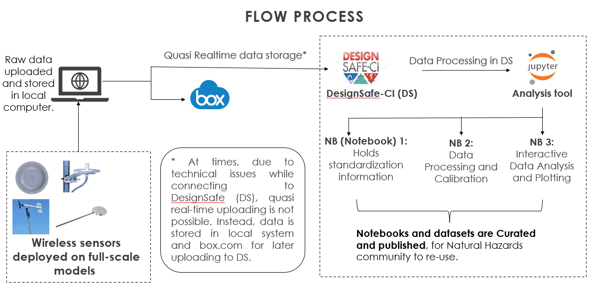
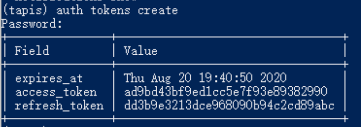
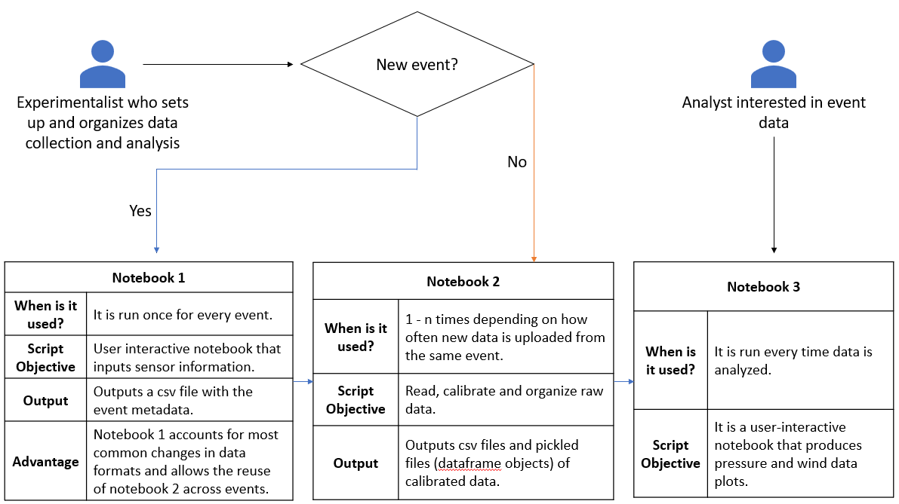
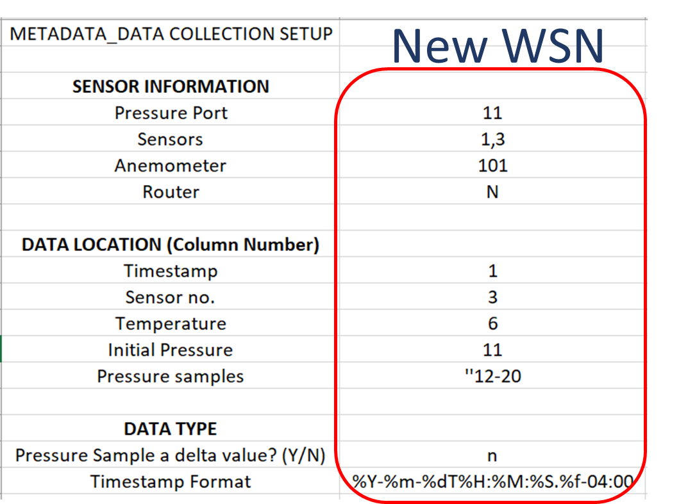
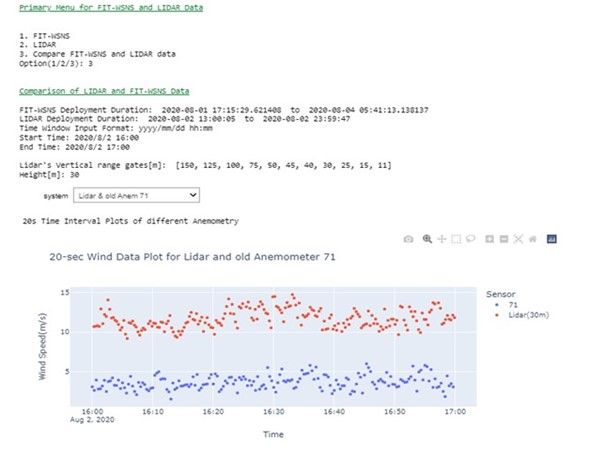

/// html | header

## Field Sensing Wind Events

Wind Data Analysis Tools

///

**Soundarya Sridhar - Florida Institute of Technology**  
**Jean-Paul Pinelli - Florida Institute of Technology**  
**M.A. Ajaz - Florida Institute of Technology**

*Key Words: wireless sensors network, Tapis, Plotly, and Hurricane Ian*

Florida Tech (FIT) teams deploy networks of wireless sensors on residential houses during high impact wind events or on full scale wind tunnel models. Each deployment might include pressure, temperature and humidity sensors alongside different anemometers and a conical scanning infrared LIDAR. Figure 1 describes the workflow, which starts with uploading the data to DesignSafe through authentication tokens created in Tapis. Once on DesignSafe, three Jupyter notebooks process and visualize the instruments data for analyses. The notebooks provide a user friendly and interactive environment that can adapt to different datasets. For this project, the notebooks perform quasi static real-time analysis, assess sensor performance, and study pressure variations for different wind conditions and data correlation. The user interactivity of these notebooks facilitates an easy adaptation to different datasets with little to no-change in code. 

{:  width="600" }
<p style="text-align: center;">Figure 1.  Workflow </p>

### Resources
 
#### Jupyter Notebooks
The following Jupyter notebooks are available to facilitate the analysis of each case. They are described in details in this section. You can access and run them directly on DesignSafe by clicking on the "Open in DesignSafe" button.

##### Jupyter Notebooks for WOW Sliding Patio Doors

<span style="font-size:.75em;">

| Scope | Notebook |
| :-------: | :---------:  |
| Metadata Collection Setup | WOW_6-22-21_NB1__Standardization File.ipynb <br> [](https://jupyter.designsafe-ci.org/hub/user-redirect/lab/tree/NHERI-Published/PRJ-2890/Jupyter%20Notebooks%20for%20WOW_Sliding%20Patio%20Doors/WOW_6-22-21_NB1__Standardization%20File.ipynb) |
| Data Integration and Cleanup | WoW_6-22-21_NB2_WSNS POST PROCESSING.ipynb <br> [](https://jupyter.designsafe-ci.org/hub/user-redirect/lab/tree/NHERI-Published/PRJ-2890/Jupyter%20Notebooks%20for%20WOW_Sliding%20Patio%20Doors/WoW_6-22-21_NB2_WSNS%20POST%20PROCESSING.ipynb) |
| WoW Test for Glass Sliding Doors, JUNE 2021 | WoW_6-22-21_NB3_INTERACTIVE ANALYSIS.ipynb <br> [](https://jupyter.designsafe-ci.org/hub/user-redirect/lab/tree/NHERI-Published/PRJ-2890/Jupyter%20Notebooks%20for%20WOW_Sliding%20Patio%20Doors/WoW_6-22-21_NB3_INTERACTIVE%20ANALYSIS.ipynb) |

</span>

##### Jupyter Notebooks for WOW Storm Shield

<span style="font-size:.75em;">

| Scope | Notebook |
| :-------: | :---------:  |
| Metadata Collection Setup | WOW_8-10-21_NB1__Standardization File.ipynb <br> [](https://jupyter.designsafe-ci.org/hub/user-redirect/lab/tree/NHERI-Published/PRJ-2890/Jupyter%20Notebooks%20for%20WOW_Storm%20Shield/WOW_8-10-21_NB1__Standardization%20File.ipynb) |
| Data Integration and Cleanup | WoW_8-10-21_NB2_WSNS POST PROCESSING.ipynb <br> [](https://jupyter.designsafe-ci.org/hub/user-redirect/lab/tree/NHERI-Published/PRJ-2890/Jupyter%20Notebooks%20for%20WOW_Storm%20Shield/WoW_8-10-21_NB2_WSNS%20POST%20PROCESSING.ipynb) |
| WoW Test for Storm Shield, AUG 10, 2021 | WoW_8-10-21_NB3_INTERACTIVE ANALYSIS.ipynb <br> [](https://jupyter.designsafe-ci.org/hub/user-redirect/lab/tree/NHERI-Published/PRJ-2890/Jupyter%20Notebooks%20for%20WOW_Storm%20Shield/WoW_8-10-21_NB3_INTERACTIVE%20ANALYSIS.ipynb) |

</span>

#### DesignSafe Resources
The following DesignSafe resources were used in developing this use case.

* [Jupyter notebooks on DS Juypterhub](https://www.designsafe-ci.org/use-designsafe/tools-applications/analysis/jupyter){target=_blank}
* Subramanian, C., J. Pinelli, S. Lazarus, J. Zhang, S. Sridhar, H. Besing, A. Lebbar, (2023) "Wireless Sensor Network System Deployment During Hurricane Ian, Satellite Beach, FL, September 2022", in Hurricane IAN Data from Wireless Pressure Sensor Network and LiDAR. DesignSafe-CI. https://doi.org/10.17603/ds2-mshp-5q65
* Video Tutorial (Timestamps - 28:01 to 35:04):  https://youtu.be/C2McrpQ8XmI?t=1678


### Background 
    
#### Citation and Licensing

* Please cite [Subramanian et al. (2022)](https://doi.org/10.17603/ds2-6qnj-tv17){target=_blank}, [Pinelli et al. (2022)](https://doi.org/10.17603/ds2-jv3x-fp80){target=_blank}, [J. Wang et al. (2021)](https://tigerprints.clemson.edu/cgi/viewcontent.cgi?article=1077&context=aawe){target=_blank} and [S. Sridhar et al. (2021)](https://tigerprints.clemson.edu/cgi/viewcontent.cgi?article=1068&context=aawe){target=_blank} to acknowledge the use of any resources from this use case.

* Please cite [Rathje et al. (2017)](https://doi.org/10.1061/(ASCE)NH.1527-6996.0000246){target=_blank} to acknowledge the use of DesignSafe resources.

* This software is distributed under the [GNU General Public License](https://www.gnu.org/licenses/gpl-3.0.html){target=_blank}.


### Description

### Implementaton

#### Quasi-real time Data Upload with Tapis

The user needs a DesignSafe-CI (DS) account. During deployment, data is uploaded to DS in user defined time interval. Tapis CLI and [Python 3 executable](https://www.python.org/downloads/windows/){target=_blank} enable this feature and must be installed on the local system. The user initiates Tapis before every deployment through Windows PowerShell and Tapis creates a token as described below:

Video Tutorial (Timestamps - 28:01 to 35:04): [https://www.youtube.com/watch?v=C2McrpQ8XmI](https://youtu.be/C2McrpQ8XmI?t=1678){target=_blank}

**User Guide**

1.	Turn on Windows Power Shell and enter the command tapis auth init -interactive.
2.	Enter designsafe for the tenant name.
3.	Enter the DesignSafe username and password of the authorized user.
4.	Choose to set up Container registry access and Git server access or skip this step by pressing the return key.
5.	Create a token using the command tapis auth tokens create. At the end, the response will appear on the cmd line as shown in Figure 2

{:  width="600" }
<p style="text-align: center;">Figure 2. </p>
    
    
#### Using Jupyter Notebooks

##### Instructions

###### Using JupyterHub on DesignSafe
###### Accessing JupyterHub

1. Navigate to [JupyterHub portal on DesignSafe](https://www.designsafe-ci.org/use-designsafe/tools-applications/analysis/jupyter).
2. Sign In: You must have a TACC (Texas Advanced Computing Center) account to access the resources. If you do not have an account, you can register <a href="https://www.designsafe-ci.org/account/register/">here</a>.
3. Access the Notebook: Once signed in, you can access and interact with the Jupyter notebooks available on your account.
4. To run this <a href="https://www.designsafe-ci.org/data/browser/public/designsafe.storage.published/PRJ-4535v2" target="_blank">Project</a>, you must copy it to your MyData directory to make it write-able as it is read only in NHERI- published directory. Use your favorite way to lunch a Jupyter Notebook and then open the FirstMap.ipynb file.

    1. Run the following command cell to copy the project to your MyData or change path to wherever you want to copy it to: after opening this Notebook in MyData you don't have to run the below cell again

        ```
        !umask 0022; cp -r/home/jupyter/NHERI-Published/PRJ-4535v2 /home/jupyter/MyData/PRJ-4535;
        chmod -R u+rw /home/jupyter/MyData/PRJ-4535
        ```

    2. Navigate to your 'MyData' directory.
    For illustrative purposes, input files have been created and shared in this project. These files have been pre-processed and conveniently organized used to illustrate the data collection, integration, and visualization on the map. The outcomes as follows: 
        1.	CB_WSNS_WOW_6-22-21: This folder contains
            a.	Calibration Constants_WSNS_WOW_6-22-21_ALL.csv file.  
            b.	Standardization_Info_FITWSNS_WOW_6-22-21.csv file.
            c.	CSV files and pkl files. 
        2.	html_images: input and output are saved as html_images used are included in this folder 
        3.	Res.csv :  contains, Sensor, WS (MPH),WD (deg), Min, Max, Mean (mbar), Stddev
        4.	RW_WOW_6-21-2021_SlidingPatioDoors_WSNS
        5.	Jupyter Notebooks for WOW_Sliding Patio Doors
            a.	WOW_6-22-21_NB1__Standardization File.ipynb  
            b.	WoW_6-22-21_NB2_WSNS POST PROCESSING.ipynb
            c.	WoW_6-22-21_NB3_INTERACTIVE ANALYSIS.ipynb
            d.	Box.jpg, SensorLoc_Glass Slider_6_22.jpg, Sliders.jpg.


To save time and memory, the project uses three different notebooks. For any event, either a field deployment or a wind tunnel experiment, the <a href="https://jupyter.designsafe-ci.org/hub/user-redirect/lab/tree/NHERI-Published/PRJ-4535v2/Jupyter%20Notebooks%20for%20WOW_Sliding%20Patio%20Doors/WOW_6-22-21_NB1__Standardization%20File.ipynb" traget="_blank">first notebook</a> inputs metadata (sensor information, data columns, timestamp formats) for the dataset and is ideally used once for every event. It outputs a csv file containing the metadata required to run the second notebook. The <a href="https://jupyter.designsafe-ci.org/hub/user-redirect/lab/tree/NHERI-Published/PRJ-4535v2/Jupyter%20Notebooks%20for%20WOW_Sliding%20Patio%20Doors/WoW_6-22-21_NB2_WSNS%20POST%20PROCESSING.ipynb" traget="_blank">second notebook</a> calibrates raw data and organizes them into csv and pickled files. This notebook may be run more than once depending on how often new data is uploaded during the event. With the <a href="https://jupyter.designsafe-ci.org/hub/user-redirect/lab/tree/NHERI-Published/PRJ-4535v2/Jupyter%20Notebooks%20for%20WOW_Sliding%20Patio%20Doors/WoW_6-22-21_NB3_INTERACTIVE%20ANALYSIS.ipynb" traget="_blank">third notebook</a>, users analyse and visualize the data interactively. This is the most frequently used notebook and is run every time the data needs to be analysed. There is no need to execute the notebooks sequentially every time an analysis is done. Figure 3 below illustrates the possible sequences of analysis:


{:  width="600" }
<p style="text-align: center;">Figure 3. Sequence of analysis </p>

    
#### Adaptation to Different Datasets

The first notebook is a user interactive guide to input important raw data information. This notebook saves time as the user does not have to read, understand and edit the code to change information regarding sensors, columns and data formats. For example, WSNS deployment during the tropical storm Isaias (8/2/2020) used an old and a new WSNS system. The first notebook documented the significant differences in data storage between the two systems. This accelerates data processing as there is no change required in code and the file generated by the notebook acts as a metadata for the second notebook responsible for data processing. Figure 4 below shows snapshots of the output file created by the first notebook describing raw data information from two different systems.

{:  width="300" height="250" }
{:  width="300" height="350" }
<p style="text-align: center;">Figure 4. Snapshots of output files </p>

    
### Jupyter Notebooks for WOW Sliding Platio Door

#### Analyses Notebooks and Examples

The project goal is to measure pressure variation on non-structural components during either strong wind events or full-scale testing in the WoW, using the network of wireless sensors. The analysis notebooks on DesignSafe are user interactive with markdowns describing the test. They also provide the users with several options to visualize the data. For example, figure 5a shows the analysis notebook for [Isaias](https://doi.org/10.17603/ds2-6qnj-tv17){target=_blank} (tropical storm on August 1-3, 2020) while Figure 5b shows the analysis notebook for [WoW test](https://doi.org/10.17603/ds2-e0wn-ge12){:target="_blank"}. The markdowns have important information and pictures from the deployment, and instructions for the user to easily access data. 
 
{:  width="520" }
<p style="text-align: center;">Figure 5a. Analysis notebook for Isaias (field deployment) </p> 
{:  width="520" }
<p style="text-align: center;">Figure 5b. Analysis notebook for WoW test (wind tunnel deployment)</p>

Figure 6 shows the menu that allows users to select from options and look at specific time windows or test conditions.

{:  width="520" }
<p style="text-align: center;">Figure 6. Menu options in Analysis Notebook </p>

  
    
#### Using Plotly for Data Driven Animation Frames

The project objective is to study high impact wind events on non-structural components of residential houses. After the deployment or the test, Jupyter notebooks process and visualize important data for different purposes, including among others: comparisons to ASCE 7 standard; and assessment of sensor performance with respect to wind conditions. Plotly can create animation frames to look at a snapshot of data from all sensors in different test conditions or even at different timestamps. A single line of code enabled with the right data frame can quickly reveal trends in the data and facilitate troubleshooting of any system errors. Figure 7 below shows an application of plotly for one of the Wall of Wind tests for glass sliding doors. The test model was a mock-up box with flat roof, and full-scale glass sliding doors, which were tested at 105 mph for different wind directions. At uniform velocity, data for each wind direction was collected for 3 minutes and the program computed pressure coefficient Cp values averaged over that time window. A 2D scanner plot was created with x and z dimensions with each point representing a sensor whose colour corresponded to a Cp value on the colour scale. A single line of code enables the animation frame, which reveals important information:

```python
px.scatter(dataframe, x=x column, y=y column, color=scatter point values, text=text to be displayed for each point, range_color=color scale range, animation_frame=variable for each animation frame, title = plot title)
``` 

Including dimensions and trace lines to the plots can add more clarity.

{:  width="425" }
{:  width="300" }
<p style="text-align: center;">Figure 7. Application of Plotly for one of the Wall of Wind tests for glass sliding doors </p>

#### Plotly features example
The exercise below is an illustration of these plotly features:
    
**Requirements:**
    
Access [Jupyter Notebook on DesignSafe](https://jupyter.designsafe-ci.org/){target=_blank}. Once you have your notebook open and you don’t have plotly dash installed, go ahead and use: `!pip install dash==1.14.0 --user`
    
Building the Dataframe:
Building the Dataframe: Consider a box of spheres that change their numbers ranging from 1 to 10 every hour. You want to look at how the number changes for 12 hours.

**Code**

```python
#import Libraries
import random
import pandas as pd
# Define necessary columns
spheres = [1, 2, 3, 4, 5]
x = [6, 14, 10, 6, 14]
y = [6, 6, 10, 14, 14]
rad = []
# Generating 5 random numbers ranging from 1 to 10 for the first hour
for i in range(0, 5):
    n = random.randint(1, 10)
    rad.append(n)
hour = 1
Label = ['1', '2', '3', '4', '5']
# DataFrame for the first hour
df = pd.DataFrame(spheres, columns=['Sphere'])
df['x'] = x
df['y'] = y
df['number'] = rad
df['hour'] = hour
df['label'] = Label
# Loop for the next 11 hours
for i in range(0, 11):
    hour = hour+1
    temp = pd.DataFrame(spheres, columns=['Sphere'])
    temp['x'] = x
    temp['y'] = y
    rad = []
    for i in range(0, 5):
        n = random.randint(1, 10)
        rad.append(n)
    temp['number'] = rad
    temp['hour'] = hour
    temp['label'] = Label
    df = df.append(temp, ignore_index=True)
print(df)
```

Matching the right columns to suit the syntax will result in an animation frame and a slider!

```python
import plotly.express as px
import plotly.graph_objects as go
from IPython.display import display, HTML
fig = px.scatter(df, x='x',y='y', color='number',text="label",
 animation_frame='hour',title='Magic Box') #animation frame
fig.update_traces(textposition='top center',mode='markers', marker_line_width=2, marker_size=40)                      
trace1 = go.Scatter(x=[2, 2], y=[2, 18],line=dict(color='black', width=4),showlegend=False) #Tracelines to create the box
trace2 = go.Scatter(x=[2, 18], y=[18, 18],line=dict(color='black', width=4),showlegend=False)
trace3 = go.Scatter(x=[18, 18], y=[18, 2],line=dict(color='black', width=4),showlegend=False)
trace4 = go.Scatter(x=[18, 2], y=[2, 2],line=dict(color='black', width=4),showlegend=False)
fig.add_trace(trace1)
fig.add_trace(trace2)
fig.add_trace(trace3)
fig.add_trace(trace4)
fig.update_layout(autosize=False,width=500,height=500,showlegend=True) 
html_file_path11 = parent_dir+'/html_images/magic_box.html' 
fig.write_html(html_file_path11, include_plotlyjs='cdn') 
display(HTML(filename=html_file_path11))display(HTML(filename=html_file_path11))
```


{:  width="450" }

{:  width="300" }