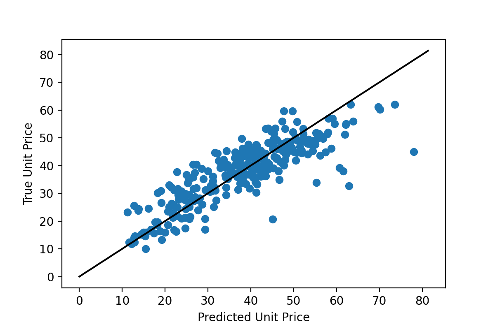
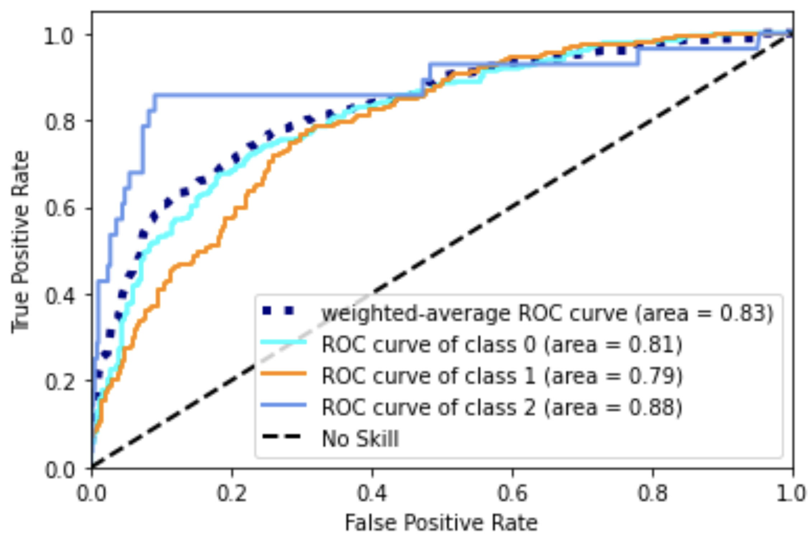
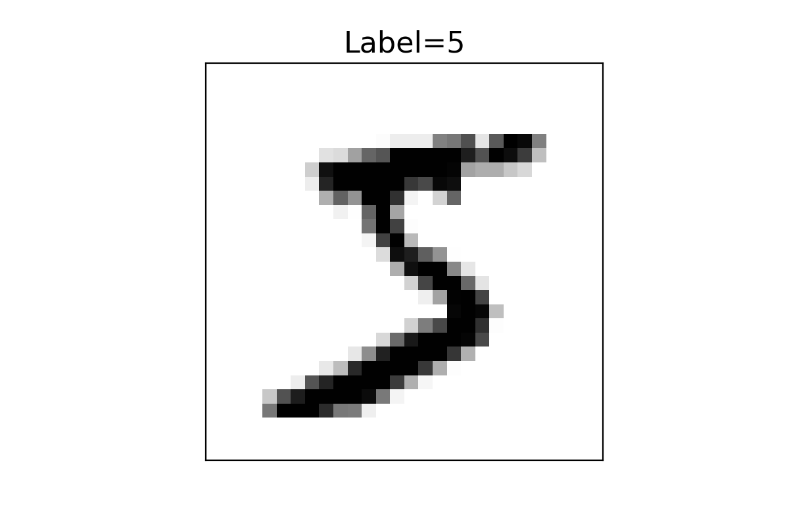

## ML and AI

**An Example-Based Introduction to Common Machine Learning Approaches**   
**Joseph P. Vantassel and Wenyang Zhang, Texas Advanced Computing Center - The University of Texas at Austin**  

With the increasing acquisition and sharing of data in the natural hazards community, solutions from 
data science, in particular machine learning, are increasingly being applied to natural hazard problems.
To better equip the natural hazards community to understand
and utilize these solution this use case presents an example-based introduction to common machine
learning approaches. This use case is not intended to be exhaustive in its coverage
of machine learning approaches (as there are many), nor in its coverage of the selected approaches
(as they are more complex than can be effectively communicated here), rather, this use case is
intended to provide a high-level overview of different approaches to using machine learning to
solve data-related problems.  The example makes use of the following DesignSafe resources:

[Jupyter notebooks on DS Juypterhub](https://www.designsafe-ci.org/rw/workspace/#!/Jupyter::Analysis){target=_blank} 

### Citation and Licensing

<!-- * Please cite [AUTHORS et al. (20xx) - example of published project]() to acknowledge the use of any resources from this use case. -->

* Please cite [Rathje et al. (2017)](https://doi.org/10.1061/(ASCE)NH.1527-6996.0000246){target=_blank} to acknowledge the use of DesignSafe resources.  

* Please cite [Durante and Rathje (2021)](https://doi.org/10.1177/87552930211004613){target=_blank} to acknowledge the use of any resources for the Random Forest and Neural Networks examples included in this use case.

* This software is distributed under the [GNU General Public License](https://www.gnu.org/licenses/gpl-3.0.html){target=_blank}.

### Overview of ML examples

This use case is example-based meaning that is its contents have been organized into self-contained examples.
These self-contained example are organized by machine learning algorithm. Importantly, the machine learning
algorithm applied to the specific example provided here are not the only (or even necessarily the optimal)
algorithm for that particular (or related) problem, instead the datasets considered are used merely for example
and the algorithm applied is but one of the potentially many reasonable alternatives one could use to solve
that particular problem. The focus of these examples is to demonstrate the general procedure for applying that
particular machine learning algorithm and does not necessarily indicate that this is the correct or optimal
solution.

To run the examples for yourself, first copy the directory for the example you are interested in. You can
do this by following the links below to find the location of the associated notebooks in community data,
selecting the directory of interest (e.g., 0_linear_regression for the linear regression example) you will
need to navigate up one directory to make this selection and then selecting `Copy > My Data > Copy Here`. You
can then navigate to your `My Data` and run, explore, and modify the notebooks from your user space. If you do
not make a copy the notebooks will open as read-only and you will not be able to fully explore the examples provided.

#### Linear Regression

Linear regression seeks to find linear relationships between features in a dataset and an associated set of labels
(i.e., real values to be predicted). Linear regression is one of the simplest machine learning algorithms and
likely one that many natural hazards researchers will already be familiar with from undergraduate mathematics
coursework (e.g., statistics, linear algebra). The example for linear regression presented in this use case shows
the process of attempting to predict housing prices from house and neighborhood characteristics. The notebooks cover
how to perform basic linear regression using the raw features, combine those features (also called feature crosses) to
produce better predictions, use regularization to reduce overfitting, and use learning curves as a diagnostic tool for
machine learning problems.

[Linear Regression Example](https://www.designsafe-ci.org/data/browser/public/designsafe.storage.community/Use%20Case%20Products/An%20Example-Based%20Introduction%20to%20Machine%20Learning/0_linear_regression){target=_blank}

#### Random Forest

Random forests or random decision forests is an ensemble learning method for classification, regression and other tasks that operates by constructing a multitude of decision trees at training time. For classification tasks, the output of the random forest is the class selected by most trees. For regression tasks, the mean or average prediction of the individual trees is returned. Random decision forests correct for decision trees' habit of overfitting to their training set. Random forests generally outperform decision trees, but their accuracy is lower than gradient boosted trees. However, data characteristics can affect their performance.

[Random Forest Example](https://www.designsafe-ci.org/data/browser/public/designsafe.storage.community/Use%20Case%20Products/An%20Example-Based%20Introduction%20to%20Machine%20Learning/1_random_forest){target=_blank}

#### Neural Networks

Artificial neural networks (ANNs), usually simply called neural networks (NNs), are computing systems inspired by the biological neural networks that constitute animal brains. An ANN is based on a collection of connected units or nodes called artificial neurons, which loosely model the neurons in a biological brain. Each connection, like the synapses in a biological brain, can transmit a signal to other neurons. An artificial neuron receives a signal then processes it and can signal neurons connected to it. The "signal" at a connection is a real number, and the output of each neuron is computed by some non-linear function of the sum of its inputs. The connections are called edges. Neurons and edges typically have a weight that adjusts as learning proceeds. The weight increases or decreases the strength of the signal at a connection. Neurons may have a threshold such that a signal is sent only if the aggregate signal crosses that threshold. Typically, neurons are aggregated into layers. Different layers may perform different transformations on their inputs. Signals travel from the first layer (the input layer), to the last layer (the output layer), possibly after traversing the layers multiple times.

[Artificial Neural Network Example](https://www.designsafe-ci.org/data/browser/public/designsafe.storage.community/Use%20Case%20Products/An%20Example-Based%20Introduction%20to%20Machine%20Learning/2_artificial_neural_networks){target=_blank}

#### Convolutional Neural Networks

Convolutional neural networks fall under the deep learning subset of machine learning and are an effective
tool for processing and understanding image and image-like data. The convolutional neural network example will show an
image classification algorithm for automatically reading hand-written digits. The network will be provided
an image of a hand-written digit and predict a label classifying it as a number between 0 and 9. The notebooks
will show how to install Keras/TensorFlow, load a standard dataset, pre-process the data for acceptance by the
network, design and train a convolutional neural network using Keras/TensorFlow, and visualize correct and
incorrect output predictions. For those who have access to graphical processing unit (GPU) computational
resources a replica of the main notebook is provided that can run across multiple GPUs on a single machine.

[Convolutional Neural Network Example](https://www.designsafe-ci.org/data/browser/public/designsafe.storage.community/Use%20Case%20Products/An%20Example-Based%20Introduction%20to%20Machine%20Learning/3_convolutional_neural_networks){target=_blank}
